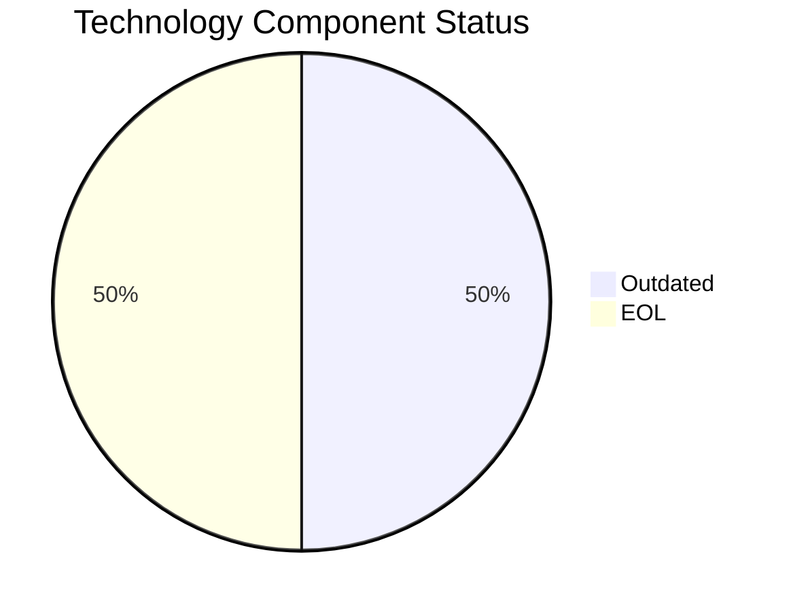

# AnalyticsApp-003 (app003)

> Analysis timestamp: 2025-07-15T00:00:00Z

## Application Overview

| Attribute | Value |
|-----------|-------|
| **Name** | AnalyticsApp-003 |
| **Status** | Production |
| **Criticality** | Low |
| **Users** | 480 |
| **Solution Type** | Open Source |
| **Architecture** | 3-Tier |
| **Containerized** | Yes |
| **CI/CD** | Yes |
| **Environments** | 1 |
| **Servers** | s, v, 0, 3 |
| **External Interfaces** | 3 |

## Technology Stack

| Component | Value | Status |
|-----------|-------|--------|
| **Os** | RHEL 7 | ❌ EOL |
| **Language** | Python 3.9 | ⚠️ OUTDATED |
| **Database** | PostgreSQL 13 | ⚠️ OUTDATED |
| **App Server** | Apache Tomcat 6.1 | ❌ EOL |

## Technology Health

## Complexity Assessment

**Score: 5/10 — MEDIUM**

2 EOL component(s) significantly raise technical debt; 2 outdated component(s) require attention; 3 external interfaces drive integration complexity; 4 server(s) across 1 environment(s); Business criticality is Low.

| Factor | Value |
|--------|-------|
| Servers | 4 |
| Environments | 1 |
| External Interfaces | 3 |
| EOL Technologies | 2 |
| Outdated Technologies | 2 |
| CI/CD Present | Yes |
| Containerized | Yes |

## Modernization Scenarios

| Scenario | Status | Reason |
|----------|--------|--------|
| OS Security Patch | 🔧 APPLICABLE | Operating system RHEL 7 is EOL and requires security patching/upgrade. |
| Switch to Linux | ✅ FULFILLED | Application already runs on standard Linux (RHEL 7). |
| ARM CPU | 🔧 APPLICABLE | Application is containerized on Linux; ARM CPU migration is feasible. |
| App Server Replace | 🔧 APPLICABLE | Application server Apache Tomcat 6.1 is EOL and should be replaced. |
| Cloud Deploy | 🔧 APPLICABLE | Application can be migrated to cloud infrastructure. |
| Containerization | ✅ FULFILLED | Application is already containerized. |
| Refactor/Decouple | ✅ FULFILLED | 3-Tier architecture already provides modular separation. |
| DB Upgrade | 🔧 APPLICABLE | Database PostgreSQL 13 is OUTDATED and should be upgraded. |
| Open Source DB | ✅ FULFILLED | Database PostgreSQL 13 is already open source. |
| Update Components | 🔧 APPLICABLE | Application has EOL or outdated components that require updating. |

## Financial Summary

| Metric | Value |
|--------|-------|
| Total Implementation Cost | $31,176.04 |
| Total Annual Savings | $25,000.00 |
| Payback Period | 1.25 years |
| 5-Year Net Benefit | $93,823.96 |

### Applicable Scenario Costs

| Scenario | Impl. Cost | Annual Savings | Payback |
|----------|-----------|----------------|---------|
| OS Security Patch | $1,005.68 | $500.00 | 2.01 yrs |
| ARM CPU | $5,028.39 | $1,000.00 | 5.03 yrs |
| App Server Replace | $10,056.79 | $10,800.00 | 0.93 yrs |
| Cloud Deploy | $5,028.39 | $2,700.00 | 1.86 yrs |
| DB Upgrade | $10,056.79 | $10,000.00 | 1.01 yrs |
