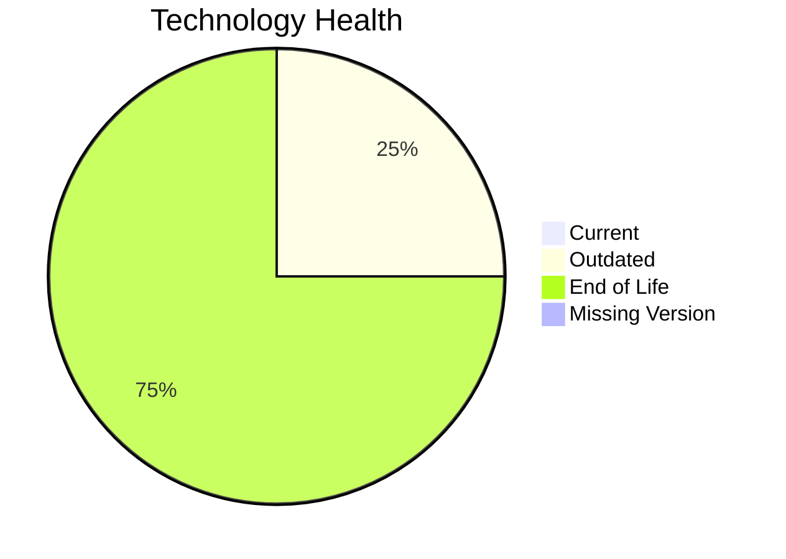

# Application Report: AnalyticsApp-003

**ID:** app003  
**Generated:** 2026-05-13

## Overview
| Attribute | Value |
|---|---|
| Owner | IT |
| Environment | AWS |
| Business Criticality | Low |
| Users | 480 |
| Servers | 1 |

## Technology Stack
| Component | Technology | Status |
|---|---|---|
| Operating System | RHEL 7 | 🔴 EOL |
| Language | Python 3.9 | 🔴 EOL |
| Application Server | Apache Tomcat 6.1 | 🔴 EOL |
| Database | PostgreSQL 13 | 🟡 OUTDATED |

## Complexity Assessment
**Score:** 5/10 — **MEDIUM**  
**Confidence:** Medium

## Modernization Scenarios
| Applicable Scenario | Priority | Cost | Savings/Year |
|---|---|---:|---:|
| Operating System Update | High | €1006 | €500 |
| Applications Server replacement | Medium | €10057 | €10800 |
| Application Refactoring and De-coupling | High | €251420 | €135000 |
| Upgrade Legacy Databases | High | €10057 | €10000 |
| Update outdated components | High | €N/A | €N/A |

## Financial Summary
| Metric | Value |
|---|---:|
| Total One-Time Cost | €272540 |
| Total Yearly Savings | €156300 |
| Break-Even | 1.7 years |
