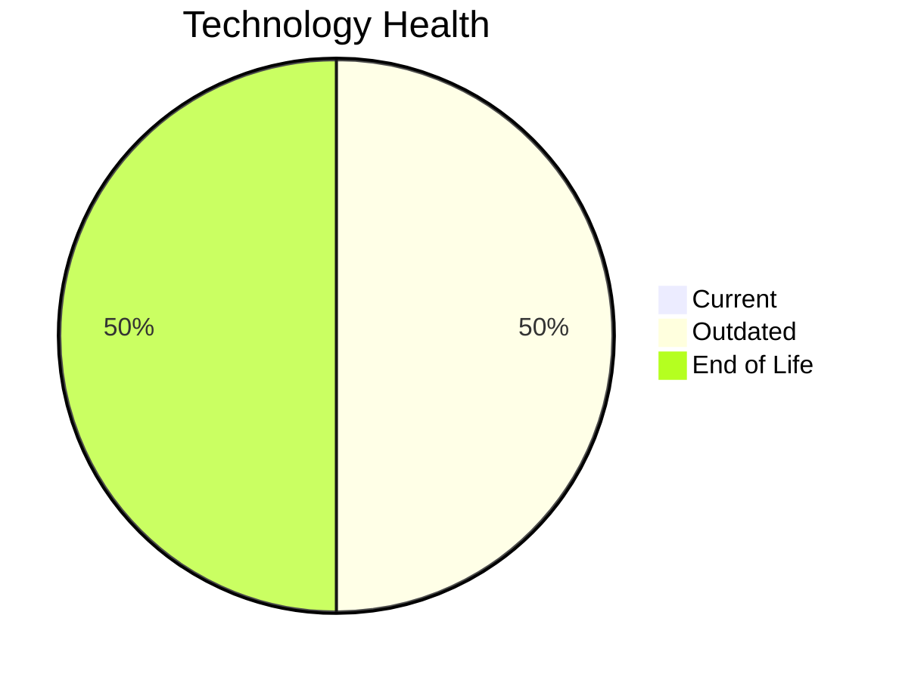

# Application Report: AnalyticsApp-003

**ID:** app003  
**Generated:** 2026-05-06

## Overview

| Attribute | Value |
|-----------|-------|
| Business Unit | IT |
| Deployment | AWS |
| Business Criticality | Low |
| Users | 480 |
| Servers | sv03 |
| Architecture | 3-Tier |
| Containerized | Yes |
| CI/CD | Yes |

## Technology Stack

| Component | Technology | Status |
|-----------|-----------|--------|
| Operating System | RHEL 7 | 🔴 EOL |
| Database | PostgreSQL 13 | 🟡 OUTDATED |
| Language | Python 3.9 | 🟡 OUTDATED |
| App Server | Apache Tomcat 6.1 | 🔴 EOL |

## Complexity Assessment

**Score:** 5/10 — **MEDIUM**  
**Confidence:** 8/10

> Complexity score 5/10 (MEDIUM). 2 EOL component(s), 2 outdated component(s).

| Factor | Score |
|--------|-------|
| Technology Age & EOL | 9/10 |
| Integration Complexity | 5/10 |
| Infrastructure Scale | 2/10 |
| Business Criticality | 7/10 |
| Code & Architecture | 2/10 |
| Data Complexity | 4/10 |

## Modernization Scenarios

### Applicable Scenarios

#### ✅ Operating System Update

- **Priority:** High
- **Effort:** Low
- **Effects:** security
- **Cost:** €1,006 (one-time)
- **Savings:** €500/year
- **Reasoning:** OS (RHEL 7) is EOL; update to a current, supported version.

#### ✅ Applications Server replacement

- **Priority:** Medium
- **Effort:** Medium
- **Effects:** agility, cost
- **Cost:** €10,057 (one-time)
- **Savings:** €10,800/year
- **Reasoning:** Application server (Apache Tomcat 6.1) is EOL; replacement recommended.

#### ✅ Upgrade Legacy Databases

- **Priority:** High
- **Effort:** Medium
- **Effects:** security, agility
- **Cost:** €10,057 (one-time)
- **Savings:** €10,000/year
- **Reasoning:** Database (PostgreSQL 13) is outdated; upgrade recommended.

#### ✅ Update outdated components

- **Priority:** High
- **Effort:** High
- **Effects:** security, agility, cost
- **Cost:** N/A (one-time)
- **Savings:** N/A
- **Reasoning:** Components need updating. EOL: RHEL 7, Apache Tomcat 6.1; Outdated: PostgreSQL 13, Python 3.9.

### Other Scenarios

| Scenario | Status | Reason |
|----------|--------|--------|
| Switch to standard Linux Operating System | FULFILLED | Application runs on standard Linux (RHEL 7). |
| Switch to ARM-based CPU | LACK_OF_DATA | CPU architecture not documented in application data. |
| Application Migration to Cloud Infrastructure (Lift & Shift) | FULFILLED | Application is already deployed on cloud (AWS). |
| Application Containerization | FULFILLED | Application is already containerized. |
| Application Refactoring and De-coupling | PARTIALLY_FULFILLED | 3-tier architecture has some separation; further decoupling into microservices i... |
| Switch DB Engine to open-source database solution | FULFILLED | Database (PostgreSQL 13) is already open-source or compatible. |

## Financial Summary

| Metric | Value |
|--------|-------|
| Total One-Time Investment | €21,120 |
| Total Annual Savings | €21,300 |
| Break-Even | 1.0 years |
