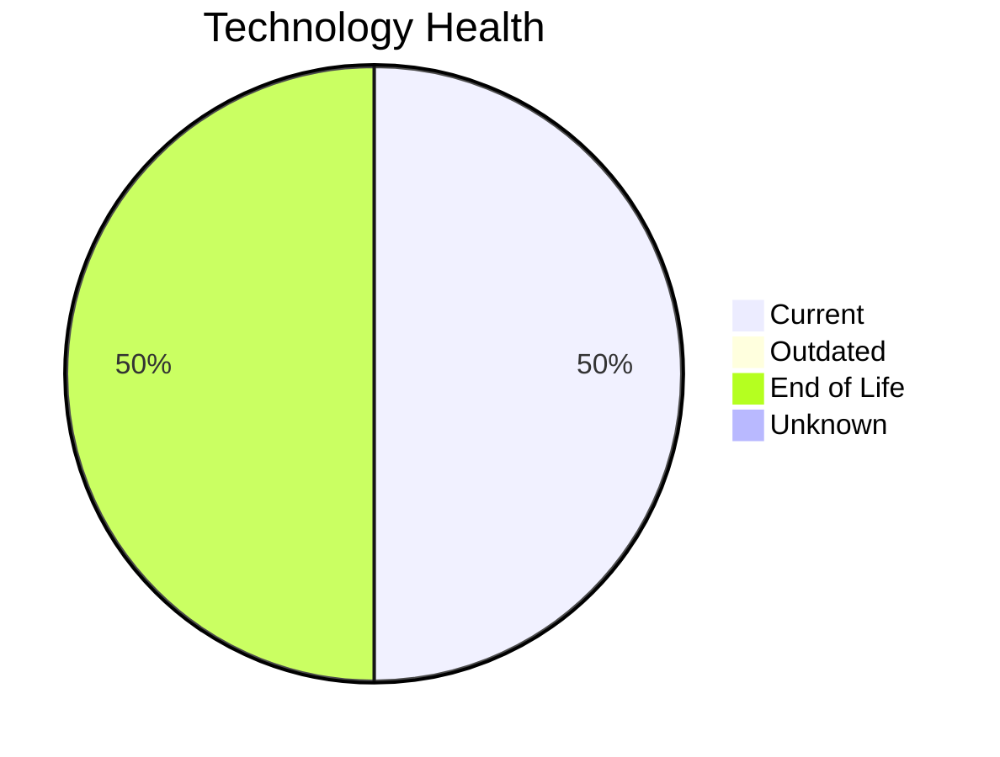

# Application Report: AnalyticsApp-003

**ID:** app003
**Generated:** 2026-05-14

## Overview

| Attribute | Value |
|-----------|-------|
| Owner | IT |
| Environment | AWS |
| Business Criticality | Low |
| Users | 480 |
| Servers | 1 |
| Solution Type | Open Source |
| Architecture | 3-Tier |
| Containerized | Yes |
| CI/CD | Yes |

## Technology Stack

| Component | Technology | Version | Status |
|-----------|-----------|---------|--------|
| Os | RHEL 7 | 7 | 🔴 EOL |
| Database | PostgreSQL 13 | 13 | 🟢 CURRENT_VERSION |
| Programming Language | Python 3.9 | 3.9 | 🟢 CURRENT_VERSION |
| Application Server | Apache Tomcat 6.1 | Tomcat 6.1 | 🔴 EOL |

## Complexity Assessment

**Score:** 4/10 — **MEDIUM**
**Confidence:** 8/10

| Factor | Score | Notes |
|--------|-------|-------|
| Technology Age | 8/10 | 2 EOL, 0 outdated components |
| Integration | 5/10 | 3 external interfaces |
| Infrastructure | 2/10 | 1 server(s), 1 environment(s) |
| Business Criticality | 2/10 | Low criticality |
| Architecture | 2/10 | Containerized: Yes, CI/CD: Yes |
| Data | 5/10 | DB: PostgreSQL 13 |

## Modernization Scenarios

### Applicable Scenarios

#### ✅ Operating System Update

- **Priority:** High
- **Effort:** Low
- **Effects:** security
- **Cost:** €875 (one-time)
- **Savings:** €500/year
- **Reasoning:** Operating system RHEL 7 has reached End of Life and no longer receives security patches. Immediate OS update required.

#### ✅ Switch to ARM-based CPU

- **Priority:** Medium
- **Effort:** Medium
- **Effects:** cost, sustainability
- **Cost:** €4,373 (one-time)
- **Savings:** €1,000/year
- **Reasoning:** Application is containerized on Linux and custom-developed, making it a good candidate for ARM CPU migration for cost and sustainability benefits.

#### ✅ Applications Server replacement

- **Priority:** Medium
- **Effort:** Medium
- **Effects:** agility, cost
- **Cost:** €8,745 (one-time)
- **Savings:** €10,800/year
- **Reasoning:** Application server Apache Tomcat 6.1 is End of Life. Replacement with a modern, supported alternative is strongly recommended.

#### ✅ Update outdated components

- **Priority:** High
- **Effort:** High
- **Effects:** security, agility, cost
- **Cost:** N/A (one-time)
- **Savings:** N/A/year
- **Reasoning:** Application has EOL components: application server Apache Tomcat 6.1 is EOL. Immediate component update required for security.

### Not Applicable / Other

| Scenario | Status | Reason |
|----------|--------|--------|
| Switch to standard Linux Operating System | ✔️ FULFILLED | Application already runs on standard Linux (RHEL 7). No migration needed. |
| Application Migration to Cloud Infrastructure (Lift & Shift) | ✔️ FULFILLED | Application is already deployed on cloud infrastructure (AWS). No migration needed. |
| Application Containerization | ✔️ FULFILLED | Application is already containerized. Scenario already achieved. |
| Application Refactoring and De-coupling | ❌ NOT_APPLICABLE | Application has 3-Tier architecture and is containerized, suggesting modern modular design. Refactor... |
| Upgrade Legacy Databases | ✔️ FULFILLED | Database PostgreSQL 13 is on a current, supported version. No upgrade needed. |
| Switch DB Engine to open-source database solution | ✔️ FULFILLED | Database PostgreSQL 13 is already an open-source or managed solution. No commercial license migratio... |

## Financial Summary

| Metric | Value |
|--------|-------|
| Total One-Time Cost | €13,993 |
| Total Yearly Savings | €12,300 |
| Break-Even | 1.1 years |
