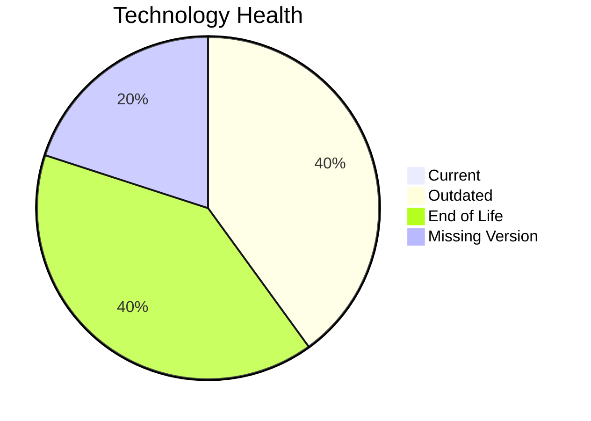

# Application Report: HRApp-004

**ID:** app004  
**Generated:** 2026-05-17

## Overview

| Attribute | Value |
|-----------|-------|
| Owner | unknown |
| Environment | AWS, On-premise |
| Business Criticality | High |
| Users | 670 |
| Servers | sv06, sv02 |

## Technology Stack

| Component | Technology | Version | Status |
|-----------|-----------|---------|--------|
| Operating System | Windows Server 2012 | 2012 | 🔴 EOL |
| Database | SQL Server 2019 | 2019 | 🟡 OUTDATED |
| Language | .NET Core | N/A | ⚪ NO_KNOWLEDGE |
| Framework | .NET | N/A | 🟡 OUTDATED |
| App Server | Microsoft IIS 8.0 | 8.0 | 🔴 EOL |

## Complexity Assessment

**Score:** 6/10 — **MEDIUM**  
**Confidence:** 8

Tech age 7/10 (EOL=2, outdated=2, unknown=1); integration 8/10 (6 interfaces); infrastructure 5/10 (2 servers, 2 envs); criticality 8/10 (High); architecture 4/10 (arch=2-Tier, containerized=Yes, ci/cd=Yes); data 5/10 (1 DB(s), storage≈750GB).

## Modernization Scenarios

### Applicable Scenarios

#### ✅ Operating System Update
- **Priority:** High
- **Effort:** Low
- **Effects:** security
- **Cost:** €1157 (one-time)
- **Savings:** €500/year
- **Reasoning:** Operating system is outdated/EOL in technology assessment.

#### ✅ Switch to ARM-based CPU
- **Priority:** Medium
- **Effort:** Medium
- **Effects:** cost, sustainability
- **Cost:** €5783 (one-time)
- **Savings:** €1000/year
- **Reasoning:** No explicit blockers; likely x86/x64 default estate with modernization potential.

#### ✅ Applications Server replacement
- **Priority:** Medium
- **Effort:** Medium
- **Effects:** agility, cost
- **Cost:** €11565 (one-time)
- **Savings:** €10800/year
- **Reasoning:** Application server identified as legacy/EOL.

#### ✅ Upgrade Legacy Databases
- **Priority:** High
- **Effort:** Medium
- **Effects:** security, agility
- **Cost:** €11565 (one-time)
- **Savings:** €10000/year
- **Reasoning:** Database platform is legacy/outdated per lifecycle assessment.

#### ✅ Switch DB Engine to open-source database solution
- **Priority:** High
- **Effort:** Medium
- **Effects:** cost
- **Cost:** €N/A (one-time)
- **Savings:** €N/A/year
- **Reasoning:** Commercial database engine detected; open-source switch may reduce licensing.

#### ✅ Update outdated components
- **Priority:** High
- **Effort:** High
- **Effects:** security, agility, cost
- **Cost:** €N/A (one-time)
- **Savings:** €N/A/year
- **Reasoning:** Technology assessment found outdated/EOL components.

### Not Applicable / Other

| Scenario | Status | Reason |
|----------|--------|--------|
| Switch to standard Linux Operating System | NOT_APPLICABLE | Windows-based OS excluded from Linux standardization scenario. |
| Application Migration to Cloud Infrastructure (Lift & Shift) | PARTIALLY_FULFILLED | Hybrid deployment exists; further lift-and-shift opportunities remain. |
| Application Containerization | FULFILLED | Application is already containerized. |
| Application Refactoring and De-coupling | PARTIALLY_FULFILLED | Moderate complexity with selective decoupling opportunities. |

## Financial Summary

| Metric | Value |
|--------|-------|
| Total One-Time Cost | €30070 |
| Total Yearly Savings | €22300 |
| Break-Even | 1.3 years |
