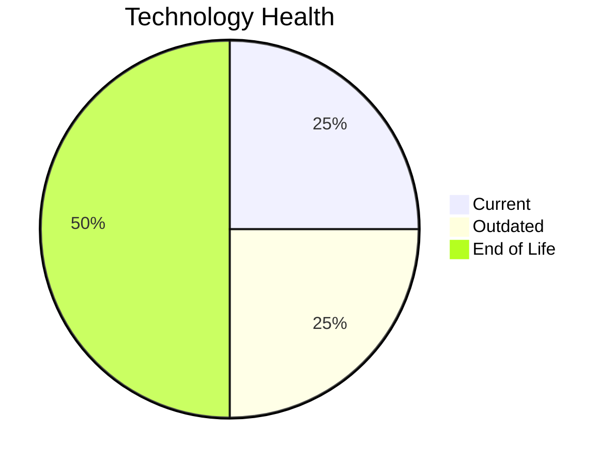

# Application Report: HRApp-004

**ID:** app004
**Generated:** 2026-05-14

## Overview

| Attribute | Value |
|-----------|-------|
| Business Unit | HR |
| Business Criticality | High |
| Solution Type | Custom made |
| Deployment Type | AWS, On-premise |
| Users | 670 |
| Servers | 2 |
| External Interfaces | 6 |
| Containerized | Yes |
| CI/CD Present | Yes |
| Architecture | 2-Tier |

## Technology Stack

| Component | Technology | Version | Status |
|-----------|-----------|---------|--------|
| Os | Windows Server | 2012 | 🔴 EOL |
| Language | .NET Core | unknown | 🟡 OUTDATED |
| Database | SQL Server | 2019 | 🟢 CURRENT_VERSION |
| App Server | Microsoft IIS | 8.0 | 🔴 EOL |

## Complexity Assessment

**Score:** 6/10 — **MEDIUM**
**Confidence:** 7

Score 6/10 (MEDIUM): EOL components=2, Outdated=1, Interfaces=6, Servers=2, Criticality=High, Architecture=2-Tier.

| Factor | Value |
|--------|-------|
| Servers | 2 |
| Environments | 2 |
| Interfaces | 6 |
| EOL Technologies | 2 |
| Outdated Technologies | 1 |
| Business Criticality | High |

## Modernization Scenarios

### Applicable Scenarios

#### ✅ Operating System Update

- **Priority:** High
- **Effort:** Low
- **Effects:** security
- **One-Time Cost:** $1,157
- **Annual Savings:** $500/year
- **Reasoning:** Operating system Windows Server 2012 is EOL. Update to a current supported OS version is recommended.

#### ✅ Applications Server replacement

- **Priority:** Medium
- **Effort:** Medium
- **Effects:** agility, cost
- **One-Time Cost:** $11,565
- **Annual Savings:** $10,800/year
- **Reasoning:** Application server Microsoft IIS 8.0 is EOL. Replacement with a modern server is recommended.

#### ✅ Application Refactoring and De-coupling

- **Priority:** High
- **Effort:** High
- **Effects:** agility, cost, sustainability
- **One-Time Cost:** $289,133
- **Annual Savings:** $135,000/year
- **Reasoning:** Application uses 2-tier architecture. Decoupling into separate frontend/backend services is applicable.

#### ✅ Switch DB Engine to open-source database solution

- **Priority:** High
- **Effort:** Medium
- **Effects:** cost
- **Reasoning:** Database SQL Server 2019 is a proprietary licensed database. Switching to PostgreSQL or another open-source solution would eliminate license costs.

#### ✅ Update outdated components

- **Priority:** High
- **Effort:** High
- **Effects:** security, agility, cost
- **Reasoning:** Application has EOL or very legacy components. Update of outdated programming language and framework components is required.

### Other Scenarios

| Scenario | Status | Reason |
|----------|--------|--------|
| Switch to standard Linux Operating System | ❌ NOT_APPLICABLE | Application runs on Windows Server (Windows Server 2012). The scenario excludes Windows-based OS. |
| Switch to ARM-based CPU | ❓ LACK_OF_DATA | CPU architecture is not explicitly documented as x86/x64. Cannot confirm primary trigger for ARM mig... |
| Application Migration to Cloud Infrastructure (Lift & Shift) | ⚠️ PARTIALLY_FULFILLED | Application has hybrid deployment (On-Premise and Cloud: AWS, On-premise). Full cloud migration not ... |
| Application Containerization | ✔️ FULFILLED | Application is already containerized (is_containerized=Yes). |
| Upgrade Legacy Databases | ✔️ FULFILLED | Database SQL Server 2019 is on a current, supported version. |