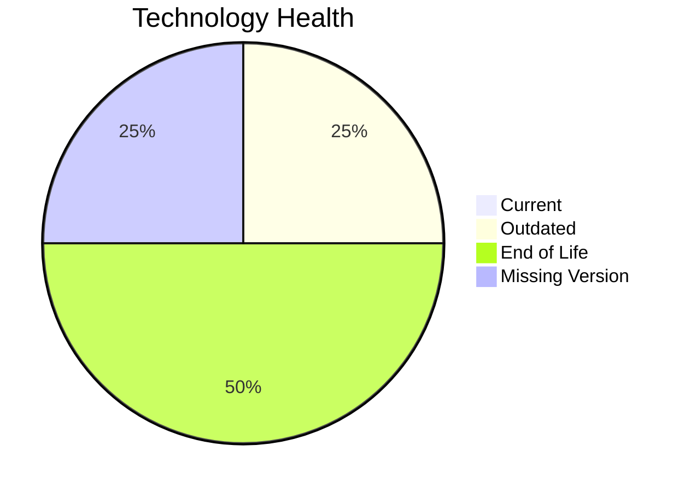

# Application Report: HRApp-004

**ID:** app004
**Generated:** 2026-05-07

## Overview

| Attribute | Value |
|-----------|-------|
| Owner | N/A |
| Environment | AWS, On-premise |
| Business Criticality | High |
| Users | 670 |
| Servers | 2 |

## Technology Stack

| Component | Technology | Version | Status |
|-----------|-----------|---------|--------|
| Operating System | Windows Server | 2012 | 🔴 EOL |
| Database | SQL Server | 2019 | 🟡 OUTDATED |
| Language | N/A | N/A | ⚪ NO_KNOWLEDGE |
| Framework | .NET Core | unknown | ⚪ NO_KNOWLEDGE |
| App Server | IIS | 8.0 | 🔴 EOL |

## Complexity Assessment

**Score:** 6/10 — **MEDIUM**
**Confidence:** 6

| Factor | Score | Notes |
|--------|-------|-------|
| Technology Age | 9/10 | 2 EOL components were found in the application stack. |
| Integration | 5/10 | The application has 6 interfaces, indicating moderate integration. |
| Infrastructure | 5/10 | 2 servers and 2 environments indicate moderate infrastructure complexity. |
| Business Criticality | 8/10 | Criticality is 'High' with 670 users. |
| Architecture | 3/10 | A 2-tier architecture suggests some legacy coupling. Containerization lowers modernization friction. CI/CD lowers delivery risk. |
| Data | 5/10 | Database footprint (750 GB) indicates moderate data migration effort. |

## Modernization Scenarios

### Applicable Scenarios

#### ✅ Operating System Update

- **Priority:** High
- **Effort:** Low
- **Effects:** security
- **Cost:** €1,157 (one-time)
- **Savings:** €500/year
- **Reasoning:** Windows Server 2012 is out of support.

#### ✅ Applications Server replacement

- **Priority:** Medium
- **Effort:** Medium
- **Effects:** agility, cost
- **Cost:** €11,565 (one-time)
- **Savings:** €10,800/year
- **Reasoning:** IIS 8.0 is tied to unsupported Windows Server releases.

#### ✅ Application Refactoring and De-coupling

- **Priority:** High
- **Effort:** High
- **Effects:** agility, cost, sustainability
- **Cost:** €289,133 (one-time)
- **Savings:** €135,000/year
- **Reasoning:** The architecture indicates coupling or legacy structure that would benefit from refactoring.

#### ✅ Upgrade Legacy Databases

- **Priority:** High
- **Effort:** Medium
- **Effects:** security, agility
- **Cost:** €11,565 (one-time)
- **Savings:** €10,000/year
- **Reasoning:** SQL Server 2019 remains supported but is one major generation behind current.

#### ✅ Switch DB Engine to open-source database solution

- **Priority:** High
- **Effort:** Medium
- **Effects:** cost
- **Cost:** €N/A (one-time)
- **Savings:** €N/A/year
- **Reasoning:** The application uses a commercial/proprietary database engine, which is a primary trigger for open-source migration.

#### ✅ Update outdated components

- **Priority:** High
- **Effort:** High
- **Effects:** security, agility, cost
- **Cost:** €N/A (one-time)
- **Savings:** €N/A/year
- **Reasoning:** At least one language, framework, or application server component is outdated or EOL.

### Not Applicable / Other

| Scenario | Status | Reason |
|----------|--------|--------|
| Switch to standard Linux Operating System | NOT_APPLICABLE | The scenario excludes Windows-based operating systems. |
| Switch to ARM-based CPU | LACK_OF_DATA | CPU architecture is not present in the workbook, so ARM suitability cannot be validated. |
| Application Migration to Cloud Infrastructure (Lift & Shift) | PARTIALLY_FULFILLED | Application spans AWS and on-premise environments, so cloud migration is only partially fulfilled. |
| Application Containerization | FULFILLED | The workbook explicitly marks the application as containerized. |

## Financial Summary

| Metric | Value |
|--------|-------|
| Total One-Time Cost | €313,420 |
| Total Yearly Savings | €156,300 |
| Break-Even | 2.0 years |
