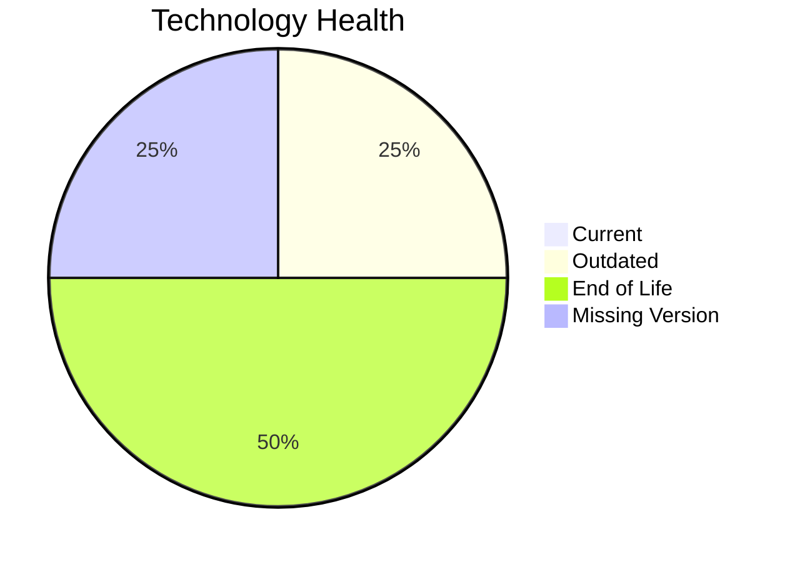

# Application Report: HRApp-004

**ID:** app004
**Generated:** 2026-05-19

## Overview

| Attribute | Value |
|-----------|-------|
| Owner | unknown |
| Environment | AWS, On-premise |
| Business Criticality | High |
| Users | 670 |
| Servers | 2 |

## Technology Stack

| Component | Technology | Version | Status |
|-----------|-----------|---------|--------|
| Operating System | Windows Server 2012 | 2012 | 🔴 EOL |
| Database | SQL Server 2019 | 2019 | 🟡 OUTDATED |
| Language | N/A | N/A | ⚪ N/A |
| Framework | .NET Core | None | ⚪ NO_KNOWLEDGE |
| App Server | Microsoft IIS 8.0 | 8.0 | 🔴 EOL |

## Complexity Assessment

**Score:** 7/10 — **HIGH**
**Confidence:** 8

| Factor | Score | Notes |
|--------|-------|-------|
| Technology Age | n/a | High-critical app with complexity driven by technology age, integrations, and architecture characteristics. |
| Integration | n/a | Interfaces: 6 |
| Infrastructure | n/a | Environments: 2 |
| Business Criticality | n/a | High |
| Architecture | n/a | Containerized: Yes; CI/CD: Yes |
| Data | n/a | Databases: 1 |

## Scenario Applicability

### Applicable Scenarios

#### ✅ Operating System Update

- **Priority:** High
- **Effort:** Low
- **Effects:** security
- **Cost:** €1,330 (one-time)
- **Savings:** €500/year
- **Reasoning:** Windows Server 2012 is classified as EOL, which triggers an operating system update scenario.

#### ✅ Applications Server replacement

- **Priority:** Medium
- **Effort:** Medium
- **Effects:** agility, cost
- **Cost:** €13,300 (one-time)
- **Savings:** €9,600/year
- **Reasoning:** Microsoft IIS 8.0 is EOL and fits server replacement triggers.

#### ✅ Application Refactoring and De-coupling

- **Priority:** High
- **Effort:** High
- **Effects:** agility, cost, sustainability
- **Cost:** €332,502 (one-time)
- **Savings:** €120,000/year
- **Reasoning:** Legacy architecture signals or coupling indicators suggest refactoring and de-coupling would add value.

#### ✅ Upgrade Legacy Databases

- **Priority:** High
- **Effort:** Medium
- **Effects:** security, agility
- **Cost:** €13,300 (one-time)
- **Savings:** €10,000/year
- **Reasoning:** SQL Server 2019 is OUTDATED and fits database upgrade triggers.

#### ✅ Switch DB Engine to open-source database solution

- **Priority:** High
- **Effort:** Medium
- **Effects:** cost
- **Cost:** N/A (one-time)
- **Savings:** N/A/year
- **Reasoning:** SQL Server 2019 is a proprietary engine that could be evaluated for open-source replacement.

#### ✅ Update outdated components

- **Priority:** High
- **Effort:** High
- **Effects:** security, agility, cost
- **Cost:** N/A (one-time)
- **Savings:** N/A/year
- **Reasoning:** The technology assessment found outdated or EOL components that justify a component refresh.

### Not Applicable / Other

| Scenario | Status | Reason |
|----------|--------|--------|
| Switch to standard Linux Operating System | ❌ NOT_APPLICABLE | Application runs on Windows, which is explicitly excluded from Linux-standardization recommendations. |
| Switch to ARM-based CPU | 🚫 BLOCKED | Current operating system platform is a legacy Windows/proprietary Unix environment that is not a good ARM migration candidate. |
| Application Migration to Cloud Infrastructure (Lift & Shift) | 🟨 PARTIALLY_FULFILLED | Application already has an AWS footprint but still retains on-premise hosting. |
| Application Containerization | ✔️ FULFILLED | Application is already marked as containerized. |

## Financial Summary

| Metric | Value |
|--------|-------|
| Total One-Time Cost | €360,432 |
| Total Yearly Savings | €140,100 |
| Break-Even | 2.6 years |
