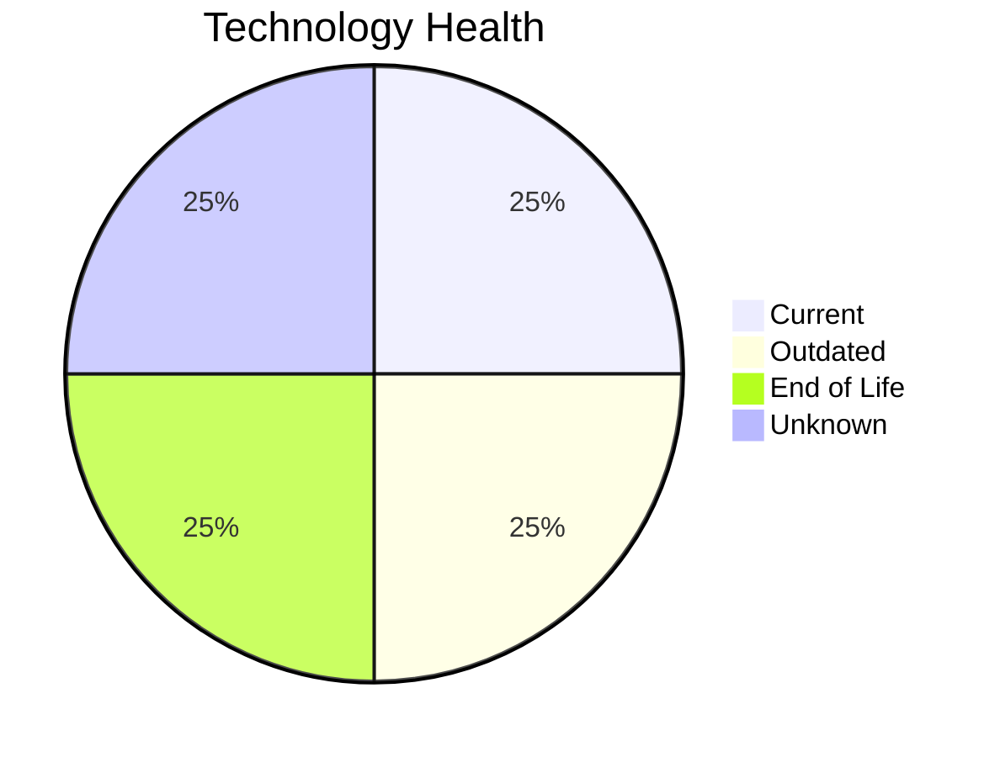

# Application Report: HRApp-004

**ID:** app004  
**Generated:** 2026-05-06

## Overview

| Attribute | Value |
|-----------|-------|
| Business Unit | HR |
| Deployment | AWS, On-premise |
| Business Criticality | High |
| Users | 670 |
| Servers | 2 |
| Architecture | 2-Tier |
| Containerized | Yes |
| CI/CD | Yes |

## Technology Stack

| Component | Technology | Status |
|-----------|-----------|--------|
| Operating System | Windows Server 2012 | 🔴 EOL |
| Database | SQL Server 2019 | 🟢 CURRENT_VERSION |
| Language | .NET Core | 🟡 OUTDATED |
| App Server | Microsoft IIS 8.0 | ⚪ NO_KNOWLEDGE |

## Complexity Assessment

**Score:** 6/10 — **MEDIUM**  
**Confidence:** 8/10

> Complexity score 6/10 (MEDIUM). 1 EOL component(s), 1 outdated component(s), 6 external interfaces, High business criticality.

| Factor | Score |
|--------|-------|
| Technology Age & EOL | 8/10 |
| Integration Complexity | 7/10 |
| Infrastructure Scale | 4/10 |
| Business Criticality | 9/10 |
| Code & Architecture | 5/10 |
| Data Complexity | 4/10 |

## Modernization Scenarios

### Applicable Scenarios

#### ✅ Operating System Update

- **Priority:** High
- **Effort:** Low
- **Effects:** security
- **Cost:** €1,157 (one-time)
- **Savings:** €500/year
- **Reasoning:** OS (Windows Server 2012) is EOL; update to a current, supported version.

#### ✅ Application Migration to Cloud Infrastructure (Lift & Shift)

- **Priority:** High
- **Effort:** Low
- **Effects:** security, agility
- **Cost:** €5,783 (one-time)
- **Savings:** €2,700/year
- **Reasoning:** Application is on-premise but containerized; cloud deployment is straightforward.

#### ✅ Application Refactoring and De-coupling

- **Priority:** High
- **Effort:** High
- **Effects:** agility, cost, sustainability
- **Cost:** €289,133 (one-time)
- **Savings:** €135,000/year
- **Reasoning:** 2-tier architecture could benefit from decoupling into services.

#### ✅ Switch DB Engine to open-source database solution

- **Priority:** High
- **Effort:** Medium
- **Effects:** cost
- **Cost:** N/A (one-time)
- **Savings:** N/A
- **Reasoning:** SQL Server requires Microsoft licensing; migration to PostgreSQL is possible.

#### ✅ Update outdated components

- **Priority:** High
- **Effort:** High
- **Effects:** security, agility, cost
- **Cost:** N/A (one-time)
- **Savings:** N/A
- **Reasoning:** Components need updating. EOL: Windows Server 2012; Outdated: .NET Core.

### Other Scenarios

| Scenario | Status | Reason |
|----------|--------|--------|
| Switch to standard Linux Operating System | NOT_APPLICABLE | Windows Server OS; this scenario targets proprietary Unix-like systems. |
| Switch to ARM-based CPU | LACK_OF_DATA | CPU architecture not documented in application data. |
| Applications Server replacement | LACK_OF_DATA | Application server lifecycle status unknown. |
| Application Containerization | FULFILLED | Application is already containerized. |
| Upgrade Legacy Databases | FULFILLED | Database (SQL Server 2019) is on a current, supported version. |

## Financial Summary

| Metric | Value |
|--------|-------|
| Total One-Time Investment | €296,073 |
| Total Annual Savings | €138,200 |
| Break-Even | 2.1 years |
