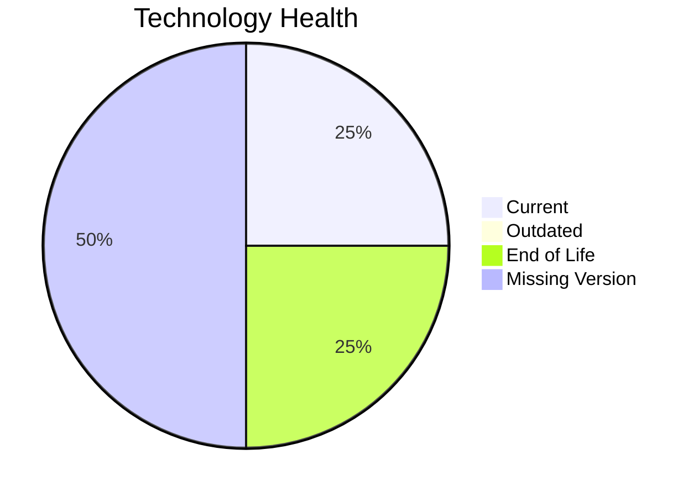

# Application Report: HRApp-004

**ID:** app004
**Generated:** 2026-04-24

## Overview

| Attribute | Value |
|-----------|-------|
| Owner | HR |
| Business Unit | HR |
| Deployment Type | AWS, On-premise |
| Business Criticality | High |
| Users | 670 |
| Servers | 2 |
| Architecture | 2-Tier |
| Solution Type | Custom made |
| CI/CD | Yes |
| Containerized | Yes |

## Technology Stack

| Component | Technology | Version | Status |
|-----------|-----------|---------|--------|
| Operating System | Windows Server 2012 | Windows Server 2012 | 🔴 EOL |
| Language | .NET Core | .NET Core | ⚪ NO_KNOWLEDGE |
| Database | SQL Server 2019 | SQL Server 2019 | 🟢 CURRENT_VERSION |
| App Server | Microsoft IIS 8.0 | Microsoft IIS 8.0 | ⚪ NO_KNOWLEDGE |

## Complexity Assessment

**Score:** 6/10 — **MEDIUM**
**Confidence:** 7

**Reasoning:** Tech age score 7/10 (1 EOL, 0 outdated components). Integration score 7/10 (6 external interfaces). Infrastructure score 3/10 (2 servers, 2 environments). Business criticality score 8/10 (criticality: High). Architecture score 3/10 (architecture: 2-Tier, containerized: Yes, CI/CD: Yes). Data score 4/10 (750GB storage).

### Contributing Factors

| Factor | Value |
|--------|-------|
| Servers | 2 |
| Environments | 2 |
| External Interfaces | 6 |
| EOL Technologies | 1 |
| Outdated Technologies | 0 |
| CI/CD | Yes |
| Containerized | Yes |

## Modernization Scenarios

### Applicable Scenarios

#### ✅ Operating System Update

- **Priority:** High
- **Effort:** Low
- **Effects:** security
- **Cost:** €1,157 (one-time)
- **Savings:** €500/year
- **Reasoning:** Operating system 'Windows Server 2012' is EOL. OS update is recommended.

#### ✅ Application Refactoring and De-coupling

- **Priority:** High
- **Effort:** High
- **Effects:** agility, cost, sustainability
- **Cost:** €289,133 (one-time)
- **Savings:** €135,000/year
- **Reasoning:** Custom application with '2-tier' architecture may benefit from refactoring for better agility.

#### ✅ Switch DB Engine to open-source database solution

- **Priority:** High
- **Effort:** Medium
- **Effects:** cost
- **Cost:** N/A (one-time)
- **Savings:** N/A
- **Reasoning:** Database 'SQL Server 2019' is a proprietary/commercial database. Switching to open-source (e.g., PostgreSQL) would reduce licensing costs.

### Not Applicable / Other

| Scenario | Status | Reason |
|----------|--------|--------|
| Switch to standard Linux Operating System | NOT_APPLICABLE | Exclusion criterion: Application runs on Windows-based OS.... |
| Switch to ARM-based CPU | BLOCKED | Legacy Windows OS is not ARM-compatible for server workloads.... |
| Applications Server replacement | LACK_OF_DATA | Lifecycle data for application server 'Microsoft IIS 8.0' is not available.... |
| Application Migration to Cloud Infrastructure (Lift & Shift) | FULFILLED | Application is already deployed on cloud: 'AWS, On-premise'.... |
| Application Containerization | FULFILLED | Application is already containerized.... |
| Upgrade Legacy Databases | FULFILLED | Database 'SQL Server 2019' is on a currently supported version.... |
| Update outdated components | LACK_OF_DATA | Lifecycle status of '.NET Core' is unknown.... |

## Financial Summary

| Metric | Value |
|--------|-------|
| Total One-Time Cost | €290,290 |
| Total Yearly Savings | €135,500 |
| Break-Even | 2.1 years |
