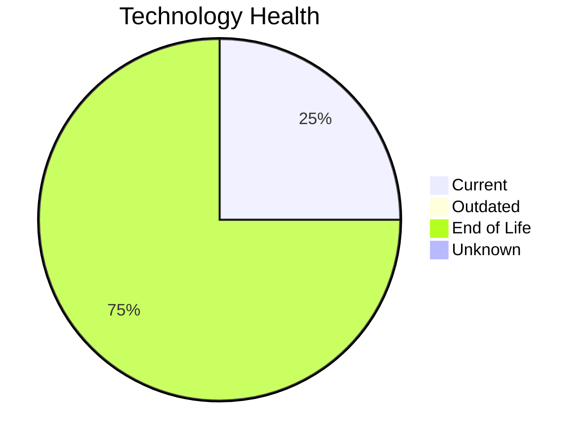

# Application Report: HRApp-004

**ID:** app004  
**Generated:** 2026-05-15

## Overview

| Attribute | Value |
|-----------|-------|
| Business Unit | HR |
| Deployment | AWS, On-premise |
| Business Criticality | High |
| Users | 670 |
| Solution Type | Custom made |
| Architecture | 2-Tier |
| Containerized | Yes |
| CI/CD | Yes |
| External Interfaces | 6 |

## Technology Stack

| Component | Technology | Status |
|-----------|-----------|--------|
| Operating System | Windows Server 2012 | 🔴 EOL |
| Database | SQL Server 2019 | 🟢 Current |
| Language | .NET Core | 🔴 EOL |
| App Server | Microsoft IIS 8.0 | 🔴 EOL |

## Complexity Assessment

**Score:** 7/10 — **HIGH**  
**Confidence:** 8

| Factor | Score | Notes |
|--------|-------|-------|
| Technology Age | 9/10 | 3 EOL and 0 outdated components out of 4 — severe technical debt |
| Integration | 6/10 | 6 external interfaces, 0 dependencies — moderately integrated |
| Infrastructure | 5/10 | 2 server instances, 2 environments |
| Business Criticality | 9/10 | Business criticality: high, 670 users |
| Architecture | 4/10 | 2-tier architecture; containerized; CI/CD present |
| Data | 4/10 | 750 GB data storage |

## Modernization Scenarios

### Applicable Scenarios

#### ✅ Operating System Update

- **Priority:** High
- **Effort:** Low
- **Effects:** security
- **One-time Cost:** €1,330
- **Yearly Savings:** €500/year
- **Reasoning:** OS 'Windows Server 2012' has reached EOL — critical security risk. Immediate OS update required.

#### ✅ Switch to ARM-based CPU

- **Priority:** Medium
- **Effort:** Medium
- **Effects:** cost, sustainability
- **One-time Cost:** €6,650
- **Yearly Savings:** €1,000/year
- **Reasoning:** Application is cloud-deployed and containerized. ARM-based instances (e.g., AWS Graviton) can reduce costs.

#### ✅ Applications Server replacement

- **Priority:** Medium
- **Effort:** Medium
- **Effects:** agility, cost
- **One-time Cost:** €13,300
- **Yearly Savings:** €9,600/year
- **Reasoning:** Application server 'Microsoft IIS 8.0' has reached EOL. Replacement is needed to maintain security and support.

#### ✅ Switch DB Engine to open-source database solution

- **Priority:** High
- **Effort:** Medium
- **Effects:** cost
- **One-time Cost:** N/A
- **Yearly Savings:** N/A
- **Reasoning:** Microsoft SQL Server has licensing costs. Migrating to PostgreSQL or MySQL is a cost-saving option.

#### ✅ Update outdated components

- **Priority:** High
- **Effort:** High
- **Effects:** security, agility, cost
- **One-time Cost:** N/A
- **Yearly Savings:** N/A
- **Reasoning:** Multiple EOL/outdated components detected (3 EOL, 0 outdated). Systematic update program needed.

### Other Scenarios

| Scenario | Status | Reason |
|----------|--------|--------|
| Switch to standard Linux Operating System | ➖ N/A | Application runs on Windows (Windows Server 2012). Scenario excludes Windows-bas... |
| Application Migration to Cloud Infrastructure (Lift & Shift) | 🔶 Partial | Application has hybrid deployment (on-premise and cloud). Full cloud migration w... |
| Application Containerization | ✔️ Fulfilled | Application is already containerized. |
| Application Refactoring and De-coupling | ➖ N/A | Application architecture does not indicate a need for major refactoring. |
| Upgrade Legacy Databases | ✔️ Fulfilled | Database 'SQL Server 2019' is on a current, supported version. |

## Business Case Summary

| Metric | Value |
|--------|-------|
| Total One-time Cost | €21,280 |
| Total Yearly Savings | €11,100 |
| ROI Break-even | 1.9 years |
