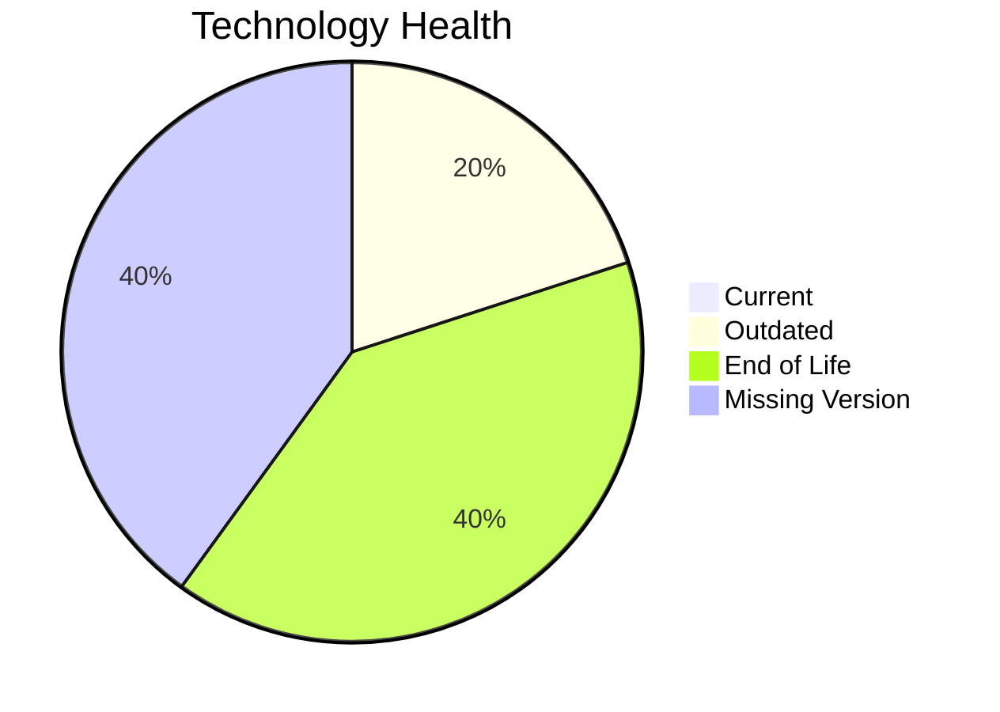

# Application Report: HRApp-004

Modernization assessment for HRApp-004 based solely on the Excel portfolio row and derived workflow outputs.

**ID:** app004  
**Generated:** 2026-05-07

## Overview

| Attribute | Value |
|-----------|-------|
| Owner | HR |
| Environment | AWS, On-premise |
| Business Criticality | High |
| Users | 670 |
| Servers | sv06, sv02 |

## Technology Stack

| Component | Technology | Version | Status |
|-----------|-----------|---------|--------|
| Operating System | Windows Server | 2012 | 🔴 |
| Database | SQL Server | 2019 | 🟡 |
| Language | .NET Core | unknown | ⚪ |
| Framework | .NET Core | unknown | ⚪ |
| App Server | Microsoft IIS | 8.0 | 🔴 |

## Complexity Assessment

**Score:** 8/10 — **HIGH**  
**Confidence:** 7

| Factor | Score | Notes |
|--------|-------|-------|
| Technology Age | 9/10 | 2 EOL, 1 outdated, 2 unknown lifecycle components. |
| Integration | 8/10 | 6 external interfaces and 12 API endpoints indicate the integration footprint. |
| Infrastructure | 5/10 | 2 listed server instances and 2 environments drive infrastructure coordination. |
| Business Criticality | 8/10 | Business criticality is High with approximately 670 users. |
| Architecture | 8/10 | 2-tier architecture still carries coupling risk; application stack contains EOL runtime components |
| Data | 6/10 | database storage is 750 GB; moderate database footprint; proprietary or enterprise database migration complexity |

## Modernization Scenarios

### Applicable Scenarios

#### ✅ Operating System Update

- **Priority:** High
- **Effort:** Low
- **Effects:** security
- **Cost:** €1530 (one-time)
- **Savings:** €500/year
- **Reasoning:** Operating system Windows Server 2012 is eol and matches the OS update trigger.

#### ✅ Applications Server replacement

- **Priority:** Medium
- **Effort:** Medium
- **Effects:** agility, cost
- **Cost:** €15295 (one-time)
- **Savings:** €9600/year
- **Reasoning:** Application server Microsoft IIS 8.0 is eol.

#### ✅ Application Refactoring and De-coupling

- **Priority:** High
- **Effort:** High
- **Effects:** agility, cost, sustainability
- **Cost:** €382378 (one-time)
- **Savings:** €120000/year
- **Reasoning:** Architecture and complexity indicators suggest a refactoring/de-coupling opportunity.

#### ✅ Upgrade Legacy Databases

- **Priority:** High
- **Effort:** Medium
- **Effects:** security, agility
- **Cost:** €15295 (one-time)
- **Savings:** €10000/year
- **Reasoning:** Database platform SQL Server 2019 is outdated.

#### ✅ Switch DB Engine to open-source database solution

- **Priority:** High
- **Effort:** Medium
- **Effects:** cost
- **Cost:** N/A (one-time)
- **Savings:** N/A/year
- **Reasoning:** Database engine SQL Server 2019 is proprietary and matches the open-source migration trigger.

#### ✅ Update outdated components

- **Priority:** High
- **Effort:** High
- **Effects:** security, agility, cost
- **Cost:** N/A (one-time)
- **Savings:** N/A/year
- **Reasoning:** At least one language/framework/application-server component is outdated or end of life.

### Not Applicable / Other

| Scenario | Status | Reason |
|----------|--------|--------|
| Switch to standard Linux Operating System | NOT_APPLICABLE | The application already runs on Windows; this Linux standardization scenario is not a natural fit. |
| Switch to ARM-based CPU | LACK_OF_DATA | CPU architecture is not present in the Excel input, so the primary ARM migration trigger cannot be confirmed. |
| Application Migration to Cloud Infrastructure (Lift & Shift) | PARTIALLY_FULFILLED | The application already has an AWS footprint but still retains on-premise deployment. |
| Application Containerization | FULFILLED | The application is already containerized. |

## Financial Summary

| Metric | Value |
|--------|-------|
| Total One-Time Cost | €414498 |
| Total Yearly Savings | €140100 |
| Break-Even | 3.0 years |
