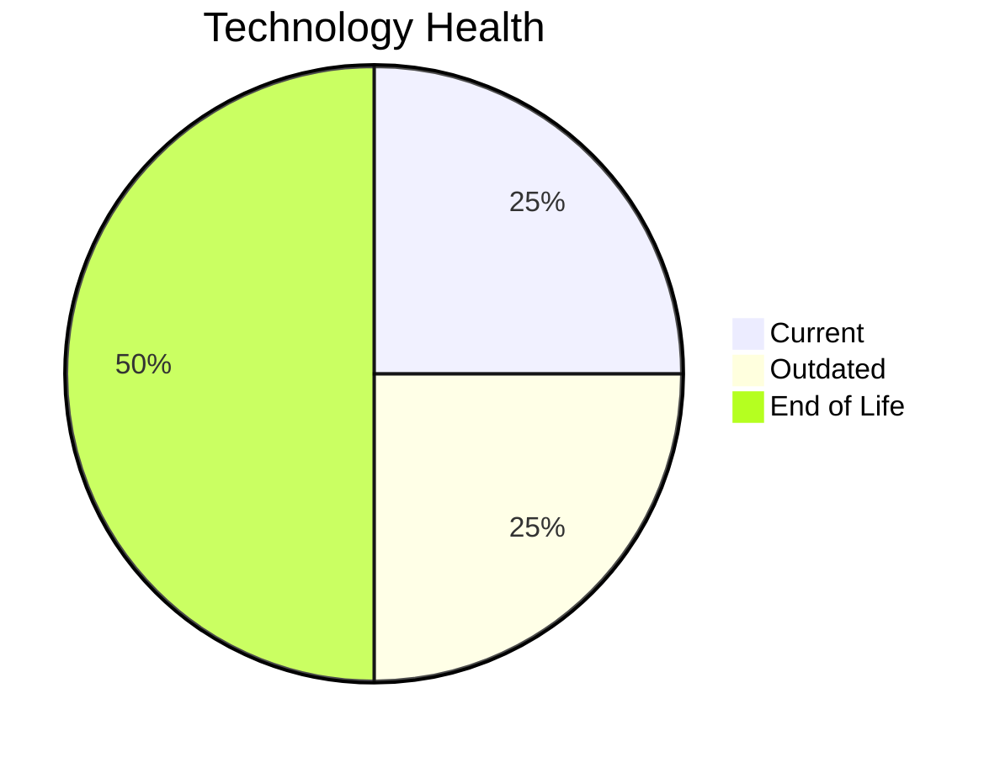

# Application Report: HRApp-004

**ID:** app004  
**Generated:** 2026-05-05

## Overview

| Attribute | Value |
|-----------|-------|
| Business Unit | HR |
| Deployment Type | AWS, On-premise |
| Business Criticality | High |
| Users | 670 |
| Servers | sv06, sv02 |
| Environments | 2 |
| Architecture | 2-Tier |
| Containerized | Yes |
| CI/CD | Yes |
| Solution Type | Custom made |
| Data Classification | Internal |

> Human resources management system handling employee records, benefits, and HR workflows

## Technology Stack

| Component | Technology | Version | Status |
|-----------|-----------|---------|--------|
| Os | Windows Server | 2012 | 🔴 EOL |
| Database | SQL Server | 2019 | 🟢 CURRENT_VERSION |
| Language | .NET Core | unspecified | 🟡 OUTDATED |
| Application Server | Microsoft IIS | 8.0 | 🔴 EOL |

## Complexity Assessment

**Score:** 6/10 — **MEDIUM**  
**Confidence:** 7

> Score 6/10 (MEDIUM). EOL components: 2, Outdated: 1. External interfaces: 6. Servers: 2. Criticality: High. Architecture: 2-Tier. DB storage: 750.0GB.

| Factor | Value |
|--------|-------|
| Servers | 2 |
| Environments | 2 |
| External Interfaces | 6 |
| Business Criticality | High |
| EOL Technologies | 2 |
| Outdated Technologies | 1 |
| CI/CD | Yes |
| Containerized | Yes |

## Modernization Scenarios

### ✅ Applicable Scenarios

#### ✅ Operating System Update

- **Priority:** High
- **Effort:** Low
- **One-Time Cost:** €1,157
- **Yearly Savings:** €500
- **Reasoning:** OS Windows Server 2012 is EOL. Windows Server 2012/2012 R2 reached End of Support on October 10, 2023. OS update is required.

#### ✅ Application Server Replacement

- **Priority:** Medium
- **Effort:** Medium
- **One-Time Cost:** €11,565
- **Yearly Savings:** €10,800
- **Reasoning:** Application server Microsoft IIS 8.0 is EOL. IIS 8.0 ships with Windows Server 2012, which reached EOL on October 10, 2023. Replacement with a modern server is recommended.

#### ✅ Application Migration to Cloud (Lift & Shift)

- **Priority:** High
- **Effort:** Low
- **One-Time Cost:** €5,783
- **Yearly Savings:** €2,700
- **Reasoning:** Application has hybrid deployment (on-premise + cloud). Remaining on-premise components can be migrated to cloud.

#### ✅ Application Refactoring and De-coupling

- **Priority:** High
- **Effort:** High
- **One-Time Cost:** €289,133
- **Yearly Savings:** €135,000
- **Reasoning:** Application has a 2-tier architecture with limited modularity. Refactoring and decoupling would improve maintainability and cloud-readiness.

#### ✅ Switch DB Engine to Open-Source

- **Priority:** High
- **Effort:** Medium
- **Reasoning:** Application uses SQL Server (SQL Server 2019), a proprietary Microsoft database. Migration to PostgreSQL would reduce licensing costs.

#### ✅ Update Outdated Components

- **Priority:** High
- **Effort:** High
- **Reasoning:** Outdated/EOL application components detected: .NET Core unspecified (OUTDATED), Microsoft IIS 8.0 (EOL). These should be updated to current supported versions.

### Other Scenarios

| Scenario | Status | Reason |
|----------|--------|--------|
| Switch to Standard Linux OS | ❌ NOT_APPLICABLE | Application runs on Windows OS. Scenario is excluded for Windows-based systems. |
| Switch to ARM-based CPU | ❌ NOT_APPLICABLE | Application runs on Windows OS, which is excluded from ARM migration per scenario criteria. |
| Application Containerization | ✔️ FULFILLED | Application is already containerized. |
| Upgrade Legacy Databases | ✔️ FULFILLED | Database SQL Server 2019 is on a current supported version. |

## Financial Summary

| Metric | Value |
|--------|-------|
| Total One-Time Cost | €307,638 |
| Total Yearly Savings | €149,000 |
| Break-Even | 2.1 years |
