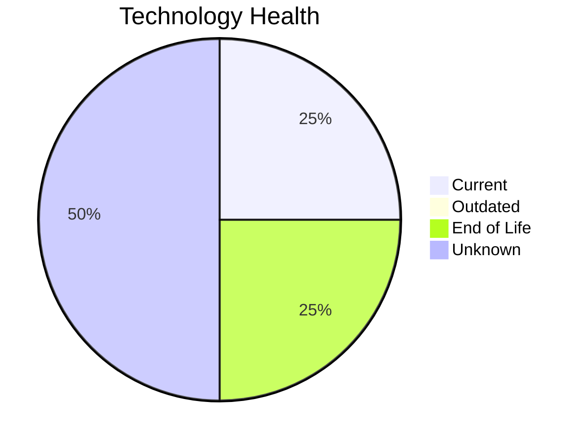

# Application Report: HRApp-004

**ID:** app004
**Generated:** 2026-05-14

## Overview

| Attribute | Value |
|-----------|-------|
| Owner | HR |
| Environment | AWS, On-premise |
| Business Criticality | High |
| Users | 670 |
| Servers | 2 |
| Solution Type | Custom made |
| Architecture | 2-Tier |
| Containerized | Yes |
| CI/CD | Yes |

## Technology Stack

| Component | Technology | Version | Status |
|-----------|-----------|---------|--------|
| Os | Windows Server 2012 | Server 2012 | 🔴 EOL |
| Database | SQL Server 2019 | Server 2019 | 🟢 CURRENT_VERSION |
| Programming Language | .NET Core | Core | ⚪ NO_KNOWLEDGE |
| Application Server | Microsoft IIS 8.0 | IIS 8.0 | ⚪ NO_KNOWLEDGE |

## Complexity Assessment

**Score:** 6/10 — **MEDIUM**
**Confidence:** 8/10

| Factor | Score | Notes |
|--------|-------|-------|
| Technology Age | 7/10 | 1 EOL, 0 outdated components |
| Integration | 7/10 | 6 external interfaces |
| Infrastructure | 4/10 | 2 server(s), 2 environment(s) |
| Business Criticality | 7/10 | High criticality |
| Architecture | 2/10 | Containerized: Yes, CI/CD: Yes |
| Data | 5/10 | DB: SQL Server 2019 |

## Modernization Scenarios

### Applicable Scenarios

#### ✅ Operating System Update

- **Priority:** High
- **Effort:** Low
- **Effects:** security
- **Cost:** €1,157 (one-time)
- **Savings:** €500/year
- **Reasoning:** Operating system Windows Server 2012 has reached End of Life and no longer receives security patches. Immediate OS update required.

#### ✅ Application Refactoring and De-coupling

- **Priority:** High
- **Effort:** High
- **Effects:** agility, cost, sustainability
- **Cost:** €289,133 (one-time)
- **Savings:** €135,000/year
- **Reasoning:** Application has 2-Tier architecture which may have coupling between layers. Refactoring to modular/microservices architecture would improve agility.

#### ✅ Switch DB Engine to open-source database solution

- **Priority:** High
- **Effort:** Medium
- **Effects:** cost
- **Cost:** €28,913 (one-time)
- **Savings:** €15,000/year
- **Reasoning:** Application uses proprietary database SQL Server 2019. Migration to an open-source alternative would reduce costs.

### Not Applicable / Other

| Scenario | Status | Reason |
|----------|--------|--------|
| Switch to standard Linux Operating System | ❌ NOT_APPLICABLE | Application runs on Windows OS. Switching to Linux would require significant re-platforming; not app... |
| Switch to ARM-based CPU | 🚫 BLOCKED | Application runs on Windows Server which has legacy dependencies incompatible with ARM CPU migration... |
| Applications Server replacement | ❓ LACK_OF_DATA | Cannot assess application server lifecycle for Microsoft IIS 8.0. |
| Application Migration to Cloud Infrastructure (Lift & Shift) | ⚠️ PARTIALLY_FULFILLED | Application has hybrid deployment (AWS, On-premise). Partial cloud migration is in place; full cloud... |
| Application Containerization | ✔️ FULFILLED | Application is already containerized. Scenario already achieved. |
| Upgrade Legacy Databases | ✔️ FULFILLED | Database SQL Server 2019 is on a current, supported version. No upgrade needed. |
| Update outdated components | ❓ LACK_OF_DATA | Some component version data is missing or inconclusive. |

## Financial Summary

| Metric | Value |
|--------|-------|
| Total One-Time Cost | €319,203 |
| Total Yearly Savings | €150,500 |
| Break-Even | 2.1 years |
