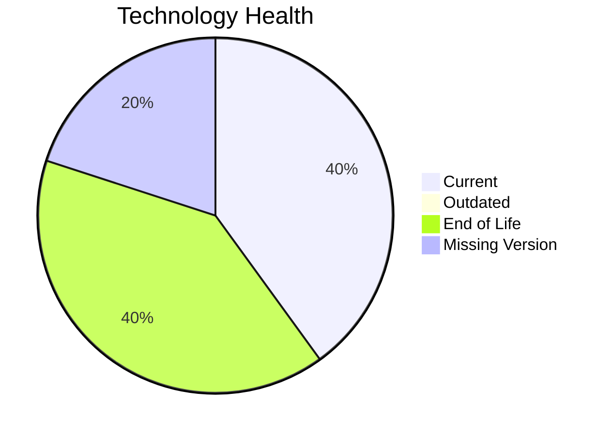

# Application Report: HRApp-004

**ID:** app004
**Generated:** 2026-05-14

## Overview

| Attribute | Value |
|-----------|-------|
| Owner | HR |
| Environment | AWS, On-premise |
| Business Criticality | High |
| Users | 670 |
| Servers | sv06, sv02 |

## Technology Stack

| Component | Technology | Status |
|-----------|-----------|--------|
| Operating System | Windows Server 2012 | 🔴 |
| Database | SQL Server 2019 | 🟢 |
| Language | .NET Core | 🟢 |

## Complexity Assessment

**Score:** 7/10 — **HIGH**

## Modernization Scenarios

### ✅ Os Update Security Patch
- **Reasoning:** EOL operating system/server components require security remediation.

### ✅ Application Server Replacement
- **Reasoning:** Legacy application server version should be replaced.

### ✅ App Deployment To Cloud
- **Reasoning:** On-premise deployment model is a direct cloud-migration opportunity.

### ✅ App Refactor Decoupling
- **Reasoning:** High coupling and/or monolithic architecture indicates refactor opportunity.

### ✅ Switch To Managed Db
- **Reasoning:** On-prem database workloads can move to managed database services.

## Financial Summary

| Metric | Value |
|--------|-------|
| Total One-Time Cost | €400332 |
| Total Yearly Savings | €172500 |
| Break-Even | 2.3 years |
