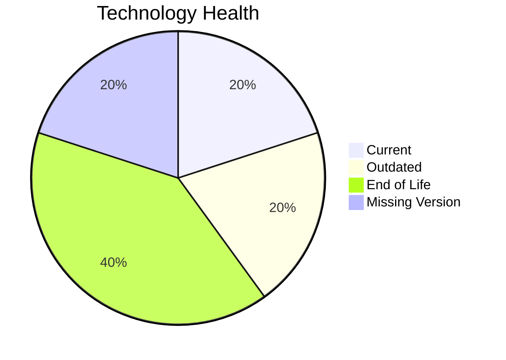

# Application Report: HRApp-004

**ID:** app004  
**Generated:** 2026-05-14

## Overview

| Attribute | Value |
|-----------|-------|
| Owner | unknown |
| Environment | AWS, On-premise |
| Business Criticality | High |
| Users | 670 |
| Servers | sv06, sv02 |

## Technology Stack

| Component | Technology | Version | Status |
|-----------|-----------|---------|--------|
| os | Windows Server 2012 | 2012 | 🔴 EOL |
| database | SQL Server 2019 | 2019 | 🟢 CURRENT_VERSION |
| language | .NET Core | unknown | 🟡 OUTDATED |
| framework | Framework | unknown | ⚪ NO_KNOWLEDGE |
| app_server | Microsoft IIS 8.0 | 8.0 | 🔴 EOL |

## Complexity Assessment

**Score:** 7/10 — **HIGH**  
**Confidence:** 8

**Reasoning:** Tech age 9/10 (2 EOL, 1 outdated components), integrations 6 interfaces and 0 dependencies, infrastructure 2 servers/2 environments, criticality High, architecture score 4/10, data score 5/10.

## Modernization Scenarios

### Applicable Scenarios

#### ✅ Operating System Update
- **Cost:** €1330 (one-time)
- **Savings:** €500/year
- **Reasoning:** Windows Server 2012 requires upgrade/security patching.
#### ✅ Switch to standard Linux Operating System
- **Cost:** €399 (one-time)
- **Savings:** €400/year
- **Reasoning:** Current OS (Windows Server 2012) is non-standard for Linux consolidation.
#### ✅ Switch to ARM-based CPU
- **Cost:** €6650 (one-time)
- **Savings:** €1000/year
- **Reasoning:** Cloud-hosted workload can be evaluated for ARM-based instances.
#### ✅ Applications Server replacement
- **Cost:** €13300 (one-time)
- **Savings:** €9600/year
- **Reasoning:** Application server Microsoft IIS 8.0 is outdated/EOL.
#### ✅ Application Refactoring and De-coupling
- **Cost:** €332502 (one-time)
- **Savings:** €120000/year
- **Reasoning:** Monolithic/tightly integrated footprint suggests refactoring benefits.

### Not Applicable / Other

| Scenario | Status | Reason |
|----------|--------|--------|
| Application Migration to Cloud Infrastructure (Lift & Shift) | PARTIALLY_FULFILLED | Hybrid deployment detected; further cloud migration possible. |
| Application Containerization | FULFILLED | Application is already containerized. |
| Upgrade Legacy Databases | FULFILLED | Database engine appears current. |
| Switch DB Engine to open-source database solution | APPLICABLE | Proprietary database engine indicates open-source migration opportunity. |
| Update outdated components | APPLICABLE | Outdated or EOL components identified in technology assessment. |

## Financial Summary

| Metric | Value |
|--------|-------|
| Total One-Time Cost | €354181 |
| Total Yearly Savings | €131500 |
| Break-Even | 2.7 years |
