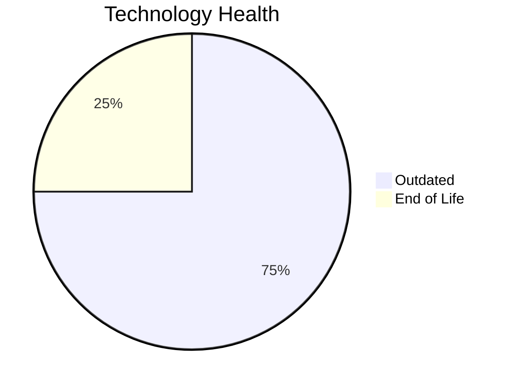

# Application Report: SupportApp-006

**ID:** app006
**Generated:** 2026-05-14

## Overview

| Attribute | Value |
|-----------|-------|
| Business Unit | IT |
| Business Criticality | Medium |
| Solution Type | 3rd party software |
| Deployment Type | AWS |
| Users | 290 |
| Servers | 1 |
| External Interfaces | 4 |
| Containerized | No |
| CI/CD Present | Yes |
| Architecture | unknown |

## Technology Stack

| Component | Technology | Version | Status |
|-----------|-----------|---------|--------|
| Os | Debian | 6 | 🔴 EOL |
| Language | Java | 11 | 🟡 OUTDATED |
| Database | PostgreSQL | 13 | 🟡 OUTDATED |
| App Server | GlassFish | 5.0 | 🟡 OUTDATED |

## Complexity Assessment

**Score:** 5/10 — **MEDIUM**
**Confidence:** 7

Score 5/10 (MEDIUM): EOL components=1, Outdated=3, Interfaces=4, Servers=1, Criticality=Medium, Architecture=unknown.

| Factor | Value |
|--------|-------|
| Servers | 1 |
| Environments | 2 |
| Interfaces | 4 |
| EOL Technologies | 1 |
| Outdated Technologies | 3 |
| Business Criticality | Medium |

## Modernization Scenarios

### Applicable Scenarios

#### ✅ Operating System Update

- **Priority:** High
- **Effort:** Low
- **Effects:** security
- **One-Time Cost:** $1,006
- **Annual Savings:** $500/year
- **Reasoning:** Operating system Debian 6 is EOL. Update to a current supported OS version is recommended.

#### ✅ Applications Server replacement

- **Priority:** Medium
- **Effort:** Medium
- **Effects:** agility, cost
- **One-Time Cost:** $10,057
- **Annual Savings:** $10,800/year
- **Reasoning:** Application server Glassfish 5.0 is outdated. Upgrade or replacement recommended.

#### ✅ Upgrade Legacy Databases

- **Priority:** High
- **Effort:** Medium
- **Effects:** security, agility
- **One-Time Cost:** $10,057
- **Annual Savings:** $10,000/year
- **Reasoning:** Database PostgreSQL 13 is OUTDATED. Upgrade to a current supported version is required.

#### ✅ Update outdated components

- **Priority:** High
- **Effort:** High
- **Effects:** security, agility, cost
- **Reasoning:** Application has EOL or very legacy components. Update of outdated programming language and framework components is required.

### Other Scenarios

| Scenario | Status | Reason |
|----------|--------|--------|
| Switch to standard Linux Operating System | ✔️ FULFILLED | Application already runs on a standard Linux distribution: Debian 6. |
| Switch to ARM-based CPU | ❌ NOT_APPLICABLE | Application is 3rd party software. 3rd party/SaaS applications cannot have their infrastructure arch... |
| Application Migration to Cloud Infrastructure (Lift & Shift) | ✔️ FULFILLED | Application is already deployed on cloud infrastructure (AWS). |
| Application Containerization | 🚫 BLOCKED | Application is 3rd party software. Containerization depends on vendor support. |
| Application Refactoring and De-coupling | ❓ LACK_OF_DATA | Application architecture is unknown ('unknown'). Cannot determine coupling level. |
| Switch DB Engine to open-source database solution | ✔️ FULFILLED | Database PostgreSQL 13 is already an open-source/license-free solution. |