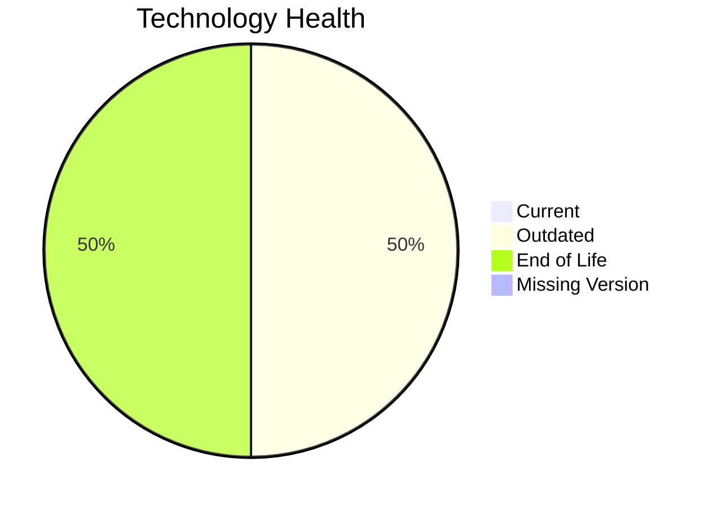

# Application Report: SupportApp-006

Modernization assessment for SupportApp-006 based solely on the Excel portfolio row and derived workflow outputs.

**ID:** app006  
**Generated:** 2026-05-07

## Overview

| Attribute | Value |
|-----------|-------|
| Owner | IT |
| Environment | AWS |
| Business Criticality | Medium |
| Users | 290 |
| Servers | sv10 |

## Technology Stack

| Component | Technology | Version | Status |
|-----------|-----------|---------|--------|
| Operating System | Debian | 6 | 🔴 |
| Database | PostgreSQL | 13 | 🔴 |
| Language | Java | 11 | 🟡 |
| Framework | N/A | N/A | ⚪ |
| App Server | GlassFish | 5.0 | 🟡 |

## Complexity Assessment

**Score:** 6/10 — **MEDIUM**  
**Confidence:** 8

| Factor | Score | Notes |
|--------|-------|-------|
| Technology Age | 9/10 | 2 EOL, 2 outdated, 0 unknown lifecycle components. |
| Integration | 5/10 | 4 external interfaces and 6 API endpoints indicate the integration footprint. |
| Infrastructure | 2/10 | 1 listed server instances and 2 environments drive infrastructure coordination. |
| Business Criticality | 5/10 | Business criticality is Medium with approximately 290 users. |
| Architecture | 6/10 | application is not containerized; third-party software limits internal modernization control |
| Data | 7/10 | database storage is 200 GB; database platform is EOL |

## Modernization Scenarios

### Applicable Scenarios

#### ✅ Operating System Update

- **Priority:** High
- **Effort:** Low
- **Effects:** security
- **Cost:** €1157 (one-time)
- **Savings:** €500/year
- **Reasoning:** Operating system Debian 6 is eol and matches the OS update trigger.

### Not Applicable / Other

| Scenario | Status | Reason |
|----------|--------|--------|
| Switch to standard Linux Operating System | PARTIALLY_FULFILLED | The application already runs on Linux, but the distribution/version is not current and still needs standardization or upgrade. |
| Switch to ARM-based CPU | LACK_OF_DATA | CPU architecture is not present in the Excel input, so the primary ARM migration trigger cannot be confirmed. |
| Applications Server replacement | BLOCKED | The application server is legacy, but the application is third-party software and likely tied to a vendor-managed stack. |
| Application Migration to Cloud Infrastructure (Lift & Shift) | FULFILLED | The application is already hosted on AWS, which fulfills the lift-and-shift cloud target. |
| Application Containerization | BLOCKED | The application is third-party software and container packaging is unlikely to be under customer control. |
| Application Refactoring and De-coupling | BLOCKED | The application is third-party software, so internal refactoring is not under customer control. |
| Upgrade Legacy Databases | BLOCKED | Database upgrade looks relevant, but the application is third-party software and may require vendor-managed migration. |
| Switch DB Engine to open-source database solution | FULFILLED | Database engine PostgreSQL 13 is already open-source aligned. |
| Update outdated components | BLOCKED | The application is third-party software, so runtime component upgrades are likely vendor-managed. |

## Financial Summary

| Metric | Value |
|--------|-------|
| Total One-Time Cost | €1157 |
| Total Yearly Savings | €500 |
| Break-Even | 2.3 years |
