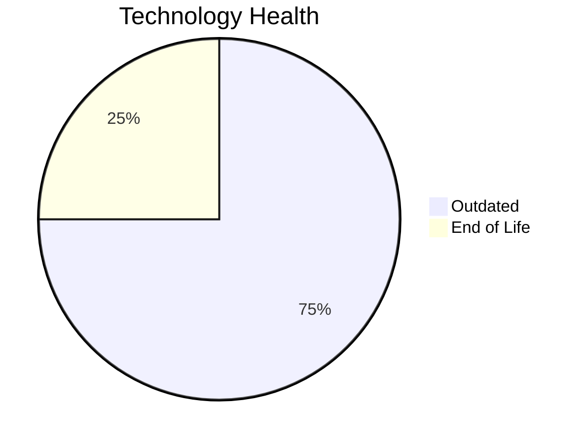

# Application Report: SupportApp-006

**ID:** app006  
**Generated:** 2026-05-05

## Overview

| Attribute | Value |
|-----------|-------|
| Business Unit | IT |
| Deployment Type | AWS |
| Business Criticality | Medium |
| Users | 290 |
| Servers | sv10 |
| Environments | 2 |
| Architecture | unknown |
| Containerized | No |
| CI/CD | Yes |
| Solution Type | 3rd party software |
| Data Classification | Internal |

> IT service desk application for handling internal support tickets and IT service requests

## Technology Stack

| Component | Technology | Version | Status |
|-----------|-----------|---------|--------|
| Os | Debian | 6 | 🔴 EOL |
| Database | PostgreSQL | 13 | 🟡 OUTDATED |
| Language | Java | 11 | 🟡 OUTDATED |
| Application Server | GlassFish | 5.0 | 🟡 OUTDATED |

## Complexity Assessment

**Score:** 5/10 — **MEDIUM**  
**Confidence:** 7

> Score 5/10 (MEDIUM). EOL components: 1, Outdated: 3. External interfaces: 4. Servers: 1. Criticality: Medium. Architecture: unknown. DB storage: 200.0GB.

| Factor | Value |
|--------|-------|
| Servers | 1 |
| Environments | 2 |
| External Interfaces | 4 |
| Business Criticality | Medium |
| EOL Technologies | 1 |
| Outdated Technologies | 3 |
| CI/CD | Yes |
| Containerized | No |

## Modernization Scenarios

### ✅ Applicable Scenarios

#### ✅ Operating System Update

- **Priority:** High
- **Effort:** Low
- **One-Time Cost:** €1,006
- **Yearly Savings:** €500
- **Reasoning:** OS Debian 6 is EOL. Debian 6 (Squeeze) reached End of Life on February 29, 2016. No security updates available. OS update is required.

#### ✅ Upgrade Legacy Databases

- **Priority:** High
- **Effort:** Medium
- **One-Time Cost:** €10,057
- **Yearly Savings:** €10,000
- **Reasoning:** Database PostgreSQL 13 is OUTDATED. PostgreSQL 13 EOL is November 2025. It is approaching end of life and upgrade is recommended. Upgrade is recommended.

### Other Scenarios

| Scenario | Status | Reason |
|----------|--------|--------|
| Switch to Standard Linux OS | ✔️ FULFILLED | Application already runs on a Linux-based OS (Debian 6). However, OS version is EOL; upgrade (os_update_security_patch) ... |
| Switch to ARM-based CPU | ❌ NOT_APPLICABLE | Third-party application; ARM compatibility depends on vendor support, which is not confirmed. |
| Application Server Replacement | ❌ NOT_APPLICABLE | SaaS/3rd-party application; application server is vendor-managed. |
| Application Migration to Cloud (Lift & Shift) | ✔️ FULFILLED | Application is already hosted on cloud (AWS). Lift & Shift is not needed. |
| Application Containerization | ❌ NOT_APPLICABLE | Third-party software; customer cannot modify runtime packaging or container images. |
| Application Refactoring and De-coupling | ❌ NOT_APPLICABLE | Third-party software; internal architecture cannot be refactored by the customer. |
| Switch DB Engine to Open-Source | ❌ NOT_APPLICABLE | Third-party application; database selection may be vendor-mandated. |
| Update Outdated Components | ❌ NOT_APPLICABLE | Third-party software; component versions (language runtime, framework) are vendor-managed and not upgradeable by the cus... |

## Financial Summary

| Metric | Value |
|--------|-------|
| Total One-Time Cost | €11,063 |
| Total Yearly Savings | €10,500 |
| Break-Even | 1.1 years |
