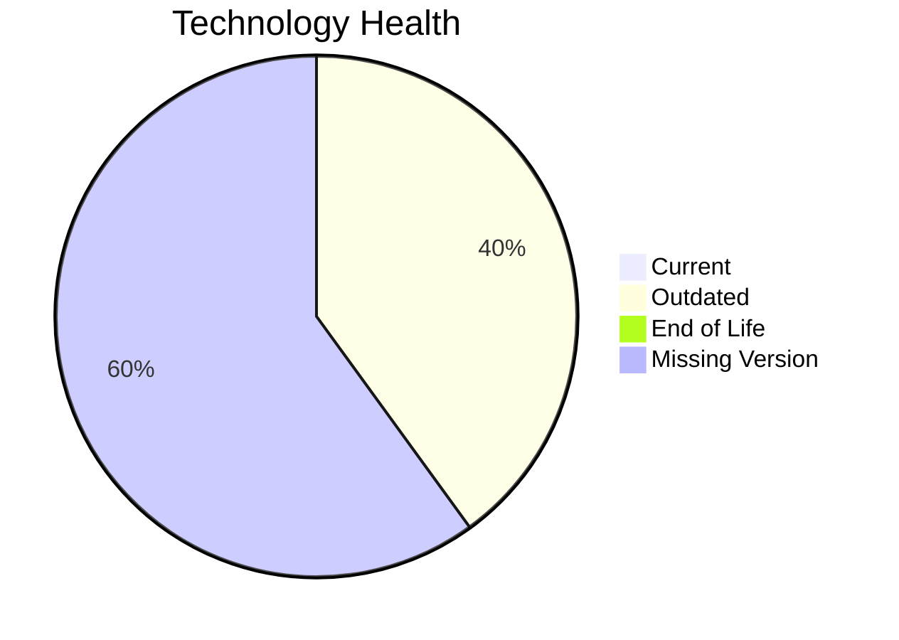

# Application Report: SupportApp-006

**ID:** app006  
**Generated:** 2026-05-14

## Overview

| Attribute | Value |
|-----------|-------|
| Owner | unknown |
| Environment | AWS |
| Business Criticality | Medium |
| Users | 290 |
| Servers | sv10 |

## Technology Stack

| Component | Technology | Version | Status |
|-----------|-----------|---------|--------|
| os | Debian 6 | 6 | ⚪ NO_KNOWLEDGE |
| database | PostgreSQL 13 | 13 | 🟡 OUTDATED |
| language | Java 11 | 11 | 🟡 OUTDATED |
| framework | Framework | unknown | ⚪ NO_KNOWLEDGE |
| app_server | Glassfish 5.0 | 5.0 | ⚪ NO_KNOWLEDGE |

## Complexity Assessment

**Score:** 4/10 — **MEDIUM**  
**Confidence:** 8

**Reasoning:** Tech age 4/10 (0 EOL, 2 outdated components), integrations 4 interfaces and 0 dependencies, infrastructure 1 servers/2 environments, criticality Medium, architecture score 4/10, data score 3/10.

## Modernization Scenarios

### Applicable Scenarios

#### ✅ Switch to standard Linux Operating System
- **Cost:** €262 (one-time)
- **Savings:** €400/year
- **Reasoning:** Current OS (Debian 6) is non-standard for Linux consolidation.
#### ✅ Switch to ARM-based CPU
- **Cost:** €4373 (one-time)
- **Savings:** €1000/year
- **Reasoning:** Cloud-hosted workload can be evaluated for ARM-based instances.
#### ✅ Application Containerization
- **Cost:** €87450 (one-time)
- **Savings:** €90000/year
- **Reasoning:** Containerization could improve portability and operations.
#### ✅ Application Refactoring and De-coupling
- **Cost:** €218626 (one-time)
- **Savings:** €135000/year
- **Reasoning:** Application modernization can include decoupling improvements.
#### ✅ Upgrade Legacy Databases
- **Cost:** €8745 (one-time)
- **Savings:** €10000/year
- **Reasoning:** Database PostgreSQL 13 is legacy/outdated.

### Not Applicable / Other

| Scenario | Status | Reason |
|----------|--------|--------|
| Operating System Update | LACK_OF_DATA | OS lifecycle data is insufficient. |
| Applications Server replacement | LACK_OF_DATA | Insufficient application server data. |
| Application Migration to Cloud Infrastructure (Lift & Shift) | FULFILLED | Application is already deployed in cloud. |
| Switch DB Engine to open-source database solution | FULFILLED | Application already uses open-source database engine. |
| Update outdated components | APPLICABLE | Outdated or EOL components identified in technology assessment. |

## Financial Summary

| Metric | Value |
|--------|-------|
| Total One-Time Cost | €319456 |
| Total Yearly Savings | €236400 |
| Break-Even | 1.4 years |
