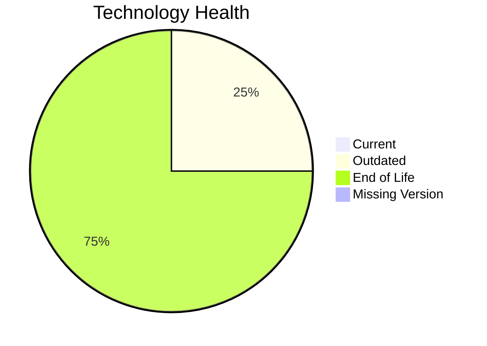

# Application Report: SupportApp-006

**ID:** app006
**Generated:** 2026-05-19

## Overview

| Attribute | Value |
|-----------|-------|
| Owner | unknown |
| Environment | AWS |
| Business Criticality | Medium |
| Users | 290 |
| Servers | 1 |

## Technology Stack

| Component | Technology | Version | Status |
|-----------|-----------|---------|--------|
| Operating System | Debian 6 | 6 | 🔴 EOL |
| Database | PostgreSQL 13 | 13 | 🔴 EOL |
| Language | Java 11 | 11 | 🟡 OUTDATED |
| Framework | N/A | N/A | ⚪ N/A |
| App Server | Glassfish 5.0 | 5.0 | 🔴 EOL |

## Complexity Assessment

**Score:** 6/10 — **MEDIUM**
**Confidence:** 9

| Factor | Score | Notes |
|--------|-------|-------|
| Technology Age | n/a | Medium-critical app with complexity driven by technology age, integrations, and architecture characteristics. |
| Integration | n/a | Interfaces: 4 |
| Infrastructure | n/a | Environments: 2 |
| Business Criticality | n/a | Medium |
| Architecture | n/a | Containerized: No; CI/CD: Yes |
| Data | n/a | Databases: 1 |

## Scenario Applicability

### Applicable Scenarios

#### ✅ Operating System Update

- **Priority:** High
- **Effort:** Low
- **Effects:** security
- **Cost:** €1,157 (one-time)
- **Savings:** €500/year
- **Reasoning:** Debian 6 is classified as EOL, which triggers an operating system update scenario.

#### ✅ Upgrade Legacy Databases

- **Priority:** High
- **Effort:** Medium
- **Effects:** security, agility
- **Cost:** €11,565 (one-time)
- **Savings:** €10,000/year
- **Reasoning:** PostgreSQL 13 is EOL and fits database upgrade triggers.

### Not Applicable / Other

| Scenario | Status | Reason |
|----------|--------|--------|
| Switch to standard Linux Operating System | ✔️ FULFILLED | Debian 6 is already a standard Linux distribution. |
| Switch to ARM-based CPU | 🚫 BLOCKED | Third-party software stack may depend on vendor-certified x86 builds. |
| Applications Server replacement | 🚫 BLOCKED | Application server appears to be part of a third-party stack, so direct replacement is constrained by vendor support. |
| Application Migration to Cloud Infrastructure (Lift & Shift) | ✔️ FULFILLED | Application is already hosted on AWS. |
| Application Containerization | 🚫 BLOCKED | Third-party packaged software may not support customer-led containerization. |
| Application Refactoring and De-coupling | 🚫 BLOCKED | Refactoring a third-party application is typically constrained by vendor ownership. |
| Switch DB Engine to open-source database solution | ✔️ FULFILLED | PostgreSQL 13 already aligns with an open-source database family. |
| Update outdated components | 🚫 BLOCKED | Outdated components exist, but remediation likely depends on the third-party vendor roadmap. |

## Financial Summary

| Metric | Value |
|--------|-------|
| Total One-Time Cost | €12,722 |
| Total Yearly Savings | €10,500 |
| Break-Even | 1.2 years |
