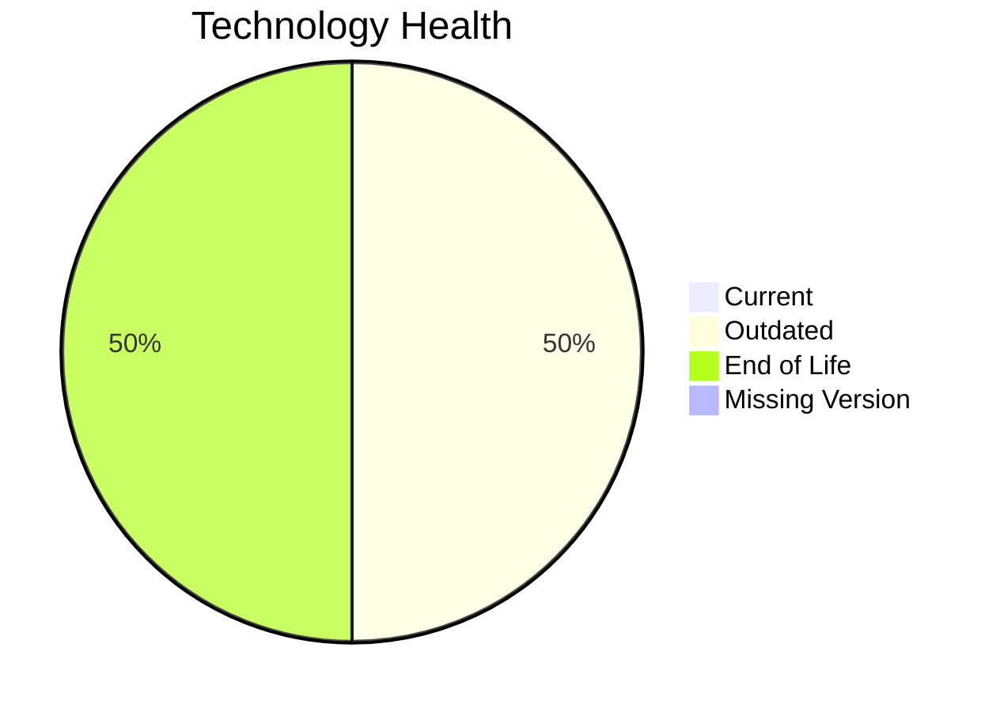

# Application Report: SupportApp-006

**ID:** app006
**Generated:** 2026-05-07

## Overview

| Attribute | Value |
|-----------|-------|
| Owner | N/A |
| Environment | AWS |
| Business Criticality | Medium |
| Users | 290 |
| Servers | 1 |

## Technology Stack

| Component | Technology | Version | Status |
|-----------|-----------|---------|--------|
| Operating System | Debian | 6 | 🔴 EOL |
| Database | PostgreSQL | 13 | 🔴 EOL |
| Language | Java | 11 | 🟡 OUTDATED |
| Framework | N/A | N/A | ⚪ NO_KNOWLEDGE |
| App Server | GlassFish | 5.0 | 🟡 OUTDATED |

## Complexity Assessment

**Score:** 6/10 — **MEDIUM**
**Confidence:** 8

| Factor | Score | Notes |
|--------|-------|-------|
| Technology Age | 9/10 | 2 EOL components were found in the application stack. |
| Integration | 5/10 | The application has 4 interfaces, indicating moderate integration. |
| Infrastructure | 5/10 | 1 servers and 2 environments indicate moderate infrastructure complexity. |
| Business Criticality | 5/10 | Criticality is 'Medium' with 290 users. |
| Architecture | 5/10 | Architecture detail is incomplete, so a neutral score was used. CI/CD lowers delivery risk. Third-party software reduces architectural control. |
| Data | 5/10 | Database footprint (200 GB) indicates moderate data migration effort. |

## Modernization Scenarios

### Applicable Scenarios

#### ✅ Operating System Update

- **Priority:** High
- **Effort:** Low
- **Effects:** security
- **Cost:** €1,157 (one-time)
- **Savings:** €500/year
- **Reasoning:** Debian 6 is long past end of life.

#### ✅ Applications Server replacement

- **Priority:** Medium
- **Effort:** Medium
- **Effects:** agility, cost
- **Cost:** €11,565 (one-time)
- **Savings:** €10,800/year
- **Reasoning:** GlassFish 5 is aging and treated as outdated.

#### ✅ Upgrade Legacy Databases

- **Priority:** High
- **Effort:** Medium
- **Effects:** security, agility
- **Cost:** €11,565 (one-time)
- **Savings:** €10,000/year
- **Reasoning:** PostgreSQL 13 reached end of life in November 2025.

### Not Applicable / Other

| Scenario | Status | Reason |
|----------|--------|--------|
| Switch to standard Linux Operating System | PARTIALLY_FULFILLED | Application already runs on Linux, but the specific distribution/version is outdated and not a currently supported standard baseline. |
| Switch to ARM-based CPU | LACK_OF_DATA | CPU architecture is not present in the workbook, so ARM suitability cannot be validated. |
| Application Migration to Cloud Infrastructure (Lift & Shift) | FULFILLED | Application is already hosted on AWS, which satisfies the public cloud hosting indicator. |
| Application Containerization | BLOCKED | The application is third-party software and container packaging cannot be assumed to be under customer control. |
| Application Refactoring and De-coupling | BLOCKED | The application is third-party software, so internal refactoring is not under customer control. |
| Switch DB Engine to open-source database solution | FULFILLED | The application already uses an open-source or open-source-compatible database engine. |
| Update outdated components | BLOCKED | The scenario excludes third-party applications because runtime components are vendor-managed. |

## Financial Summary

| Metric | Value |
|--------|-------|
| Total One-Time Cost | €24,287 |
| Total Yearly Savings | €21,300 |
| Break-Even | 1.1 years |
