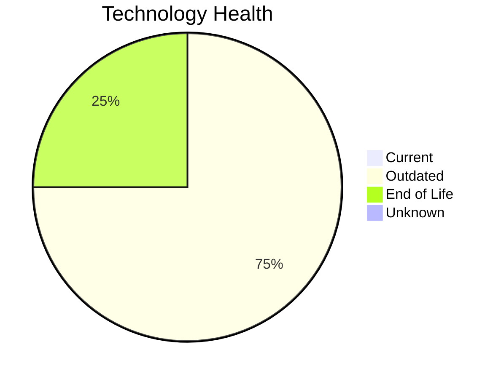

# Application Report: SupportApp-006

**ID:** app006  
**Generated:** 2026-05-15

## Overview

| Attribute | Value |
|-----------|-------|
| Business Unit | IT |
| Deployment | AWS |
| Business Criticality | Medium |
| Users | 290 |
| Solution Type | 3rd party software |
| Architecture | unknown |
| Containerized | No |
| CI/CD | Yes |
| External Interfaces | 4 |

## Technology Stack

| Component | Technology | Status |
|-----------|-----------|--------|
| Operating System | Debian 6 | 🔴 EOL |
| Database | PostgreSQL 13 | 🟡 Outdated |
| Language | Java 11 | 🟡 Outdated |
| App Server | Glassfish 5.0 | 🟡 Outdated |

## Complexity Assessment

**Score:** 5/10 — **MEDIUM**  
**Confidence:** 8

| Factor | Score | Notes |
|--------|-------|-------|
| Technology Age | 7/10 | 1 EOL and 3 outdated components — significant aging |
| Integration | 6/10 | 4 external interfaces, 0 dependencies — moderately integrated |
| Infrastructure | 3/10 | 1 server instance(s), 2 environment(s) |
| Business Criticality | 5/10 | Business criticality: medium, 290 users |
| Architecture | 5/10 | not containerized; CI/CD present |
| Data | 3/10 | Standard data complexity |

## Modernization Scenarios

### Applicable Scenarios

#### ✅ Operating System Update

- **Priority:** High
- **Effort:** Low
- **Effects:** security
- **One-time Cost:** €1,006
- **Yearly Savings:** €500/year
- **Reasoning:** OS 'Debian 6' has reached EOL — critical security risk. Immediate OS update required.

#### ✅ Switch to ARM-based CPU

- **Priority:** Medium
- **Effort:** Medium
- **Effects:** cost, sustainability
- **One-time Cost:** €5,028
- **Yearly Savings:** €1,000/year
- **Reasoning:** Application is cloud-deployed. ARM-based cloud instances offer cost savings potential.

#### ✅ Upgrade Legacy Databases

- **Priority:** High
- **Effort:** Medium
- **Effects:** security, agility
- **One-time Cost:** €10,057
- **Yearly Savings:** €10,000/year
- **Reasoning:** Database 'PostgreSQL 13' is outdated. Upgrading to a current version is recommended.

#### ✅ Update outdated components

- **Priority:** High
- **Effort:** High
- **Effects:** security, agility, cost
- **One-time Cost:** N/A
- **Yearly Savings:** N/A
- **Reasoning:** Multiple EOL/outdated components detected (1 EOL, 3 outdated). Systematic update program needed.

### Other Scenarios

| Scenario | Status | Reason |
|----------|--------|--------|
| Switch to standard Linux Operating System | ✔️ Fulfilled | OS 'Debian 6' is already a standard Linux distribution. |
| Applications Server replacement | 🚫 Blocked | Third-party or SaaS application — app server managed by vendor, replacement not ... |
| Application Migration to Cloud Infrastructure (Lift & Shift) | ✔️ Fulfilled | Application is already deployed in the cloud. |
| Application Containerization | 🚫 Blocked | Third-party/SaaS application. Containerization not feasible — vendor-managed. |
| Application Refactoring and De-coupling | 🚫 Blocked | Third-party/SaaS application — refactoring not feasible. |
| Switch DB Engine to open-source database solution | ✔️ Fulfilled | Database 'PostgreSQL 13' is already an open-source engine. |

## Business Case Summary

| Metric | Value |
|--------|-------|
| Total One-time Cost | €16,091 |
| Total Yearly Savings | €11,500 |
| ROI Break-even | 1.4 years |
