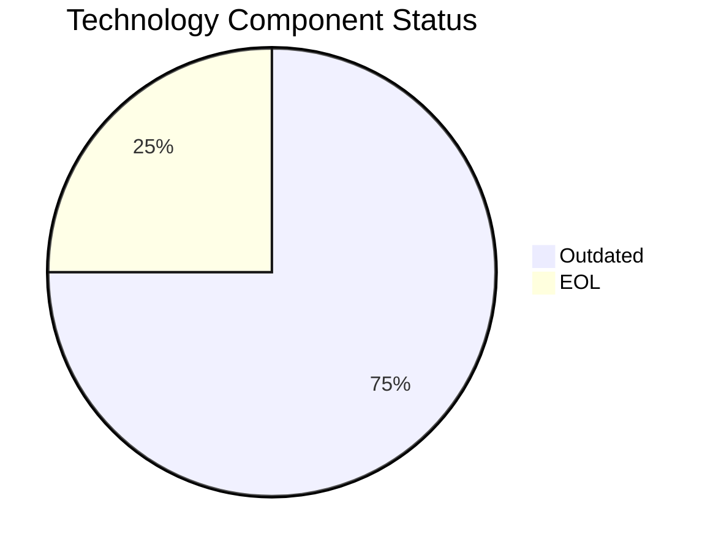

# SupportApp-006 (app006)

> Analysis timestamp: 2025-07-15T00:00:00Z

## Application Overview

| Attribute | Value |
|-----------|-------|
| **Name** | SupportApp-006 |
| **Status** | Production |
| **Criticality** | Medium |
| **Users** | 290 |
| **Solution Type** | 3rd party software |
| **Architecture** | unknown |
| **Containerized** | No |
| **CI/CD** | Yes |
| **Environments** | 2 |
| **Servers** | s, v, 1, 0 |
| **External Interfaces** | 4 |

## Technology Stack

| Component | Value | Status |
|-----------|-------|--------|
| **Os** | Debian 6 | ❌ EOL |
| **Language** | Java 11 | ⚠️ OUTDATED |
| **Database** | PostgreSQL 13 | ⚠️ OUTDATED |
| **App Server** | Glassfish 5.0 | ⚠️ OUTDATED |

## Technology Health

## Complexity Assessment

**Score: 6/10 — MEDIUM**

1 EOL component(s) significantly raise technical debt; 3 outdated component(s) require attention; 4 external interfaces drive integration complexity; 4 server(s) across 2 environment(s); Business criticality is Medium.

| Factor | Value |
|--------|-------|
| Servers | 4 |
| Environments | 2 |
| External Interfaces | 4 |
| EOL Technologies | 1 |
| Outdated Technologies | 3 |
| CI/CD Present | Yes |
| Containerized | No |

## Modernization Scenarios

| Scenario | Status | Reason |
|----------|--------|--------|
| OS Security Patch | 🔧 APPLICABLE | Operating system Debian 6 is EOL and requires security patching/upgrade. |
| Switch to Linux | ✅ FULFILLED | Application already runs on standard Linux (Debian 6). |
| ARM CPU | 🔧 APPLICABLE | Custom or open source application that can be compiled for ARM architecture. |
| App Server Replace | 🔧 APPLICABLE | Application server Glassfish 5.0 is OUTDATED and should be replaced. |
| Cloud Deploy | 🔧 APPLICABLE | Application can be migrated to cloud infrastructure. |
| Containerization | 🔧 APPLICABLE | Custom/open source application can be containerized to improve portability. |
| Refactor/Decouple | 🔧 APPLICABLE | Architecture is unknown; refactoring assessment recommended. |
| DB Upgrade | 🔧 APPLICABLE | Database PostgreSQL 13 is OUTDATED and should be upgraded. |
| Open Source DB | ✅ FULFILLED | Database PostgreSQL 13 is already open source. |
| Update Components | 🔧 APPLICABLE | Application has EOL or outdated components that require updating. |

## Financial Summary

| Metric | Value |
|--------|-------|
| Total Implementation Cost | $440,638.07 |
| Total Annual Savings | $250,000.00 |
| Payback Period | 1.76 years |
| 5-Year Net Benefit | $809,361.93 |

### Applicable Scenario Costs

| Scenario | Impl. Cost | Annual Savings | Payback |
|----------|-----------|----------------|---------|
| OS Security Patch | $1,156.53 | $500.00 | 2.31 yrs |
| ARM CPU | $5,782.65 | $1,000.00 | 5.78 yrs |
| App Server Replace | $11,565.30 | $10,800.00 | 1.07 yrs |
| Cloud Deploy | $5,782.65 | $2,700.00 | 2.14 yrs |
| Containerization | $115,653.04 | $90,000.00 | 1.29 yrs |
| Refactor/Decouple | $289,132.60 | $135,000.00 | 2.14 yrs |
| DB Upgrade | $11,565.30 | $10,000.00 | 1.16 yrs |
