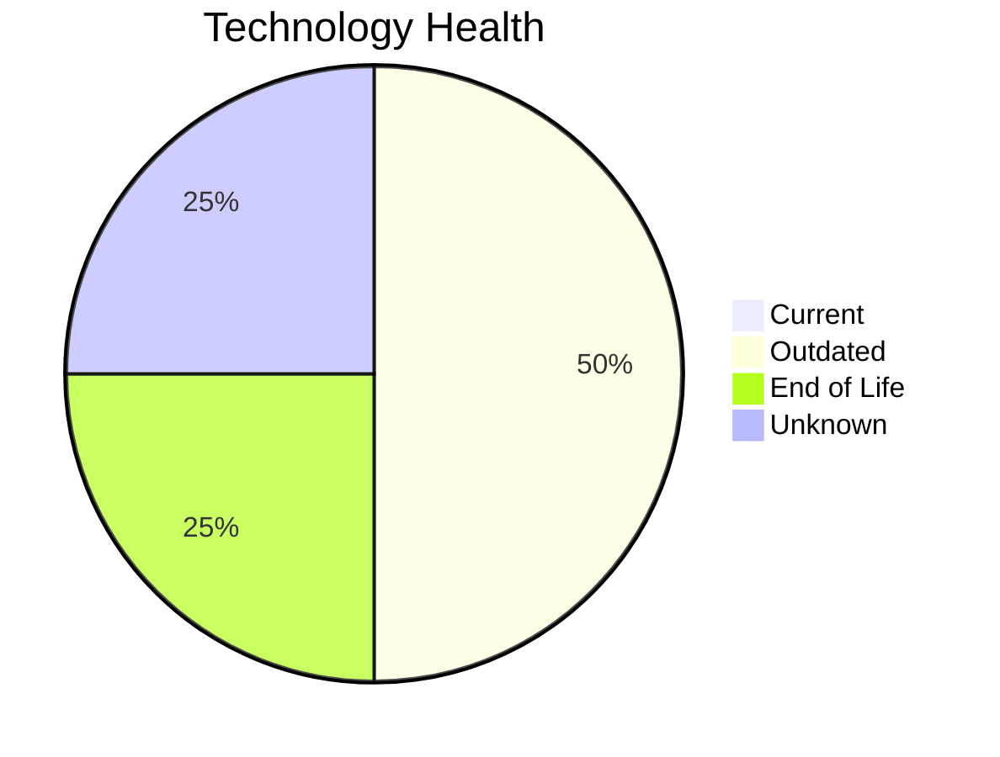

# Application Report: SupportApp-006

**ID:** app006  
**Generated:** 2026-05-06

## Overview

| Attribute | Value |
|-----------|-------|
| Business Unit | IT |
| Deployment | AWS |
| Business Criticality | Medium |
| Users | 290 |
| Servers | sv10 |
| Architecture | unknown |
| Containerized | No |
| CI/CD | Yes |

## Technology Stack

| Component | Technology | Status |
|-----------|-----------|--------|
| Operating System | Debian 6 | 🔴 EOL |
| Database | PostgreSQL 13 | 🟡 OUTDATED |
| Language | Java 11 | 🟡 OUTDATED |
| App Server | Glassfish 5.0 | ⚪ NO_KNOWLEDGE |

## Complexity Assessment

**Score:** 6/10 — **MEDIUM**  
**Confidence:** 8/10

> Complexity score 6/10 (MEDIUM). 1 EOL component(s), 2 outdated component(s).

| Factor | Score |
|--------|-------|
| Technology Age & EOL | 8/10 |
| Integration Complexity | 5/10 |
| Infrastructure Scale | 4/10 |
| Business Criticality | 7/10 |
| Code & Architecture | 4/10 |
| Data Complexity | 4/10 |

## Modernization Scenarios

### Applicable Scenarios

#### ✅ Operating System Update

- **Priority:** High
- **Effort:** Low
- **Effects:** security
- **Cost:** €1,157 (one-time)
- **Savings:** €500/year
- **Reasoning:** OS (Debian 6) is EOL; update to a current, supported version.

#### ✅ Application Containerization

- **Priority:** High
- **Effort:** High
- **Effects:** agility, cost, sustainability
- **Cost:** €115,653 (one-time)
- **Savings:** €90,000/year
- **Reasoning:** Application is not containerized; containerization could improve portability and deployment efficiency.

#### ✅ Upgrade Legacy Databases

- **Priority:** High
- **Effort:** Medium
- **Effects:** security, agility
- **Cost:** €11,565 (one-time)
- **Savings:** €10,000/year
- **Reasoning:** Database (PostgreSQL 13) is outdated; upgrade recommended.

#### ✅ Update outdated components

- **Priority:** High
- **Effort:** High
- **Effects:** security, agility, cost
- **Cost:** N/A (one-time)
- **Savings:** N/A
- **Reasoning:** Components need updating. EOL: Debian 6; Outdated: PostgreSQL 13, Java 11.

### Other Scenarios

| Scenario | Status | Reason |
|----------|--------|--------|
| Switch to standard Linux Operating System | FULFILLED | Application runs on standard Linux (Debian 6). |
| Switch to ARM-based CPU | LACK_OF_DATA | CPU architecture not documented in application data. |
| Applications Server replacement | LACK_OF_DATA | Application server lifecycle status unknown. |
| Application Migration to Cloud Infrastructure (Lift & Shift) | FULFILLED | Application is already deployed on cloud (AWS). |
| Application Refactoring and De-coupling | LACK_OF_DATA | Architecture not clearly identified. |
| Switch DB Engine to open-source database solution | FULFILLED | Database (PostgreSQL 13) is already open-source or compatible. |

## Financial Summary

| Metric | Value |
|--------|-------|
| Total One-Time Investment | €128,375 |
| Total Annual Savings | €100,500 |
| Break-Even | 1.3 years |
