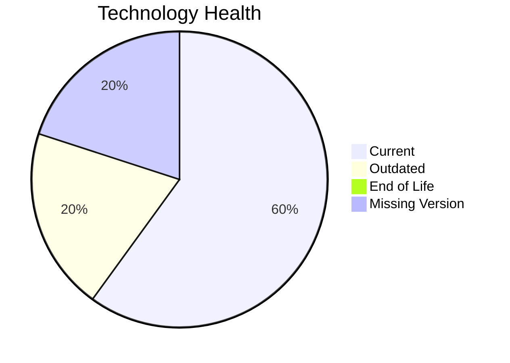

# Application Report: SupportApp-006

**ID:** app006
**Generated:** 2026-05-14

## Overview

| Attribute | Value |
|-----------|-------|
| Owner | IT |
| Environment | AWS |
| Business Criticality | Medium |
| Users | 290 |
| Servers | sv10 |

## Technology Stack

| Component | Technology | Status |
|-----------|-----------|--------|
| Operating System | Debian 6 | 🟡 |
| Database | PostgreSQL 13 | 🟢 |
| Language | Java 11 | 🟡 |

## Complexity Assessment

**Score:** 5/10 — **MEDIUM**

## Modernization Scenarios

### ✅ Switch To Arm Cpu
- **Reasoning:** Cloud-hosted workload with manageable complexity is a candidate for ARM.

### ✅ App Containerization
- **Reasoning:** Application is not containerized and can benefit from platform standardization.

## Financial Summary

| Metric | Value |
|--------|-------|
| Total One-Time Cost | €105596 |
| Total Yearly Savings | €90900 |
| Break-Even | 1.2 years |
