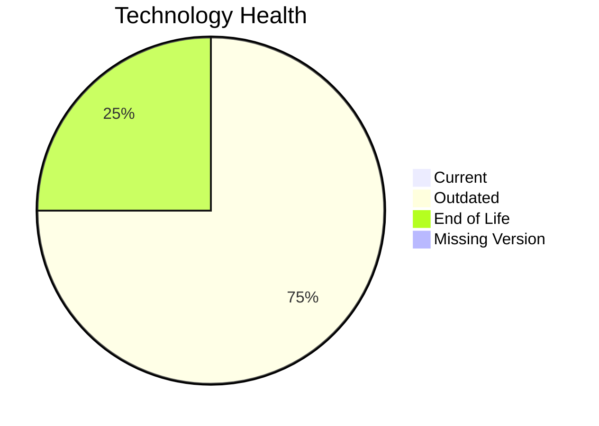

# Application Report: SupportApp-006

**ID:** app006  
**Generated:** 2026-05-13

## Overview
| Attribute | Value |
|---|---|
| Owner | IT |
| Environment | AWS |
| Business Criticality | Medium |
| Users | 290 |
| Servers | 1 |

## Technology Stack
| Component | Technology | Status |
|---|---|---|
| Operating System | Debian 6 | 🔴 EOL |
| Language | Java 11 | 🟡 OUTDATED |
| Application Server | Glassfish 5.0 | 🟡 OUTDATED |
| Database | PostgreSQL 13 | 🟡 OUTDATED |

## Complexity Assessment
**Score:** 5/10 — **MEDIUM**  
**Confidence:** Medium

## Modernization Scenarios
| Applicable Scenario | Priority | Cost | Savings/Year |
|---|---|---:|---:|
| Operating System Update | High | €1006 | €500 |
| Upgrade Legacy Databases | High | €10057 | €10000 |

## Financial Summary
| Metric | Value |
|---|---:|
| Total One-Time Cost | €11063 |
| Total Yearly Savings | €10500 |
| Break-Even | 1.1 years |
