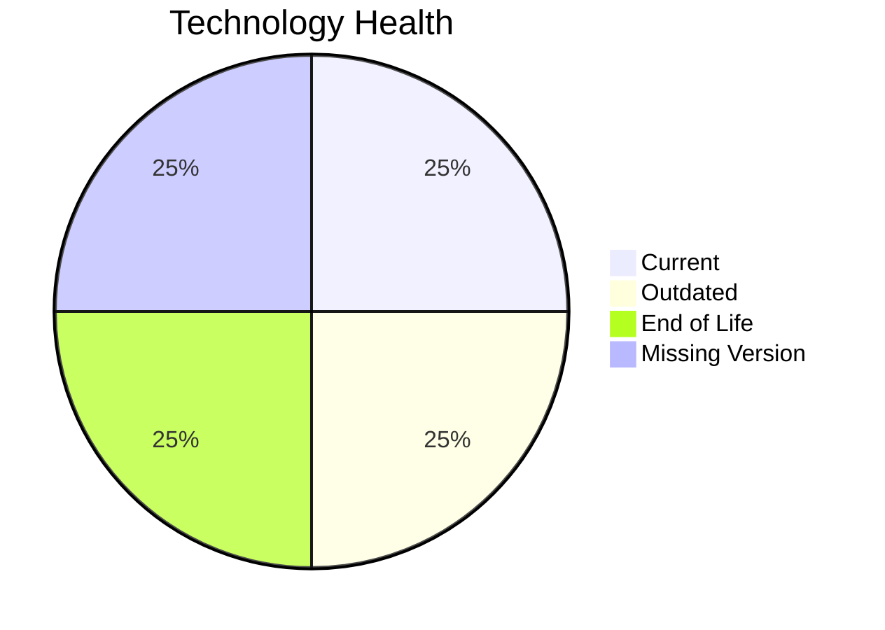

# Application Report: InventoryApp-008

**ID:** app008
**Generated:** 2026-04-24

## Overview

| Attribute | Value |
|-----------|-------|
| Owner | Operations |
| Business Unit | Operations |
| Deployment Type | On-Premise |
| Business Criticality | High |
| Users | 875 |
| Servers | 2 |
| Architecture | 1-Tier |
| Solution Type | Custom made |
| CI/CD | No |
| Containerized | No |

## Technology Stack

| Component | Technology | Version | Status |
|-----------|-----------|---------|--------|
| Operating System | AIX 6 | AIX 6 | 🔴 EOL |
| Language | COBOL-2014 | COBOL-2014 | 🟡 OUTDATED |
| Database | SQL Server 2019 | SQL Server 2019 | 🟢 CURRENT_VERSION |
| App Server | Oracle Weblogic 8.0 | Oracle Weblogic 8.0 | ⚪ NO_KNOWLEDGE |

## Complexity Assessment

**Score:** 6/10 — **MEDIUM**
**Confidence:** 7

**Reasoning:** Tech age score 7/10 (1 EOL, 1 outdated components). Integration score 3/10 (2 external interfaces). Infrastructure score 5/10 (2 servers, 3 environments). Business criticality score 8/10 (criticality: High). Architecture score 8/10 (architecture: 1-Tier, containerized: No, CI/CD: No). Data score 4/10 (400GB storage).

### Contributing Factors

| Factor | Value |
|--------|-------|
| Servers | 2 |
| Environments | 3 |
| External Interfaces | 2 |
| EOL Technologies | 1 |
| Outdated Technologies | 1 |
| CI/CD | No |
| Containerized | No |

## Modernization Scenarios

### Applicable Scenarios

#### ✅ Operating System Update

- **Priority:** High
- **Effort:** Low
- **Effects:** security
- **Cost:** €1,157 (one-time)
- **Savings:** €500/year
- **Reasoning:** Operating system 'AIX 6' is EOL. OS update is recommended.

#### ✅ Switch to standard Linux Operating System

- **Priority:** Medium
- **Effort:** Medium
- **Effects:** agility, security, cost
- **Cost:** €347 (one-time)
- **Savings:** €400/year
- **Reasoning:** Application runs on proprietary OS 'AIX 6'. Switching to standard Linux would reduce costs and improve compatibility.

#### ✅ Application Migration to Cloud Infrastructure (Lift & Shift)

- **Priority:** High
- **Effort:** Low
- **Effects:** security, agility
- **Cost:** €5,783 (one-time)
- **Savings:** €2,700/year
- **Reasoning:** Application is deployed On-Premise. Cloud migration (Lift & Shift) is applicable.

#### ✅ Application Refactoring and De-coupling

- **Priority:** High
- **Effort:** High
- **Effects:** agility, cost, sustainability
- **Cost:** €289,133 (one-time)
- **Savings:** €135,000/year
- **Reasoning:** Application has 1-tier architecture - a strong candidate for refactoring and decoupling.

#### ✅ Switch DB Engine to open-source database solution

- **Priority:** High
- **Effort:** Medium
- **Effects:** cost
- **Cost:** N/A (one-time)
- **Savings:** N/A
- **Reasoning:** Database 'SQL Server 2019' is a proprietary/commercial database. Switching to open-source (e.g., PostgreSQL) would reduce licensing costs.

#### ✅ Update outdated components

- **Priority:** High
- **Effort:** High
- **Effects:** security, agility, cost
- **Cost:** N/A (one-time)
- **Savings:** N/A
- **Reasoning:** Programming language 'COBOL-2014' is OUTDATED. Component updates are needed.

### Not Applicable / Other

| Scenario | Status | Reason |
|----------|--------|--------|
| Switch to ARM-based CPU | BLOCKED | Proprietary OS 'AIX 6' is not ARM-compatible.... |
| Applications Server replacement | LACK_OF_DATA | Lifecycle data for application server 'Oracle Weblogic 8.0' is not available.... |
| Application Containerization | BLOCKED | Legacy OS 'AIX 6' is incompatible with containerization.... |
| Upgrade Legacy Databases | FULFILLED | Database 'SQL Server 2019' is on a currently supported version.... |

## Financial Summary

| Metric | Value |
|--------|-------|
| Total One-Time Cost | €296,420 |
| Total Yearly Savings | €138,600 |
| Break-Even | 2.1 years |
