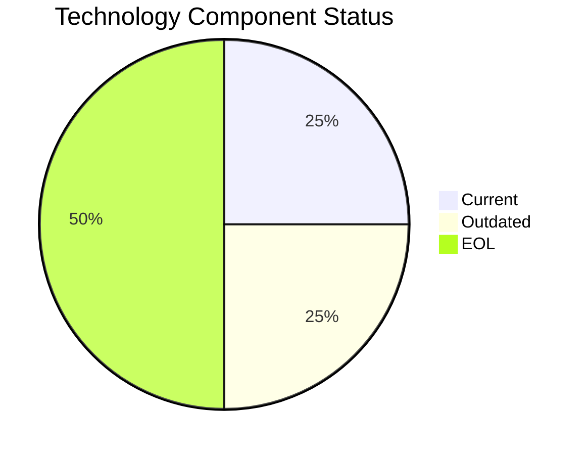

# InventoryApp-008 (app008)

> Analysis timestamp: 2025-07-15T00:00:00Z

## Application Overview

| Attribute | Value |
|-----------|-------|
| **Name** | InventoryApp-008 |
| **Status** | Production |
| **Criticality** | High |
| **Users** | 875 |
| **Solution Type** | Custom made |
| **Architecture** | 1-Tier |
| **Containerized** | No |
| **CI/CD** | No |
| **Environments** | 3 |
| **Servers** | sv11, sv01 |
| **External Interfaces** | 2 |

## Technology Stack

| Component | Value | Status |
|-----------|-------|--------|
| **Os** | AIX 6 | ❌ EOL |
| **Language** | COBOL-2014 | ⚠️ OUTDATED |
| **Database** | SQL Server 2019 | ✅ CURRENT_VERSION |
| **App Server** | Oracle Weblogic 8.0 | ❌ EOL |

## Technology Health

## Complexity Assessment

**Score: 6/10 — MEDIUM**

2 EOL component(s) significantly raise technical debt; 1 outdated component(s) require attention; 2 external interfaces drive integration complexity; 2 server(s) across 3 environment(s); Business criticality is High.

| Factor | Value |
|--------|-------|
| Servers | 2 |
| Environments | 3 |
| External Interfaces | 2 |
| EOL Technologies | 2 |
| Outdated Technologies | 1 |
| CI/CD Present | No |
| Containerized | No |

## Modernization Scenarios

| Scenario | Status | Reason |
|----------|--------|--------|
| OS Security Patch | 🔧 APPLICABLE | Operating system AIX 6 is EOL and requires security patching/upgrade. |
| Switch to Linux | 🔧 APPLICABLE | Application runs on AIX 6; migration to standard Linux would improve portability... |
| ARM CPU | 🚫 BLOCKED | Application uses COBOL-2014 which is tightly coupled to x86/mainframe architectu... |
| App Server Replace | 🔧 APPLICABLE | Application server Oracle Weblogic 8.0 is EOL and should be replaced. |
| Cloud Deploy | 🚫 BLOCKED | Application runs on AIX 6 which is tightly coupled to proprietary hardware. |
| Containerization | 🚫 BLOCKED | COBOL application on AIX 6 is not suitable for containerization. |
| Refactor/Decouple | 🔧 APPLICABLE | 1-Tier monolithic architecture is a high-priority candidate for refactoring and ... |
| DB Upgrade | ✅ FULFILLED | Database SQL Server 2019 is current and actively supported. |
| Open Source DB | 🔧 APPLICABLE | Database SQL Server 2019 is proprietary; switching to open source would reduce l... |
| Update Components | 🔧 APPLICABLE | Application has EOL or outdated components that require updating. |

## Financial Summary

| Metric | Value |
|--------|-------|
| Total Implementation Cost | $331,114.65 |
| Total Annual Savings | $161,700.00 |
| Payback Period | 2.05 years |
| 5-Year Net Benefit | $477,385.35 |

### Applicable Scenario Costs

| Scenario | Impl. Cost | Annual Savings | Payback |
|----------|-----------|----------------|---------|
| OS Security Patch | $1,156.53 | $500.00 | 2.31 yrs |
| Switch to Linux | $346.96 | $400.00 | 0.87 yrs |
| App Server Replace | $11,565.30 | $10,800.00 | 1.07 yrs |
| Refactor/Decouple | $289,132.60 | $135,000.00 | 2.14 yrs |
| Open Source DB | $28,913.26 | $15,000.00 | 1.93 yrs |
