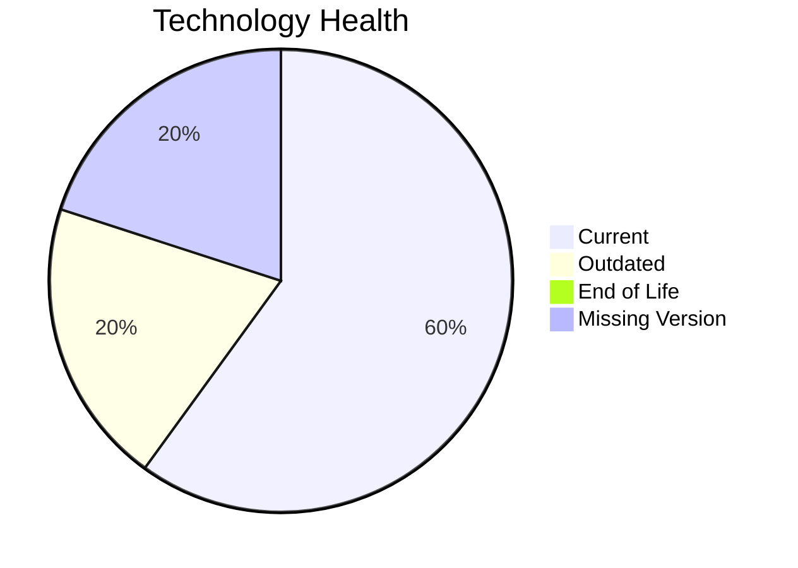

# Application Report: InventoryApp-008

**ID:** app008
**Generated:** 2026-05-14

## Overview

| Attribute | Value |
|-----------|-------|
| Owner | Operations |
| Environment | On-Premise |
| Business Criticality | High |
| Users | 875 |
| Servers | sv11, sv01 |

## Technology Stack

| Component | Technology | Status |
|-----------|-----------|--------|
| Operating System | AIX 6 | 🟡 |
| Database | SQL Server 2019 | 🟢 |
| Language | COBOL-2014 | 🟡 |

## Complexity Assessment

**Score:** 5/10 — **MEDIUM**

## Modernization Scenarios

### ✅ Switch To Standard Linux Os
- **Reasoning:** Current OS footprint includes non-standard enterprise OS variants.

### ✅ App Deployment To Cloud
- **Reasoning:** On-premise deployment model is a direct cloud-migration opportunity.

### ✅ App Containerization
- **Reasoning:** Application is not containerized and can benefit from platform standardization.

### ✅ App Refactor Decoupling
- **Reasoning:** High coupling and/or monolithic architecture indicates refactor opportunity.

### ✅ Switch To Managed Db
- **Reasoning:** On-prem database workloads can move to managed database services.

## Financial Summary

| Metric | Value |
|--------|-------|
| Total One-Time Cost | €387488 |
| Total Yearly Savings | €253060 |
| Break-Even | 1.5 years |
