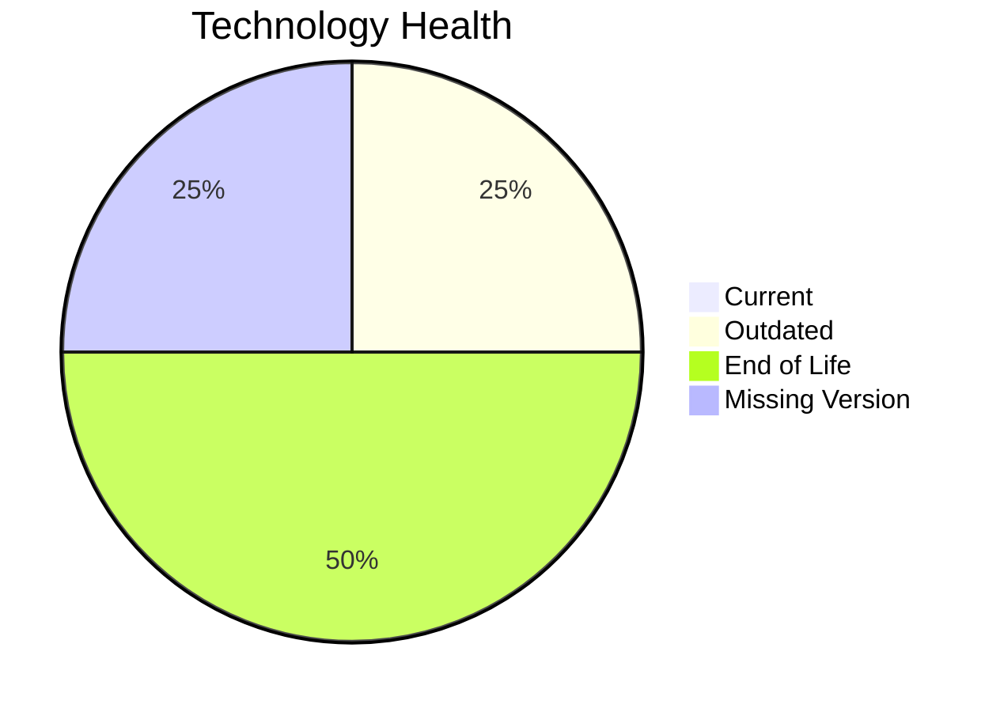

# Application Report: InventoryApp-008

**ID:** app008
**Generated:** 2026-05-18T00:00:00Z

## Overview

| Attribute | Value |
|-----------|-------|
| Owner | Operations |
| Environment | On-Premise |
| Business Criticality | High |
| Users | 875 |
| Servers | 2 |

## Technology Stack

| Component | Technology | Version | Status |
|-----------|-----------|---------|--------|
| Operating System | AIX | 6 | 🔴 EOL |
| Database | SQL Server | 2019 | 🟡 OUTDATED |
| Language | COBOL | 2014 | ⚪ NO_KNOWLEDGE |
| Framework | N/A | N/A | ⚪ N/A |
| App Server | Oracle WebLogic | 8.0 | 🔴 EOL |

## Complexity Assessment

**Score:** 6/10 — **MEDIUM**
**Confidence:** 8

| Factor | Score | Notes |
|--------|-------|-------|
| Technology Age | 8/10 | 2 component(s) are EOL. |
| Integration | 2/10 | 2 external interfaces and 0 API endpoints. |
| Infrastructure | 6/10 | 2 server instance(s) across 3 environment(s). |
| Business Criticality | 7/10 | Criticality is High with 875 users. |
| Architecture | 9/10 | Architecture is 1-Tier; containerized=No; CI/CD=No. |
| Data | 5/10 | Database storage is 400 GB on SQL Server 2019.  |

## Modernization Scenarios

### Applicable Scenarios

#### ✅ Operating System Update

- **Priority:** High
- **Effort:** Low
- **Effects:** security
- **Cost:** €1,157 (one-time)
- **Savings:** €500/year
- **Reasoning:** AIX 6 is assessed as EOL.

#### ✅ Switch to standard Linux Operating System

- **Priority:** Medium
- **Effort:** Medium
- **Effects:** agility, security, cost
- **Cost:** €347 (one-time)
- **Savings:** €400/year
- **Reasoning:** The application runs on proprietary AIX, which is a direct trigger for migration to a standard Linux distribution.

#### ✅ Applications Server replacement

- **Priority:** Medium
- **Effort:** Medium
- **Effects:** agility, cost
- **Cost:** €11,565 (one-time)
- **Savings:** €10,800/year
- **Reasoning:** Oracle Weblogic 8.0 is assessed as EOL, which directly triggers server replacement.

#### ✅ Application Migration to Cloud Infrastructure (Lift & Shift)

- **Priority:** High
- **Effort:** Low
- **Effects:** security, agility
- **Cost:** €5,783 (one-time)
- **Savings:** €2,700/year
- **Reasoning:** The application is still on-premise, which is the main trigger for lift-and-shift cloud migration.

#### ✅ Application Refactoring and De-coupling

- **Priority:** High
- **Effort:** High
- **Effects:** agility, cost, sustainability
- **Cost:** €289,133 (one-time)
- **Savings:** €135,000/year
- **Reasoning:** Architecture and integration signals indicate a tightly coupled estate that would benefit from refactoring.

#### ✅ Upgrade Legacy Databases

- **Priority:** High
- **Effort:** Medium
- **Effects:** security, agility
- **Cost:** €11,565 (one-time)
- **Savings:** €10,000/year
- **Reasoning:** SQL Server 2019 is assessed as OUTDATED.

#### ✅ Switch DB Engine to open-source database solution

- **Priority:** High
- **Effort:** Medium
- **Effects:** cost
- **Cost:** €N/A (one-time)
- **Savings:** €N/A/year
- **Reasoning:** SQL Server 2019 is a proprietary engine, so moving to an open-source database is a valid modernization option.

#### ✅ Update outdated components

- **Priority:** High
- **Effort:** High
- **Effects:** security, agility, cost
- **Cost:** €N/A (one-time)
- **Savings:** €N/A/year
- **Reasoning:** At least one application runtime component is outdated or end of life.

### Not Applicable / Other

| Scenario | Status | Reason |
|----------|--------|--------|
| Switch to ARM-based CPU | BLOCKED | The current OS/platform choice is a blocker for an ARM move in the scenario definition. |
| Application Containerization | BLOCKED | The application runs on legacy Unix (AIX), which is listed as a containerization blocker. |

## Financial Summary

| Metric | Value |
|--------|-------|
| Total One-Time Cost | €319,550 |
| Total Yearly Savings | €159,400 |
| Break-Even | 2.0 years |
