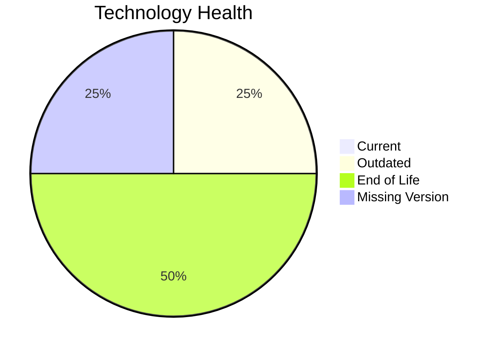

# Application Report: InventoryApp-008

**ID:** app008
**Generated:** 2026-05-11

## Overview

| Attribute | Value |
|-----------|-------|
| Owner | Operations |
| Environment | On-Premise |
| Business Criticality | High |
| Users | 875 |
| Servers | 2 |

## Technology Stack

| Component | Technology | Version | Status |
|-----------|-----------|---------|--------|
| Operating System | AIX | AIX 6 | 🔴 EOL |
| Database | SQL Server | SQL Server 2019 | 🟡 OUTDATED |
| Language | COBOL-2014 | COBOL-2014 | ⚪ NO_KNOWLEDGE |
| Framework | N/A | N/A | ⚪ |
| App Server | WebLogic | Oracle Weblogic 8.0 | 🔴 EOL |

## Complexity Assessment

**Score:** 6/10 — **MEDIUM**
**Confidence:** 7

Technology age score 9/10 (EOL=2, outdated=1, unknown=1); integration score 2/10 (interfaces=2, api_endpoints=0); infrastructure score 5/10 (servers=2, environments=3); business criticality score 8/10 (High, users=875); architecture score 8/10 (architecture=1-Tier, CI/CD=No, containerized=No); data score 5/10 (db_count=1, db_storage_gb=400).

## Modernization Scenarios

### Applicable Scenarios

#### ✅ Operating System Update

- **Priority:** High
- **Effort:** Low
- **Effects:** security
- **Cost:** €1157 (one-time)
- **Savings:** €500/year
- **Reasoning:** Operating system is outdated or end-of-life per technology assessment.

#### ✅ Switch to standard Linux Operating System

- **Priority:** Medium
- **Effort:** Medium
- **Effects:** agility, security, cost
- **Cost:** €347 (one-time)
- **Savings:** €400/year
- **Reasoning:** Application runs on proprietary Unix OS and can be standardized to Linux.

#### ✅ Applications Server replacement

- **Priority:** Medium
- **Effort:** Medium
- **Effects:** agility, cost
- **Cost:** €11565 (one-time)
- **Savings:** €10800/year
- **Reasoning:** Application server version is legacy or unsupported.

#### ✅ Application Migration to Cloud Infrastructure (Lift & Shift)

- **Priority:** High
- **Effort:** Low
- **Effects:** security, agility
- **Cost:** €5783 (one-time)
- **Savings:** €2700/year
- **Reasoning:** On-premise deployment indicates lift-and-shift opportunity to cloud.

#### ✅ Application Refactoring and De-coupling

- **Priority:** High
- **Effort:** High
- **Effects:** agility, cost, sustainability
- **Cost:** €289133 (one-time)
- **Savings:** €135000/year
- **Reasoning:** Architecture and integration profile indicate decoupling/refactoring opportunity.

#### ✅ Upgrade Legacy Databases

- **Priority:** High
- **Effort:** Medium
- **Effects:** security, agility
- **Cost:** €11565 (one-time)
- **Savings:** €10000/year
- **Reasoning:** Database engine is outdated or end-of-life.

#### ✅ Switch DB Engine to open-source database solution

- **Priority:** High
- **Effort:** Medium
- **Effects:** cost
- **Cost:** N/A
- **Savings:** N/A
- **Reasoning:** Proprietary database engine creates open-source migration opportunity.

#### ✅ Update outdated components

- **Priority:** High
- **Effort:** High
- **Effects:** security, agility, cost
- **Cost:** N/A
- **Savings:** N/A
- **Reasoning:** Language/framework/server components are outdated or end-of-life.

### Not Applicable / Other

| Scenario | Status | Reason |
|----------|--------|--------|
| Switch to ARM-based CPU | LACK_OF_DATA | CPU architecture (x86/x64/ARM) is not provided in source data. |
| Application Containerization | LACK_OF_DATA | Containerization prerequisites are unclear from source data. |

## Financial Summary

| Metric | Value |
|--------|-------|
| Total One-Time Cost | €319550 |
| Total Yearly Savings | €159400 |
| Break-Even | 2.0 years |
