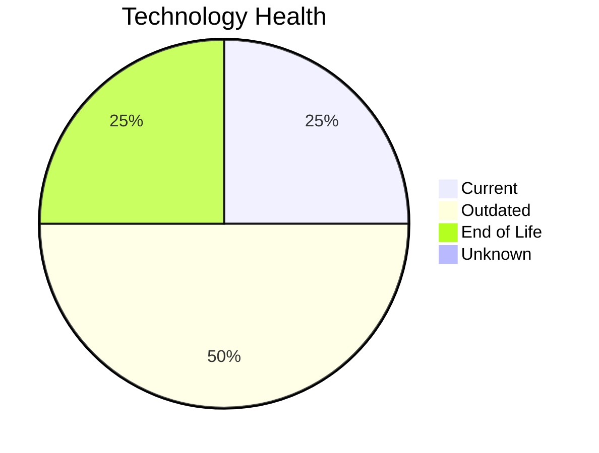

# Application Report: InventoryApp-008

**ID:** app008
**Generated:** 2026-05-14

## Overview

| Attribute | Value |
|-----------|-------|
| Owner | Operations |
| Environment | On-Premise |
| Business Criticality | High |
| Users | 875 |
| Servers | 2 |
| Solution Type | Custom made |
| Architecture | 1-Tier |
| Containerized | No |
| CI/CD | No |

## Technology Stack

| Component | Technology | Version | Status |
|-----------|-----------|---------|--------|
| Os | AIX 6 | 6 | 🔴 EOL |
| Database | SQL Server 2019 | Server 2019 | 🟢 CURRENT_VERSION |
| Programming Language | COBOL-2014 |  | 🟡 OUTDATED |
| Application Server | Oracle Weblogic 8.0 | Weblogic 8.0 | 🟡 OUTDATED |

## Complexity Assessment

**Score:** 6/10 — **MEDIUM**
**Confidence:** 8/10

| Factor | Score | Notes |
|--------|-------|-------|
| Technology Age | 7/10 | 1 EOL, 2 outdated components |
| Integration | 3/10 | 2 external interfaces |
| Infrastructure | 6/10 | 2 server(s), 3 environment(s) |
| Business Criticality | 7/10 | High criticality |
| Architecture | 8/10 | Containerized: No, CI/CD: No |
| Data | 5/10 | DB: SQL Server 2019 |

## Modernization Scenarios

### Applicable Scenarios

#### ✅ Operating System Update

- **Priority:** High
- **Effort:** Low
- **Effects:** security
- **Cost:** €1,157 (one-time)
- **Savings:** €500/year
- **Reasoning:** Operating system AIX 6 has reached End of Life and no longer receives security patches. Immediate OS update required.

#### ✅ Switch to standard Linux Operating System

- **Priority:** Medium
- **Effort:** Medium
- **Effects:** agility, security, cost
- **Cost:** €347 (one-time)
- **Savings:** €400/year
- **Reasoning:** Application runs on proprietary Unix (AIX 6) which lacks container support and is not supported by cloud providers. Migrating to standard Linux would reduce costs and improve cloud readiness.

#### ✅ Applications Server replacement

- **Priority:** Medium
- **Effort:** Medium
- **Effects:** agility, cost
- **Cost:** €11,565 (one-time)
- **Savings:** €10,800/year
- **Reasoning:** Application server Oracle Weblogic 8.0 is outdated. Replacement with a modern alternative will improve security and reduce licensing costs.

#### ✅ Application Migration to Cloud Infrastructure (Lift & Shift)

- **Priority:** High
- **Effort:** Low
- **Effects:** security, agility
- **Cost:** €5,783 (one-time)
- **Savings:** €2,700/year
- **Reasoning:** Application is on-premise. Cloud migration (Lift & Shift) offers improved scalability, security, and compliance benefits.

#### ✅ Application Refactoring and De-coupling

- **Priority:** High
- **Effort:** High
- **Effects:** agility, cost, sustainability
- **Cost:** €289,133 (one-time)
- **Savings:** €135,000/year
- **Reasoning:** Application has monolithic 1-Tier architecture with high coupling. Decoupling into modular services would significantly improve agility and maintainability.

#### ✅ Switch DB Engine to open-source database solution

- **Priority:** High
- **Effort:** Medium
- **Effects:** cost
- **Cost:** €28,913 (one-time)
- **Savings:** €15,000/year
- **Reasoning:** Application uses proprietary database SQL Server 2019. Migration to an open-source alternative would reduce costs.

#### ✅ Update outdated components

- **Priority:** High
- **Effort:** High
- **Effects:** security, agility, cost
- **Cost:** N/A (one-time)
- **Savings:** N/A/year
- **Reasoning:** Application has outdated components: programming language COBOL-2014 is outdatedapplication server Oracle Weblogic 8.0 is outdated. Update recommended.

### Not Applicable / Other

| Scenario | Status | Reason |
|----------|--------|--------|
| Switch to ARM-based CPU | 🚫 BLOCKED | Application runs on proprietary Unix (AIX 6), which is incompatible with ARM migration. |
| Application Containerization | 🚫 BLOCKED | Application runs on proprietary Unix OS (AIX 6), which does not support containerization. |
| Upgrade Legacy Databases | ✔️ FULFILLED | Database SQL Server 2019 is on a current, supported version. No upgrade needed. |

## Financial Summary

| Metric | Value |
|--------|-------|
| Total One-Time Cost | €336,898 |
| Total Yearly Savings | €164,400 |
| Break-Even | 2.0 years |
