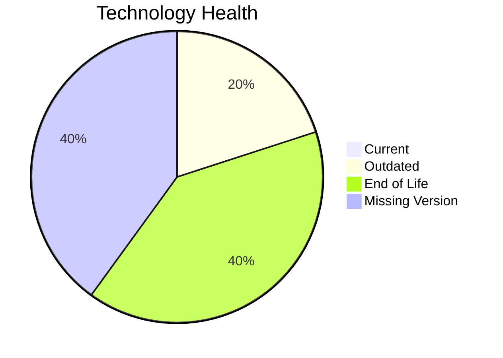

# Application Report: InventoryApp-008

**ID:** app008  
**Generated:** 2026-05-17

## Overview

| Attribute | Value |
|-----------|-------|
| Owner | unknown |
| Environment | On-Premise |
| Business Criticality | High |
| Users | 875 |
| Servers | sv11, sv01 |

## Technology Stack

| Component | Technology | Version | Status |
|-----------|-----------|---------|--------|
| Operating System | AIX 6 | 6 | 🔴 EOL |
| Database | SQL Server 2019 | 2019 | 🟡 OUTDATED |
| Language | COBOL-2014 | 2014 | ⚪ NO_KNOWLEDGE |
| Framework | Unknown Framework | N/A | ⚪ NO_KNOWLEDGE |
| App Server | Oracle Weblogic 8.0 | 8.0 | 🔴 EOL |

## Complexity Assessment

**Score:** 6/10 — **MEDIUM**  
**Confidence:** 8

Tech age 7/10 (EOL=2, outdated=1, unknown=2); integration 3/10 (2 interfaces); infrastructure 5/10 (2 servers, 3 envs); criticality 8/10 (High); architecture 9/10 (arch=1-Tier, containerized=No, ci/cd=No); data 3/10 (1 DB(s), storage≈400GB).

## Modernization Scenarios

### Applicable Scenarios

#### ✅ Operating System Update
- **Priority:** High
- **Effort:** Low
- **Effects:** security
- **Cost:** €1157 (one-time)
- **Savings:** €500/year
- **Reasoning:** Operating system is outdated/EOL in technology assessment.

#### ✅ Switch to standard Linux Operating System
- **Priority:** Medium
- **Effort:** Medium
- **Effects:** agility, security, cost
- **Cost:** €347 (one-time)
- **Savings:** €400/year
- **Reasoning:** Application runs on proprietary/non-standard Unix OS.

#### ✅ Applications Server replacement
- **Priority:** Medium
- **Effort:** Medium
- **Effects:** agility, cost
- **Cost:** €11565 (one-time)
- **Savings:** €10800/year
- **Reasoning:** Application server identified as legacy/EOL.

#### ✅ Application Migration to Cloud Infrastructure (Lift & Shift)
- **Priority:** High
- **Effort:** Low
- **Effects:** security, agility
- **Cost:** €5783 (one-time)
- **Savings:** €2700/year
- **Reasoning:** Application remains on-premise and is candidate for lift-and-shift.

#### ✅ Application Refactoring and De-coupling
- **Priority:** High
- **Effort:** High
- **Effects:** agility, cost, sustainability
- **Cost:** €289133 (one-time)
- **Savings:** €135000/year
- **Reasoning:** High coupling/complexity indicates refactoring and decoupling potential.

#### ✅ Upgrade Legacy Databases
- **Priority:** High
- **Effort:** Medium
- **Effects:** security, agility
- **Cost:** €11565 (one-time)
- **Savings:** €10000/year
- **Reasoning:** Database platform is legacy/outdated per lifecycle assessment.

#### ✅ Switch DB Engine to open-source database solution
- **Priority:** High
- **Effort:** Medium
- **Effects:** cost
- **Cost:** €N/A (one-time)
- **Savings:** €N/A/year
- **Reasoning:** Commercial database engine detected; open-source switch may reduce licensing.

#### ✅ Update outdated components
- **Priority:** High
- **Effort:** High
- **Effects:** security, agility, cost
- **Cost:** €N/A (one-time)
- **Savings:** €N/A/year
- **Reasoning:** Technology assessment found outdated/EOL components.

### Not Applicable / Other

| Scenario | Status | Reason |
|----------|--------|--------|
| Switch to ARM-based CPU | BLOCKED | Legacy/proprietary dependencies suggest ARM migration constraints. |
| Application Containerization | LACK_OF_DATA | Containerization readiness data insufficient. |

## Financial Summary

| Metric | Value |
|--------|-------|
| Total One-Time Cost | €319550 |
| Total Yearly Savings | €159400 |
| Break-Even | 2.0 years |
