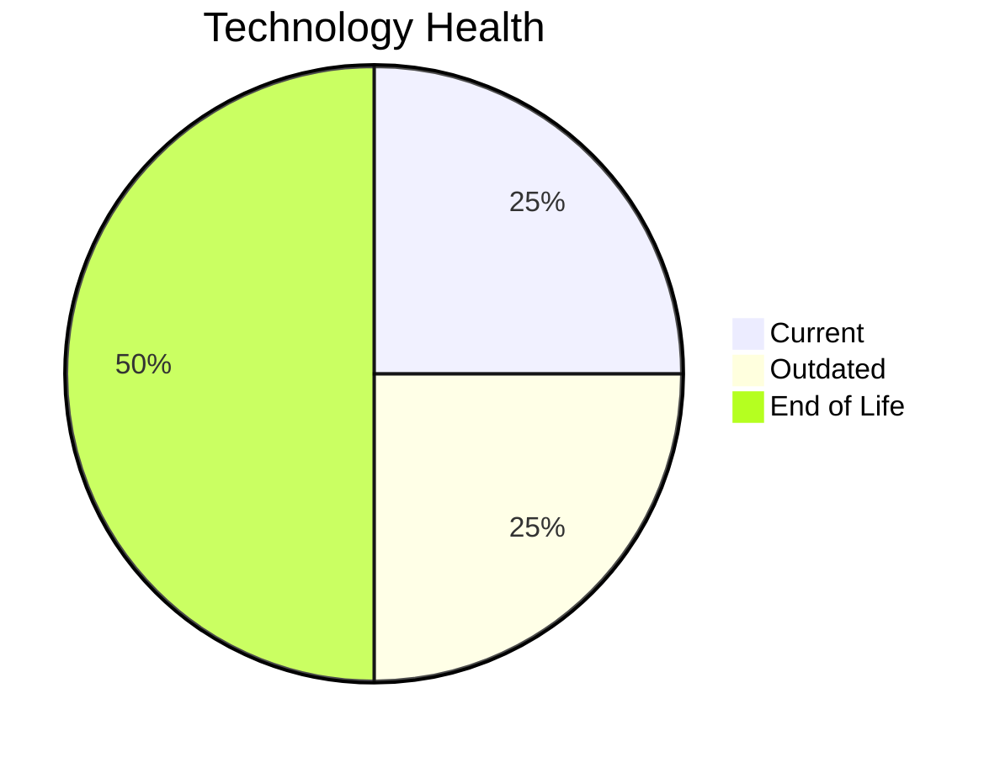

# Application Report: InventoryApp-008

**ID:** app008  
**Generated:** 2026-05-05

## Overview

| Attribute | Value |
|-----------|-------|
| Business Unit | Operations |
| Deployment Type | On-Premise |
| Business Criticality | High |
| Users | 875 |
| Servers | sv11, sv01 |
| Environments | 3 |
| Architecture | 1-Tier |
| Containerized | No |
| CI/CD | No |
| Solution Type | Custom made |
| Data Classification | Confidential |

> Legacy inventory management system controlling warehouse stock levels and material movements

## Technology Stack

| Component | Technology | Version | Status |
|-----------|-----------|---------|--------|
| Os | AIX | 6 | 🔴 EOL |
| Database | SQL Server | 2019 | 🟢 CURRENT_VERSION |
| Language | COBOL | 2014 | 🟡 OUTDATED |
| Application Server | Oracle WebLogic | 8.0 | 🔴 EOL |

## Complexity Assessment

**Score:** 6/10 — **MEDIUM**  
**Confidence:** 7

> Score 6/10 (MEDIUM). EOL components: 2, Outdated: 1. External interfaces: 2. Servers: 2. Criticality: High. Architecture: 1-Tier. DB storage: 400.0GB.

| Factor | Value |
|--------|-------|
| Servers | 2 |
| Environments | 3 |
| External Interfaces | 2 |
| Business Criticality | High |
| EOL Technologies | 2 |
| Outdated Technologies | 1 |
| CI/CD | No |
| Containerized | No |

## Modernization Scenarios

### ✅ Applicable Scenarios

#### ✅ Operating System Update

- **Priority:** High
- **Effort:** Low
- **One-Time Cost:** €1,157
- **Yearly Savings:** €500
- **Reasoning:** OS AIX 6 is EOL. IBM AIX 6.1 reached End of Support on April 30, 2015. No security patches available. OS update is required.

#### ✅ Switch to Standard Linux OS

- **Priority:** Medium
- **Effort:** Medium
- **One-Time Cost:** €347
- **Yearly Savings:** €400
- **Reasoning:** OS is a proprietary non-standard Unix system (AIX 6). Migration to standard Linux (RHEL/Ubuntu) would improve cloud compatibility and reduce licensing costs.

#### ✅ Application Server Replacement

- **Priority:** Medium
- **Effort:** Medium
- **One-Time Cost:** €11,565
- **Yearly Savings:** €10,800
- **Reasoning:** Application server Oracle WebLogic 8.0 is EOL. Oracle WebLogic 8.1 reached End of Extended Support in December 2008. Extremely outdated. Replacement with a modern server is recommended.

#### ✅ Application Refactoring and De-coupling

- **Priority:** High
- **Effort:** High
- **One-Time Cost:** €289,133
- **Yearly Savings:** €135,000
- **Reasoning:** Application has a 1-tier architecture with limited modularity. Refactoring and decoupling would improve maintainability and cloud-readiness.

#### ✅ Switch DB Engine to Open-Source

- **Priority:** High
- **Effort:** Medium
- **Reasoning:** Application uses SQL Server (SQL Server 2019), a proprietary Microsoft database. Migration to PostgreSQL would reduce licensing costs.

#### ✅ Update Outdated Components

- **Priority:** High
- **Effort:** High
- **Reasoning:** Outdated/EOL application components detected: COBOL 2014 (OUTDATED), Oracle WebLogic 8.0 (EOL). These should be updated to current supported versions.

### Other Scenarios

| Scenario | Status | Reason |
|----------|--------|--------|
| Switch to ARM-based CPU | ❌ NOT_APPLICABLE | Application runs on proprietary Unix OS (AIX/HP-UX/Solaris) which is excluded from ARM migration. |
| Application Migration to Cloud (Lift & Shift) | 🔶 PARTIALLY_FULFILLED | Application is on-premise with a legacy/monolithic architecture (1-tier). Lift & Shift is possible but refactoring may b... |
| Application Containerization | ❌ NOT_APPLICABLE | Application uses a proprietary legacy Unix OS (AIX/Solaris) which is excluded from containerization. |
| Upgrade Legacy Databases | ✔️ FULFILLED | Database SQL Server 2019 is on a current supported version. |

## Financial Summary

| Metric | Value |
|--------|-------|
| Total One-Time Cost | €302,202 |
| Total Yearly Savings | €146,700 |
| Break-Even | 2.1 years |
