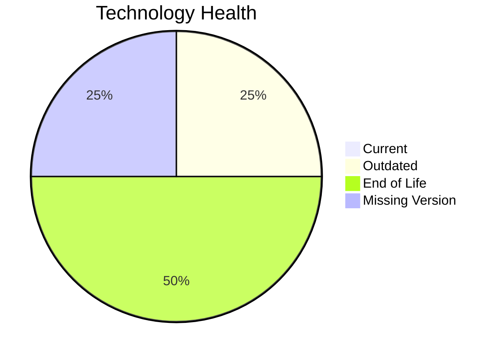

# Application Report: InventoryApp-008

Modernization assessment for InventoryApp-008 based solely on the Excel portfolio row and derived workflow outputs.

**ID:** app008  
**Generated:** 2026-05-07

## Overview

| Attribute | Value |
|-----------|-------|
| Owner | Operations |
| Environment | On-Premise |
| Business Criticality | High |
| Users | 875 |
| Servers | sv11, sv01 |

## Technology Stack

| Component | Technology | Version | Status |
|-----------|-----------|---------|--------|
| Operating System | AIX | 6 | 🔴 |
| Database | SQL Server | 2019 | 🟡 |
| Language | COBOL | 2014 | ⚪ |
| Framework | N/A | N/A | ⚪ |
| App Server | Oracle WebLogic | 8.0 | 🔴 |

## Complexity Assessment

**Score:** 7/10 — **HIGH**  
**Confidence:** 7

| Factor | Score | Notes |
|--------|-------|-------|
| Technology Age | 9/10 | 2 EOL, 1 outdated, 1 unknown lifecycle components. |
| Integration | 2/10 | 2 external interfaces and 0 API endpoints indicate the integration footprint. |
| Infrastructure | 5/10 | 2 listed server instances and 3 environments drive infrastructure coordination. |
| Business Criticality | 8/10 | Business criticality is High with approximately 875 users. |
| Architecture | 10/10 | 1-tier architecture suggests a tightly coupled legacy design; application is not containerized; CI/CD is not present; application stack contains EOL runtime components |
| Data | 6/10 | database storage is 400 GB; moderate database footprint; proprietary or enterprise database migration complexity |

## Modernization Scenarios

### Applicable Scenarios

#### ✅ Operating System Update

- **Priority:** High
- **Effort:** Low
- **Effects:** security
- **Cost:** €1330 (one-time)
- **Savings:** €500/year
- **Reasoning:** Operating system AIX 6 is eol and matches the OS update trigger.

#### ✅ Switch to standard Linux Operating System

- **Priority:** Medium
- **Effort:** Medium
- **Effects:** agility, security, cost
- **Cost:** €399 (one-time)
- **Savings:** €400/year
- **Reasoning:** The application runs on proprietary Unix, which is a direct trigger for standard Linux migration.

#### ✅ Applications Server replacement

- **Priority:** Medium
- **Effort:** Medium
- **Effects:** agility, cost
- **Cost:** €13300 (one-time)
- **Savings:** €9600/year
- **Reasoning:** Application server Oracle Weblogic 8.0 is eol.

#### ✅ Application Migration to Cloud Infrastructure (Lift & Shift)

- **Priority:** High
- **Effort:** Low
- **Effects:** security, agility
- **Cost:** €6650 (one-time)
- **Savings:** €2400/year
- **Reasoning:** The application is still on-premise and matches the lift-and-shift trigger.

#### ✅ Application Refactoring and De-coupling

- **Priority:** High
- **Effort:** High
- **Effects:** agility, cost, sustainability
- **Cost:** €332502 (one-time)
- **Savings:** €120000/year
- **Reasoning:** Architecture and complexity indicators suggest a refactoring/de-coupling opportunity.

#### ✅ Upgrade Legacy Databases

- **Priority:** High
- **Effort:** Medium
- **Effects:** security, agility
- **Cost:** €13300 (one-time)
- **Savings:** €10000/year
- **Reasoning:** Database platform SQL Server 2019 is outdated.

#### ✅ Switch DB Engine to open-source database solution

- **Priority:** High
- **Effort:** Medium
- **Effects:** cost
- **Cost:** N/A (one-time)
- **Savings:** N/A/year
- **Reasoning:** Database engine SQL Server 2019 is proprietary and matches the open-source migration trigger.

#### ✅ Update outdated components

- **Priority:** High
- **Effort:** High
- **Effects:** security, agility, cost
- **Cost:** N/A (one-time)
- **Savings:** N/A/year
- **Reasoning:** At least one language/framework/application-server component is outdated or end of life.

### Not Applicable / Other

| Scenario | Status | Reason |
|----------|--------|--------|
| Switch to ARM-based CPU | LACK_OF_DATA | CPU architecture is not present in the Excel input, so the primary ARM migration trigger cannot be confirmed. |
| Application Containerization | BLOCKED | The application runs on legacy AIX, which is a poor fit for straightforward containerization. |

## Financial Summary

| Metric | Value |
|--------|-------|
| Total One-Time Cost | €367481 |
| Total Yearly Savings | €142900 |
| Break-Even | 2.6 years |
