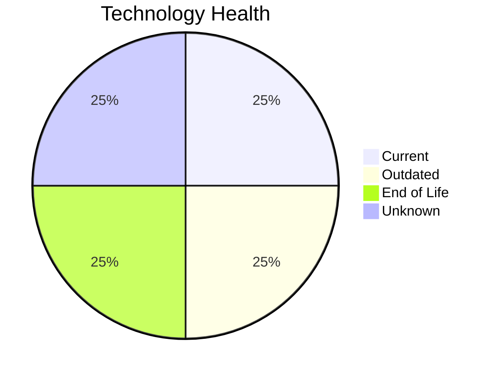

# Application Report: InventoryApp-008

**ID:** app008  
**Generated:** 2026-05-06

## Overview

| Attribute | Value |
|-----------|-------|
| Business Unit | Operations |
| Deployment | On-Premise |
| Business Criticality | High |
| Users | 875 |
| Servers | 2 |
| Architecture | 1-Tier |
| Containerized | No |
| CI/CD | No |

## Technology Stack

| Component | Technology | Status |
|-----------|-----------|--------|
| Operating System | AIX 6 | 🔴 EOL |
| Database | SQL Server 2019 | 🟢 CURRENT_VERSION |
| Language | COBOL-2014 | 🟡 OUTDATED |
| App Server | Oracle Weblogic 8.0 | ⚪ NO_KNOWLEDGE |

## Complexity Assessment

**Score:** 7/10 — **HIGH**  
**Confidence:** 8/10

> Complexity score 7/10 (HIGH). 1 EOL component(s), 1 outdated component(s), High business criticality.

| Factor | Score |
|--------|-------|
| Technology Age & EOL | 8/10 |
| Integration Complexity | 3/10 |
| Infrastructure Scale | 6/10 |
| Business Criticality | 9/10 |
| Code & Architecture | 10/10 |
| Data Complexity | 4/10 |

## Modernization Scenarios

### Applicable Scenarios

#### ✅ Operating System Update

- **Priority:** High
- **Effort:** Low
- **Effects:** security
- **Cost:** €1,330 (one-time)
- **Savings:** €500/year
- **Reasoning:** OS (AIX 6) is EOL; update to a current, supported version.

#### ✅ Switch to standard Linux Operating System

- **Priority:** Medium
- **Effort:** Medium
- **Effects:** agility, security, cost
- **Cost:** €399 (one-time)
- **Savings:** €400/year
- **Reasoning:** OS (AIX 6) is proprietary/commercial; consider migrating to standard Linux.

#### ✅ Application Migration to Cloud Infrastructure (Lift & Shift)

- **Priority:** High
- **Effort:** Low
- **Effects:** security, agility
- **Cost:** €6,650 (one-time)
- **Savings:** €2,400/year
- **Reasoning:** Application is on-premise; cloud migration could reduce infrastructure costs.

#### ✅ Application Containerization

- **Priority:** High
- **Effort:** High
- **Effects:** agility, cost, sustainability
- **Cost:** €133,001 (one-time)
- **Savings:** €80,000/year
- **Reasoning:** Application is not containerized; containerization could improve portability and deployment efficiency.

#### ✅ Application Refactoring and De-coupling

- **Priority:** High
- **Effort:** High
- **Effects:** agility, cost, sustainability
- **Cost:** €332,502 (one-time)
- **Savings:** €120,000/year
- **Reasoning:** Architecture is 1-Tier; refactoring to microservices could improve maintainability.

#### ✅ Switch DB Engine to open-source database solution

- **Priority:** High
- **Effort:** Medium
- **Effects:** cost
- **Cost:** N/A (one-time)
- **Savings:** N/A
- **Reasoning:** SQL Server requires Microsoft licensing; migration to PostgreSQL is possible.

#### ✅ Update outdated components

- **Priority:** High
- **Effort:** High
- **Effects:** security, agility, cost
- **Cost:** N/A (one-time)
- **Savings:** N/A
- **Reasoning:** Components need updating. EOL: AIX 6; Outdated: COBOL-2014.

### Other Scenarios

| Scenario | Status | Reason |
|----------|--------|--------|
| Switch to ARM-based CPU | LACK_OF_DATA | CPU architecture not documented in application data. |
| Applications Server replacement | LACK_OF_DATA | Application server lifecycle status unknown. |
| Upgrade Legacy Databases | FULFILLED | Database (SQL Server 2019) is on a current, supported version. |

## Financial Summary

| Metric | Value |
|--------|-------|
| Total One-Time Investment | €473,882 |
| Total Annual Savings | €203,300 |
| Break-Even | 2.3 years |
