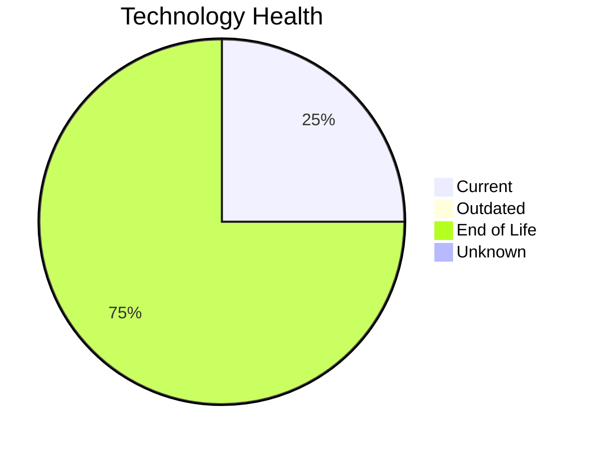

# Application Report: InventoryApp-008

**ID:** app008  
**Generated:** 2026-05-15

## Overview

| Attribute | Value |
|-----------|-------|
| Business Unit | Operations |
| Deployment | On-Premise |
| Business Criticality | High |
| Users | 875 |
| Solution Type | Custom made |
| Architecture | 1-Tier |
| Containerized | No |
| CI/CD | No |
| External Interfaces | 2 |

## Technology Stack

| Component | Technology | Status |
|-----------|-----------|--------|
| Operating System | AIX 6 | 🔴 EOL |
| Database | SQL Server 2019 | 🟢 Current |
| Language | COBOL-2014 | 🔴 EOL |
| App Server | Oracle Weblogic 8.0 | 🔴 EOL |

## Complexity Assessment

**Score:** 7/10 — **HIGH**  
**Confidence:** 8

| Factor | Score | Notes |
|--------|-------|-------|
| Technology Age | 9/10 | 3 EOL and 0 outdated components out of 4 — severe technical debt |
| Integration | 4/10 | 2 external interfaces — some integrations |
| Infrastructure | 5/10 | 2 server instances, 3 environments |
| Business Criticality | 9/10 | Business criticality: high, 875 users |
| Architecture | 10/10 | monolithic 1-tier architecture; not containerized; no CI/CD; legacy language: cobol-2014 |
| Data | 3/10 | Standard data complexity |

## Modernization Scenarios

### Applicable Scenarios

#### ✅ Operating System Update

- **Priority:** High
- **Effort:** Low
- **Effects:** security
- **One-time Cost:** €1,330
- **Yearly Savings:** €500/year
- **Reasoning:** OS 'AIX 6' has reached EOL — critical security risk. Immediate OS update required.

#### ✅ Switch to standard Linux Operating System

- **Priority:** Medium
- **Effort:** Medium
- **Effects:** agility, security, cost
- **One-time Cost:** €399
- **Yearly Savings:** €400/year
- **Reasoning:** OS 'AIX 6' is a proprietary non-standard OS (AIX/HP-UX). Standardization on Linux reduces licensing costs and improves maintainability.

#### ✅ Applications Server replacement

- **Priority:** Medium
- **Effort:** Medium
- **Effects:** agility, cost
- **One-time Cost:** €13,300
- **Yearly Savings:** €9,600/year
- **Reasoning:** Application server 'Oracle Weblogic 8.0' has reached EOL. Replacement is needed to maintain security and support.

#### ✅ Application Migration to Cloud Infrastructure (Lift & Shift)

- **Priority:** High
- **Effort:** Low
- **Effects:** security, agility
- **One-time Cost:** €6,650
- **Yearly Savings:** €2,400/year
- **Reasoning:** Application is fully on-premise. Migration to cloud (Lift & Shift) can reduce infrastructure costs and improve agility.

#### ✅ Application Refactoring and De-coupling

- **Priority:** High
- **Effort:** High
- **Effects:** agility, cost, sustainability
- **One-time Cost:** €332,502
- **Yearly Savings:** €120,000/year
- **Reasoning:** Monolithic architecture with no modern decomposition. Refactoring into services would improve maintainability and scalability.

#### ✅ Switch DB Engine to open-source database solution

- **Priority:** High
- **Effort:** Medium
- **Effects:** cost
- **One-time Cost:** N/A
- **Yearly Savings:** N/A
- **Reasoning:** Microsoft SQL Server has licensing costs. Migrating to PostgreSQL or MySQL is a cost-saving option.

#### ✅ Update outdated components

- **Priority:** High
- **Effort:** High
- **Effects:** security, agility, cost
- **One-time Cost:** N/A
- **Yearly Savings:** N/A
- **Reasoning:** Multiple EOL/outdated components detected (3 EOL, 0 outdated). Systematic update program needed.

### Other Scenarios

| Scenario | Status | Reason |
|----------|--------|--------|
| Switch to ARM-based CPU | ❓ No Data | On-premise application. CPU architecture not specified in available data. |
| Application Containerization | 🚫 Blocked | Legacy language (COBOL-2014) makes containerization technically very challenging... |
| Upgrade Legacy Databases | ✔️ Fulfilled | Database 'SQL Server 2019' is on a current, supported version. |

## Business Case Summary

| Metric | Value |
|--------|-------|
| Total One-time Cost | €354,181 |
| Total Yearly Savings | €132,900 |
| ROI Break-even | 2.7 years |
