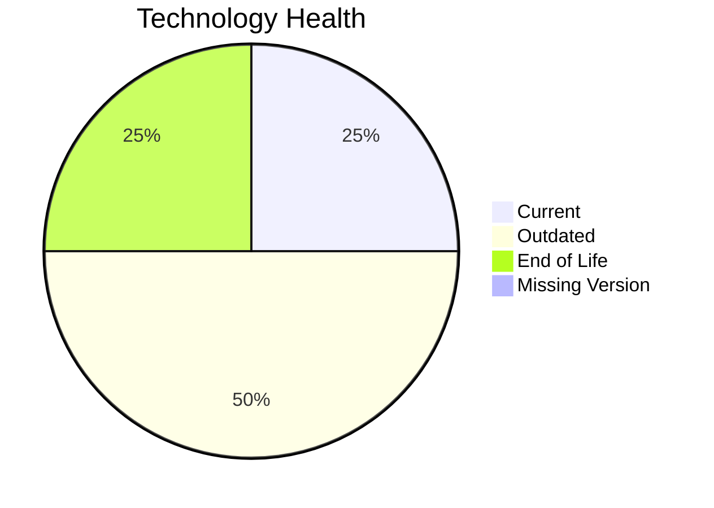

# Application Report: PayrollApp-010

**ID:** app010
**Generated:** 2026-05-18T00:00:00Z

## Overview

| Attribute | Value |
|-----------|-------|
| Owner | HR |
| Environment | AWS |
| Business Criticality | Medium |
| Users | 315 |
| Servers | 1 |

## Technology Stack

| Component | Technology | Version | Status |
|-----------|-----------|---------|--------|
| Operating System | Windows Server | 2019 | 🟡 OUTDATED |
| Database | MySQL | 8.0 | 🟡 OUTDATED |
| Language | Ruby | 2.7 | 🔴 EOL |
| Framework | N/A | N/A | ⚪ N/A |
| App Server | Microsoft IIS | 10.0 | 🟢 CURRENT_VERSION |

## Complexity Assessment

**Score:** 5/10 — **MEDIUM**
**Confidence:** 8

| Factor | Score | Notes |
|--------|-------|-------|
| Technology Age | 7/10 | 1 component(s) are EOL. |
| Integration | 5/10 | 4 external interfaces and 3 API endpoints. |
| Infrastructure | 2/10 | 1 server instance(s) across 1 environment(s). |
| Business Criticality | 5/10 | Criticality is Medium with 315 users. |
| Architecture | 5/10 | Architecture is unknown; containerized=No; CI/CD=Yes. |
| Data | 5/10 | Database storage is 250 GB on MySQL 8.0.  |

## Modernization Scenarios

### Applicable Scenarios

#### ✅ Operating System Update

- **Priority:** High
- **Effort:** Low
- **Effects:** security
- **Cost:** €1,006 (one-time)
- **Savings:** €500/year
- **Reasoning:** Windows Server 2019 is assessed as OUTDATED.

#### ✅ Upgrade Legacy Databases

- **Priority:** High
- **Effort:** Medium
- **Effects:** security, agility
- **Cost:** €10,057 (one-time)
- **Savings:** €10,000/year
- **Reasoning:** MySQL 8.0 is assessed as OUTDATED.

### Not Applicable / Other

| Scenario | Status | Reason |
|----------|--------|--------|
| Switch to standard Linux Operating System | NOT_APPLICABLE | The application already runs on Windows Server, so this Linux migration scenario is not a natural fit. |
| Switch to ARM-based CPU | BLOCKED | The application is identified as 3rd party software, so ARM compatibility cannot be assumed or forced by the customer. |
| Applications Server replacement | BLOCKED | The application is 3rd party software, making application-server changes likely vendor constrained. |
| Application Migration to Cloud Infrastructure (Lift & Shift) | FULFILLED | The deployment target is already a public cloud platform (AWS). |
| Application Containerization | BLOCKED | The application is 3rd party software and no vendor container support is documented. |
| Application Refactoring and De-coupling | BLOCKED | The application is 3rd party software, so its internal architecture is not under customer control. |
| Switch DB Engine to open-source database solution | BLOCKED | The application is 3rd party software, so database-engine changes are likely outside customer control. |
| Update outdated components | BLOCKED | The application is 3rd party software, so runtime/component upgrades are vendor managed. |

## Financial Summary

| Metric | Value |
|--------|-------|
| Total One-Time Cost | €11,063 |
| Total Yearly Savings | €10,500 |
| Break-Even | 1.1 years |
