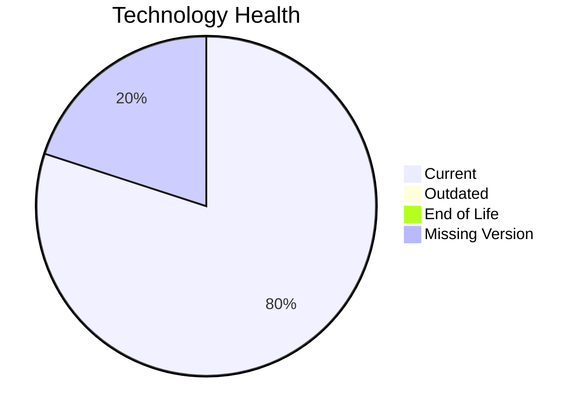

# Application Report: PayrollApp-010

**ID:** app010
**Generated:** 2026-05-14

## Overview

| Attribute | Value |
|-----------|-------|
| Owner | HR |
| Environment | AWS |
| Business Criticality | Medium |
| Users | 315 |
| Servers | sv13 |

## Technology Stack

| Component | Technology | Status |
|-----------|-----------|--------|
| Operating System | Windows Server 2019 | �� |
| Database | MySQL 8.0 | 🟡 |
| Language | Ruby 2.7 | 🟢 |

## Complexity Assessment

**Score:** 4/10 — **MEDIUM**

## Modernization Scenarios

### ✅ Switch To Arm Cpu
- **Reasoning:** Cloud-hosted workload with manageable complexity is a candidate for ARM.

### ✅ App Containerization
- **Reasoning:** Application is not containerized and can benefit from platform standardization.

### ✅ Upgrade Legacy Databases
- **Reasoning:** Database platform is aging and should be upgraded.

## Financial Summary

| Metric | Value |
|--------|-------|
| Total One-Time Cost | €100568 |
| Total Yearly Savings | €99900 |
| Break-Even | 1.0 years |
