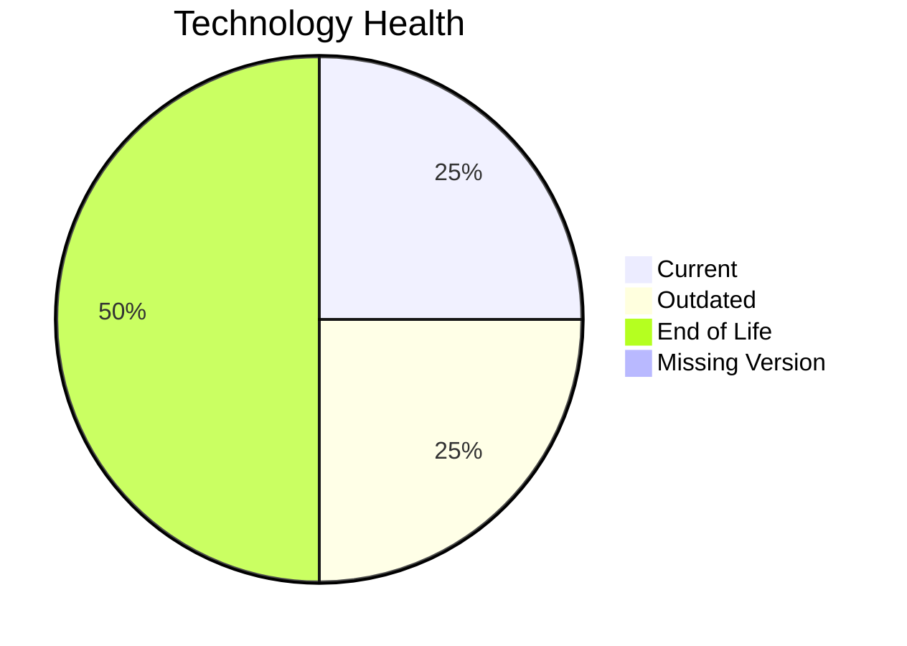

# Application Report: RouteOptApp-011

Modernization assessment for RouteOptApp-011 based solely on the Excel portfolio row and derived workflow outputs.

**ID:** app011  
**Generated:** 2026-05-07

## Overview

| Attribute | Value |
|-----------|-------|
| Owner | R&D |
| Environment | AWS |
| Business Criticality | Medium |
| Users | 125 |
| Servers | sv14 |

## Technology Stack

| Component | Technology | Version | Status |
|-----------|-----------|---------|--------|
| Operating System | CentOS | 7 | 🔴 |
| Database | PostgreSQL | 14 | 🟡 |
| Language | Python | 3.11 | 🟢 |
| Framework | N/A | N/A | ⚪ |
| App Server | GlassFish | 4.0 | 🔴 |

## Complexity Assessment

**Score:** 6/10 — **MEDIUM**  
**Confidence:** 8

| Factor | Score | Notes |
|--------|-------|-------|
| Technology Age | 9/10 | 2 EOL, 1 outdated, 0 unknown lifecycle components. |
| Integration | 5/10 | 5 external interfaces and 12 API endpoints indicate the integration footprint. |
| Infrastructure | 2/10 | 1 listed server instances and 1 environments drive infrastructure coordination. |
| Business Criticality | 5/10 | Business criticality is Medium with approximately 125 users. |
| Architecture | 8/10 | 3-tier architecture is more modular than 1-tier or 2-tier; application stack contains EOL runtime components |
| Data | 3/10 | database storage is 180 GB |

## Modernization Scenarios

### Applicable Scenarios

#### ✅ Operating System Update

- **Priority:** High
- **Effort:** Low
- **Effects:** security
- **Cost:** €1157 (one-time)
- **Savings:** €500/year
- **Reasoning:** Operating system CentOS 7 is eol and matches the OS update trigger.

#### ✅ Applications Server replacement

- **Priority:** Medium
- **Effort:** Medium
- **Effects:** agility, cost
- **Cost:** €11565 (one-time)
- **Savings:** €10800/year
- **Reasoning:** Application server Glassfish 4.0 is eol.

#### ✅ Upgrade Legacy Databases

- **Priority:** High
- **Effort:** Medium
- **Effects:** security, agility
- **Cost:** €11565 (one-time)
- **Savings:** €10000/year
- **Reasoning:** Database platform PostgreSQL 14 is outdated.

#### ✅ Update outdated components

- **Priority:** High
- **Effort:** High
- **Effects:** security, agility, cost
- **Cost:** N/A (one-time)
- **Savings:** N/A/year
- **Reasoning:** At least one language/framework/application-server component is outdated or end of life.

### Not Applicable / Other

| Scenario | Status | Reason |
|----------|--------|--------|
| Switch to standard Linux Operating System | PARTIALLY_FULFILLED | The application already runs on Linux, but the distribution/version is not current and still needs standardization or upgrade. |
| Switch to ARM-based CPU | LACK_OF_DATA | CPU architecture is not present in the Excel input, so the primary ARM migration trigger cannot be confirmed. |
| Application Migration to Cloud Infrastructure (Lift & Shift) | FULFILLED | The application is already hosted on AWS, which fulfills the lift-and-shift cloud target. |
| Application Containerization | FULFILLED | The application is already containerized. |
| Application Refactoring and De-coupling | PARTIALLY_FULFILLED | The application already shows some modular traits, but the source does not prove a fully decoupled architecture. |
| Switch DB Engine to open-source database solution | FULFILLED | Database engine PostgreSQL 14 is already open-source aligned. |

## Financial Summary

| Metric | Value |
|--------|-------|
| Total One-Time Cost | €24287 |
| Total Yearly Savings | €21300 |
| Break-Even | 1.1 years |
