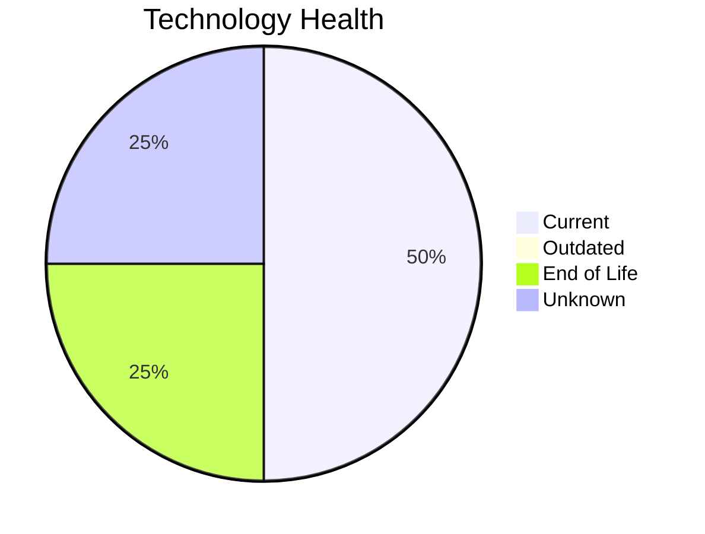

# Application Report: RouteOptApp-011

**ID:** app011  
**Generated:** 2026-05-06

## Overview

| Attribute | Value |
|-----------|-------|
| Business Unit | R&D |
| Deployment | AWS |
| Business Criticality | Medium |
| Users | 125 |
| Servers | sv14 |
| Architecture | 3-Tier |
| Containerized | Yes |
| CI/CD | Yes |

## Technology Stack

| Component | Technology | Status |
|-----------|-----------|--------|
| Operating System | CentOS 7 | 🔴 EOL |
| Database | PostgreSQL 14 | 🟢 CURRENT_VERSION |
| Language | Python 3.11 | 🟢 CURRENT_VERSION |
| App Server | Glassfish 4.0 | ⚪ NO_KNOWLEDGE |

## Complexity Assessment

**Score:** 4/10 — **MEDIUM**  
**Confidence:** 8/10

> Complexity score 4/10 (MEDIUM). 1 EOL component(s).

| Factor | Score |
|--------|-------|
| Technology Age & EOL | 7/10 |
| Integration Complexity | 5/10 |
| Infrastructure Scale | 2/10 |
| Business Criticality | 5/10 |
| Code & Architecture | 2/10 |
| Data Complexity | 4/10 |

## Modernization Scenarios

### Applicable Scenarios

#### ✅ Operating System Update

- **Priority:** High
- **Effort:** Low
- **Effects:** security
- **Cost:** €875 (one-time)
- **Savings:** €500/year
- **Reasoning:** OS (CentOS 7) is EOL; update to a current, supported version.

#### ✅ Update outdated components

- **Priority:** High
- **Effort:** High
- **Effects:** security, agility, cost
- **Cost:** N/A (one-time)
- **Savings:** N/A
- **Reasoning:** Components need updating. EOL: CentOS 7.

### Other Scenarios

| Scenario | Status | Reason |
|----------|--------|--------|
| Switch to standard Linux Operating System | FULFILLED | Application runs on standard Linux (CentOS 7). |
| Switch to ARM-based CPU | LACK_OF_DATA | CPU architecture not documented in application data. |
| Applications Server replacement | LACK_OF_DATA | Application server lifecycle status unknown. |
| Application Migration to Cloud Infrastructure (Lift & Shift) | FULFILLED | Application is already deployed on cloud (AWS). |
| Application Containerization | FULFILLED | Application is already containerized. |
| Application Refactoring and De-coupling | PARTIALLY_FULFILLED | 3-tier architecture has some separation; further decoupling into microservices i... |
| Upgrade Legacy Databases | FULFILLED | Database (PostgreSQL 14) is on a current, supported version. |
| Switch DB Engine to open-source database solution | FULFILLED | Database (PostgreSQL 14) is already open-source or compatible. |

## Financial Summary

| Metric | Value |
|--------|-------|
| Total One-Time Investment | €875 |
| Total Annual Savings | €500 |
| Break-Even | 1.8 years |
