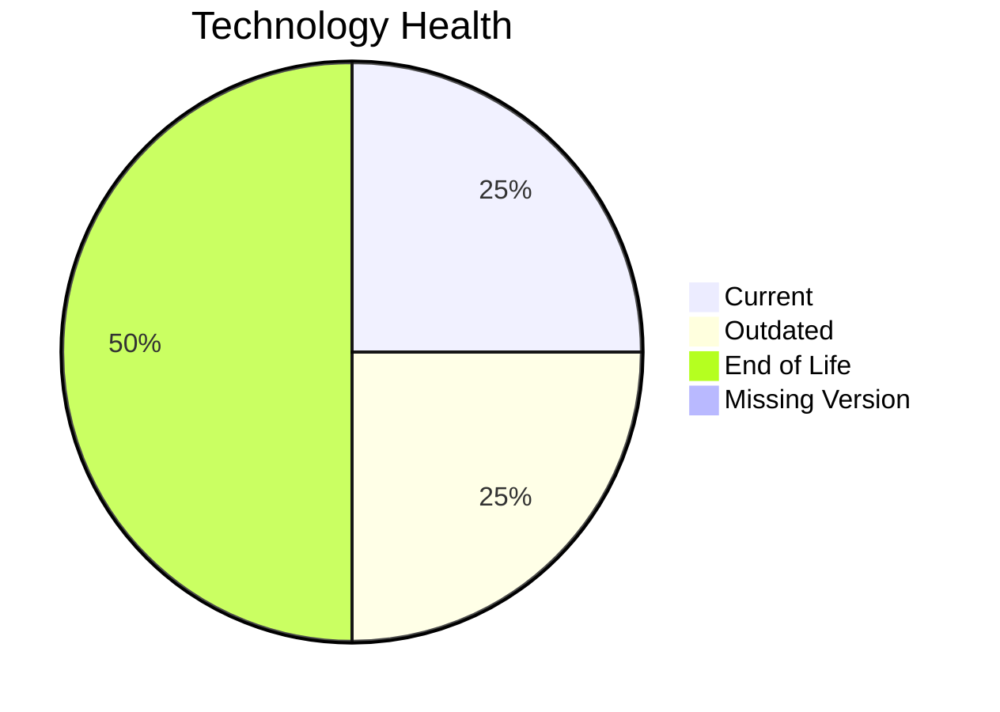

# Application Report: RouteOptApp-011

**ID:** app011
**Generated:** 2026-05-18T00:00:00Z

## Overview

| Attribute | Value |
|-----------|-------|
| Owner | R&D |
| Environment | AWS |
| Business Criticality | Medium |
| Users | 125 |
| Servers | 1 |

## Technology Stack

| Component | Technology | Version | Status |
|-----------|-----------|---------|--------|
| Operating System | CentOS | 7 | 🔴 EOL |
| Database | PostgreSQL | 14 | 🟡 OUTDATED |
| Language | Python | 3.11 | 🟢 CURRENT_VERSION |
| Framework | N/A | N/A | ⚪ N/A |
| App Server | GlassFish | 4.x | 🔴 EOL |

## Complexity Assessment

**Score:** 5/10 — **MEDIUM**
**Confidence:** 8

| Factor | Score | Notes |
|--------|-------|-------|
| Technology Age | 8/10 | 2 component(s) are EOL. |
| Integration | 5/10 | 5 external interfaces and 12 API endpoints. |
| Infrastructure | 2/10 | 1 server instance(s) across 1 environment(s). |
| Business Criticality | 5/10 | Criticality is Medium with 125 users. |
| Architecture | 2/10 | Architecture is 3-Tier; containerized=Yes; CI/CD=Yes. |
| Data | 3/10 | Database storage is 180 GB on PostgreSQL 14.  |

## Modernization Scenarios

### Applicable Scenarios

#### ✅ Operating System Update

- **Priority:** High
- **Effort:** Low
- **Effects:** security
- **Cost:** €1,006 (one-time)
- **Savings:** €500/year
- **Reasoning:** CentOS 7 is assessed as EOL.

#### ✅ Applications Server replacement

- **Priority:** Medium
- **Effort:** Medium
- **Effects:** agility, cost
- **Cost:** €10,057 (one-time)
- **Savings:** €10,800/year
- **Reasoning:** Glassfish 4.0 is assessed as EOL, which directly triggers server replacement.

#### ✅ Upgrade Legacy Databases

- **Priority:** High
- **Effort:** Medium
- **Effects:** security, agility
- **Cost:** €10,057 (one-time)
- **Savings:** €10,000/year
- **Reasoning:** PostgreSQL 14 is assessed as OUTDATED.

#### ✅ Update outdated components

- **Priority:** High
- **Effort:** High
- **Effects:** security, agility, cost
- **Cost:** €N/A (one-time)
- **Savings:** €N/A/year
- **Reasoning:** At least one application runtime component is outdated or end of life.

### Not Applicable / Other

| Scenario | Status | Reason |
|----------|--------|--------|
| Switch to standard Linux Operating System | PARTIALLY_FULFILLED | The application already runs on Linux, but the current distribution/version is outdated or unsupported. |
| Switch to ARM-based CPU | LACK_OF_DATA | CPU architecture is not documented in the workbook, so ARM suitability cannot be confirmed. |
| Application Migration to Cloud Infrastructure (Lift & Shift) | FULFILLED | The deployment target is already a public cloud platform (AWS). |
| Application Containerization | FULFILLED | The workbook already marks the application as containerized. |
| Application Refactoring and De-coupling | PARTIALLY_FULFILLED | The application already shows some modular characteristics, but there is not enough evidence of true microservice decoupling. |
| Switch DB Engine to open-source database solution | FULFILLED | PostgreSQL 14 is already an open-source or open-source-compatible database option. |

## Financial Summary

| Metric | Value |
|--------|-------|
| Total One-Time Cost | €21,120 |
| Total Yearly Savings | €21,300 |
| Break-Even | 1.0 years |
