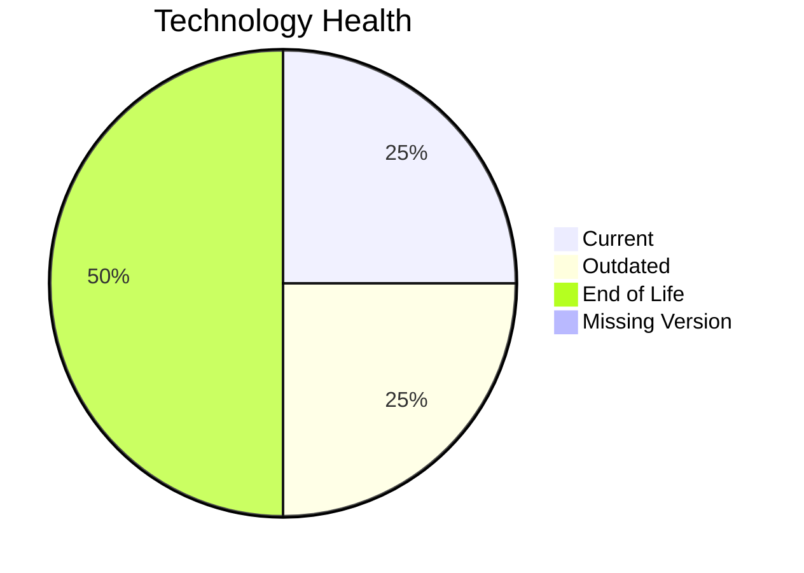

# Application Report: RouteOptApp-011

**ID:** app011
**Generated:** 2026-05-11

## Overview

| Attribute | Value |
|-----------|-------|
| Owner | R&D |
| Environment | AWS |
| Business Criticality | Medium |
| Users | 125 |
| Servers | 1 |

## Technology Stack

| Component | Technology | Version | Status |
|-----------|-----------|---------|--------|
| Operating System | CentOS | CentOS 7 | 🔴 EOL |
| Database | PostgreSQL | PostgreSQL 14 | 🟡 OUTDATED |
| Language | Python | Python 3.11 | 🟢 CURRENT_VERSION |
| Framework | N/A | N/A | ⚪ |
| App Server | GlassFish | Glassfish 4.0 | 🔴 EOL |

## Complexity Assessment

**Score:** 6/10 — **MEDIUM**
**Confidence:** 8

Technology age score 9/10 (EOL=2, outdated=1, unknown=0); integration score 8/10 (interfaces=5, api_endpoints=12); infrastructure score 2/10 (servers=1, environments=1); business criticality score 5/10 (Medium, users=125); architecture score 3/10 (architecture=3-Tier, CI/CD=Yes, containerized=Yes); data score 3/10 (db_count=1, db_storage_gb=180).

## Modernization Scenarios

### Applicable Scenarios

#### ✅ Operating System Update

- **Priority:** High
- **Effort:** Low
- **Effects:** security
- **Cost:** €1157 (one-time)
- **Savings:** €500/year
- **Reasoning:** Operating system is outdated or end-of-life per technology assessment.

#### ✅ Applications Server replacement

- **Priority:** Medium
- **Effort:** Medium
- **Effects:** agility, cost
- **Cost:** €11565 (one-time)
- **Savings:** €10800/year
- **Reasoning:** Application server version is legacy or unsupported.

#### ✅ Upgrade Legacy Databases

- **Priority:** High
- **Effort:** Medium
- **Effects:** security, agility
- **Cost:** €11565 (one-time)
- **Savings:** €10000/year
- **Reasoning:** Database engine is outdated or end-of-life.

#### ✅ Update outdated components

- **Priority:** High
- **Effort:** High
- **Effects:** security, agility, cost
- **Cost:** N/A
- **Savings:** N/A
- **Reasoning:** Language/framework/server components are outdated or end-of-life.

### Not Applicable / Other

| Scenario | Status | Reason |
|----------|--------|--------|
| Switch to standard Linux Operating System | FULFILLED | Application already runs on a standard Linux distribution. |
| Switch to ARM-based CPU | LACK_OF_DATA | CPU architecture (x86/x64/ARM) is not provided in source data. |
| Application Migration to Cloud Infrastructure (Lift & Shift) | FULFILLED | Application is already hosted on public cloud infrastructure. |
| Application Containerization | FULFILLED | Application is already containerized. |
| Application Refactoring and De-coupling | PARTIALLY_FULFILLED | Some modularity exists, but additional decoupling opportunities remain. |
| Switch DB Engine to open-source database solution | FULFILLED | Database engine is already open-source compatible. |

## Financial Summary

| Metric | Value |
|--------|-------|
| Total One-Time Cost | €24287 |
| Total Yearly Savings | €21300 |
| Break-Even | 1.1 years |
