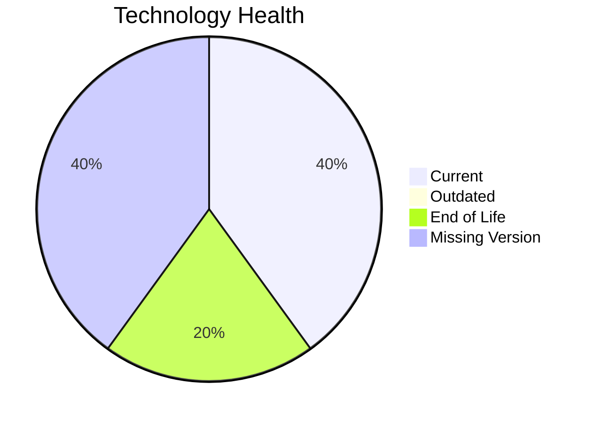

# Application Report: RouteOptApp-011

**ID:** app011  
**Generated:** 2026-05-14

## Overview

| Attribute | Value |
|-----------|-------|
| Owner | unknown |
| Environment | AWS |
| Business Criticality | Medium |
| Users | 125 |
| Servers | sv14 |

## Technology Stack

| Component | Technology | Version | Status |
|-----------|-----------|---------|--------|
| os | CentOS 7 | 7 | 🔴 EOL |
| database | PostgreSQL 14 | 14 | 🟢 CURRENT_VERSION |
| language | Python 3.11 | 3.11 | 🟢 CURRENT_VERSION |
| framework | Framework | unknown | ⚪ NO_KNOWLEDGE |
| app_server | Glassfish 4.0 | 4.0 | ⚪ NO_KNOWLEDGE |

## Complexity Assessment

**Score:** 5/10 — **MEDIUM**  
**Confidence:** 8

**Reasoning:** Tech age 7/10 (1 EOL, 0 outdated components), integrations 5 interfaces and 0 dependencies, infrastructure 1 servers/1 environments, criticality Medium, architecture score 3/10, data score 3/10.

## Modernization Scenarios

### Applicable Scenarios

#### ✅ Operating System Update
- **Cost:** €1006 (one-time)
- **Savings:** €500/year
- **Reasoning:** CentOS 7 requires upgrade/security patching.
#### ✅ Switch to standard Linux Operating System
- **Cost:** €302 (one-time)
- **Savings:** €400/year
- **Reasoning:** Current OS (CentOS 7) is non-standard for Linux consolidation.
#### ✅ Switch to ARM-based CPU
- **Cost:** €5028 (one-time)
- **Savings:** €1000/year
- **Reasoning:** Cloud-hosted workload can be evaluated for ARM-based instances.

### Not Applicable / Other

| Scenario | Status | Reason |
|----------|--------|--------|
| Applications Server replacement | LACK_OF_DATA | Insufficient application server data. |
| Application Migration to Cloud Infrastructure (Lift & Shift) | FULFILLED | Application is already deployed in cloud. |
| Application Containerization | FULFILLED | Application is already containerized. |
| Application Refactoring and De-coupling | PARTIALLY_FULFILLED | Architecture shows partial decoupling already. |
| Upgrade Legacy Databases | FULFILLED | Database engine appears current. |
| Switch DB Engine to open-source database solution | FULFILLED | Application already uses open-source database engine. |
| Update outdated components | APPLICABLE | Outdated or EOL components identified in technology assessment. |

## Financial Summary

| Metric | Value |
|--------|-------|
| Total One-Time Cost | €6336 |
| Total Yearly Savings | €1900 |
| Break-Even | 3.3 years |
