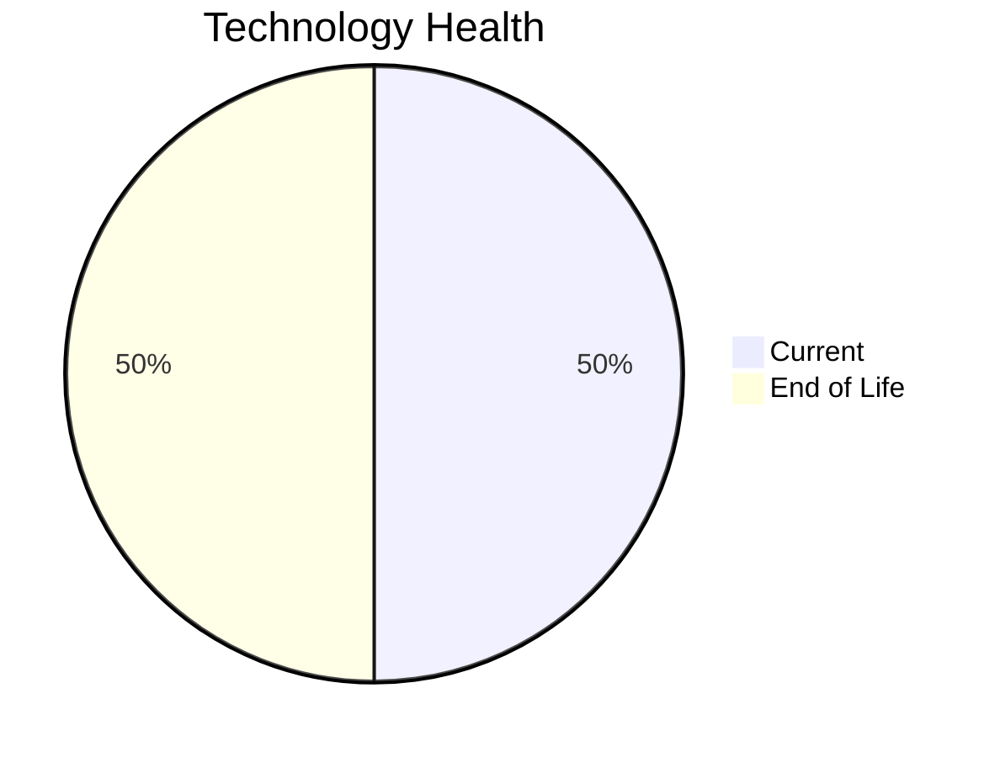

# Application Report: RouteOptApp-011

**ID:** app011  
**Generated:** 2026-05-05

## Overview

| Attribute | Value |
|-----------|-------|
| Business Unit | R&D |
| Deployment Type | AWS |
| Business Criticality | Medium |
| Users | 125 |
| Servers | sv14 |
| Environments | 1 |
| Architecture | 3-Tier |
| Containerized | Yes |
| CI/CD | Yes |
| Solution Type | Custom made |
| Data Classification | Internal |

> Advanced route optimization system using machine learning algorithms for delivery planning

## Technology Stack

| Component | Technology | Version | Status |
|-----------|-----------|---------|--------|
| Os | CentOS | 7 | 🔴 EOL |
| Database | PostgreSQL | 14 | 🟢 CURRENT_VERSION |
| Language | Python | 3.11 | 🟢 CURRENT_VERSION |
| Application Server | GlassFish | 4.0 | 🔴 EOL |

## Complexity Assessment

**Score:** 5/10 — **MEDIUM**  
**Confidence:** 7

> Score 5/10 (MEDIUM). EOL components: 2, Outdated: 0. External interfaces: 5. Servers: 1. Criticality: Medium. Architecture: 3-Tier. DB storage: 180.0GB.

| Factor | Value |
|--------|-------|
| Servers | 1 |
| Environments | 1 |
| External Interfaces | 5 |
| Business Criticality | Medium |
| EOL Technologies | 2 |
| Outdated Technologies | 0 |
| CI/CD | Yes |
| Containerized | Yes |

## Modernization Scenarios

### ✅ Applicable Scenarios

#### ✅ Operating System Update

- **Priority:** High
- **Effort:** Low
- **One-Time Cost:** €1,006
- **Yearly Savings:** €500
- **Reasoning:** OS CentOS 7 is EOL. CentOS 7 reached End of Life on June 30, 2024. No further updates provided. OS update is required.

#### ✅ Application Server Replacement

- **Priority:** Medium
- **Effort:** Medium
- **One-Time Cost:** €10,057
- **Yearly Savings:** €10,800
- **Reasoning:** Application server GlassFish 4.0 is EOL. GlassFish 4.0 is EOL. Oracle transferred to Eclipse Foundation; GlassFish 4.x is no longer actively maintained. Replacement with a modern server is recommended.

#### ✅ Update Outdated Components

- **Priority:** High
- **Effort:** High
- **Reasoning:** Outdated/EOL application components detected: GlassFish 4.0 (EOL). These should be updated to current supported versions.

### Other Scenarios

| Scenario | Status | Reason |
|----------|--------|--------|
| Switch to Standard Linux OS | ✔️ FULFILLED | Application already runs on a Linux-based OS (CentOS 7). However, OS version is EOL; upgrade (os_update_security_patch) ... |
| Switch to ARM-based CPU | ❓ LACK_OF_DATA | CPU architecture is not explicitly documented in the application record. ARM eligibility cannot be confirmed. |
| Application Migration to Cloud (Lift & Shift) | ✔️ FULFILLED | Application is already hosted on cloud (AWS). Lift & Shift is not needed. |
| Application Containerization | ✔️ FULFILLED | Application is already containerized. |
| Application Refactoring and De-coupling | 🔶 PARTIALLY_FULFILLED | Application uses 3-tier architecture with CI/CD and containerization. Some decoupling is in place, but microservices mig... |
| Upgrade Legacy Databases | ✔️ FULFILLED | Database PostgreSQL 14 is on a current supported version. |
| Switch DB Engine to Open-Source | ✔️ FULFILLED | Application already uses an open-source database engine (PostgreSQL 14). |

## Financial Summary

| Metric | Value |
|--------|-------|
| Total One-Time Cost | €11,063 |
| Total Yearly Savings | €11,300 |
| Break-Even | 1.0 years |
