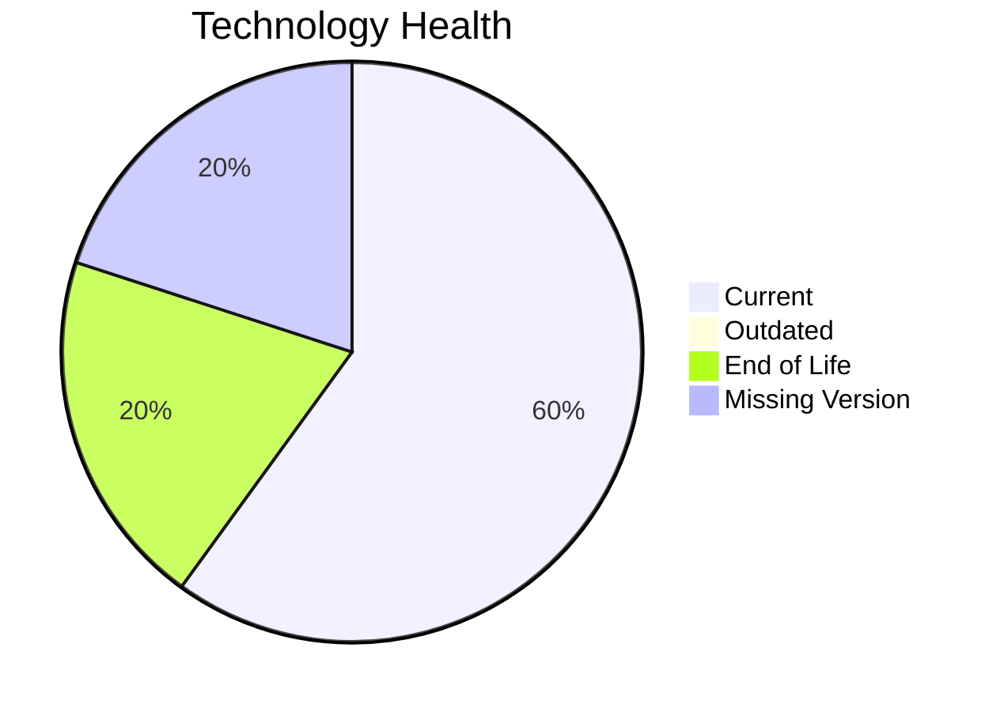

# Application Report: RouteOptApp-011

**ID:** app011
**Generated:** 2026-05-14

## Overview

| Attribute | Value |
|-----------|-------|
| Owner | R&D |
| Environment | AWS |
| Business Criticality | Medium |
| Users | 125 |
| Servers | sv14 |

## Technology Stack

| Component | Technology | Status |
|-----------|-----------|--------|
| Operating System | CentOS 7 | 🔴 |
| Database | PostgreSQL 14 | 🟢 |
| Language | Python 3.11 | 🟢 |

## Complexity Assessment

**Score:** 5/10 — **MEDIUM**

## Modernization Scenarios

### ✅ Os Update Security Patch
- **Reasoning:** EOL operating system/server components require security remediation.

### ✅ Switch To Arm Cpu
- **Reasoning:** Cloud-hosted workload with manageable complexity is a candidate for ARM.

### ✅ Serverless Db Migration
- **Reasoning:** API-intensive cloud workload can evaluate serverless DB patterns.

## Financial Summary

| Metric | Value |
|--------|-------|
| Total One-Time Cost | €11062 |
| Total Yearly Savings | €16400 |
| Break-Even | 0.7 years |
