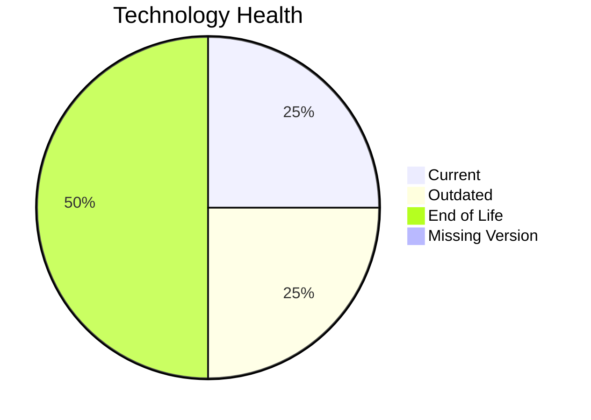

# Application Report: RouteOptApp-011

**ID:** app011
**Generated:** 2026-05-07

## Overview

| Attribute | Value |
|-----------|-------|
| Owner | N/A |
| Environment | AWS |
| Business Criticality | Medium |
| Users | 125 |
| Servers | 1 |

## Technology Stack

| Component | Technology | Version | Status |
|-----------|-----------|---------|--------|
| Operating System | CentOS | 7 | 🔴 EOL |
| Database | PostgreSQL | 14 | 🟡 OUTDATED |
| Language | Python | 3.11 | 🟢 CURRENT_VERSION |
| Framework | N/A | N/A | ⚪ NO_KNOWLEDGE |
| App Server | GlassFish | 4.0 | 🔴 EOL |

## Complexity Assessment

**Score:** 5/10 — **MEDIUM**
**Confidence:** 8

| Factor | Score | Notes |
|--------|-------|-------|
| Technology Age | 9/10 | 2 EOL components were found in the application stack. |
| Integration | 5/10 | The application has 5 interfaces, indicating moderate integration. |
| Infrastructure | 2/10 | 1 server(s) and 1 environment(s) indicate a small footprint. |
| Business Criticality | 5/10 | Criticality is 'Medium' with 125 users. |
| Architecture | 1/10 | A 3-tier architecture is more separable than 1-tier or 2-tier designs. Containerization lowers modernization friction. CI/CD lowers delivery risk. |
| Data | 5/10 | Database footprint (180 GB) indicates moderate data migration effort. |

## Modernization Scenarios

### Applicable Scenarios

#### ✅ Operating System Update

- **Priority:** High
- **Effort:** Low
- **Effects:** security
- **Cost:** €1,006 (one-time)
- **Savings:** €500/year
- **Reasoning:** CentOS 7 reached end of life in June 2024.

#### ✅ Switch to standard Linux Operating System

- **Priority:** Medium
- **Effort:** Medium
- **Effects:** agility, security, cost
- **Cost:** €302 (one-time)
- **Savings:** €400/year
- **Reasoning:** CentOS 7 is Linux-based but no longer a supported standard enterprise baseline.

#### ✅ Applications Server replacement

- **Priority:** Medium
- **Effort:** Medium
- **Effects:** agility, cost
- **Cost:** €10,057 (one-time)
- **Savings:** €10,800/year
- **Reasoning:** GlassFish 4 is out of support.

#### ✅ Upgrade Legacy Databases

- **Priority:** High
- **Effort:** Medium
- **Effects:** security, agility
- **Cost:** €10,057 (one-time)
- **Savings:** €10,000/year
- **Reasoning:** PostgreSQL 14 is still supported in 2026 but nearing end of life and behind the latest major releases.

#### ✅ Update outdated components

- **Priority:** High
- **Effort:** High
- **Effects:** security, agility, cost
- **Cost:** €N/A (one-time)
- **Savings:** €N/A/year
- **Reasoning:** At least one language, framework, or application server component is outdated or EOL.

### Not Applicable / Other

| Scenario | Status | Reason |
|----------|--------|--------|
| Switch to ARM-based CPU | LACK_OF_DATA | CPU architecture is not present in the workbook, so ARM suitability cannot be validated. |
| Application Migration to Cloud Infrastructure (Lift & Shift) | FULFILLED | Application is already hosted on AWS, which satisfies the public cloud hosting indicator. |
| Application Containerization | FULFILLED | The workbook explicitly marks the application as containerized. |
| Application Refactoring and De-coupling | PARTIALLY_FULFILLED | The application already shows some modular characteristics, but there is no evidence it is fully decoupled or microservice-based. |
| Switch DB Engine to open-source database solution | FULFILLED | The application already uses an open-source or open-source-compatible database engine. |

## Financial Summary

| Metric | Value |
|--------|-------|
| Total One-Time Cost | €21,422 |
| Total Yearly Savings | €21,700 |
| Break-Even | 1.0 years |
