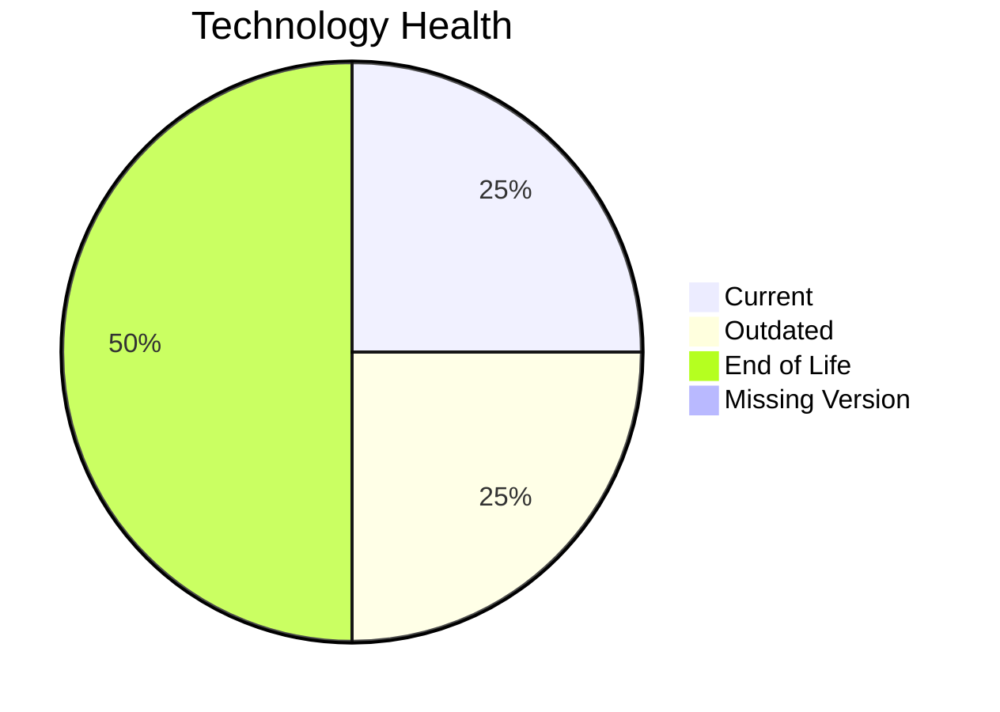

# Application Report: RouteOptApp-011

**ID:** app011  
**Generated:** 2026-05-17

## Overview

| Attribute | Value |
|-----------|-------|
| Owner | N/A |
| Environment | AWS |
| Business Criticality | Medium |
| Users | 125 |
| Servers | 1 |

## Technology Stack

| Component | Technology | Version | Status |
|-----------|-----------|---------|--------|
| Operating System | CentOS | 7 | 🔴 EOL |
| Database | PostgreSQL | 14 | 🟡 OUTDATED |
| Language | Python | 3.11 | 🟢 CURRENT_VERSION |
| Framework | N/A | N/A | ⚪ NO_KNOWLEDGE |
| App Server | GlassFish | 4.0 | 🔴 EOL |

## Complexity Assessment

**Score:** 6/10 — **MEDIUM**  
**Confidence:** 8

| Factor | Score | Notes |
|--------|-------|-------|
| Technology Age | 9/10 | 2 components are EOL. |
| Integration | 6/10 | Moderate integration surface with 5 external interfaces and 12 APIs. |
| Infrastructure | 2/10 | Small infrastructure footprint with 1 server(s) and 1 environment(s). |
| Business Criticality | 5/10 | Business criticality is Medium. |
| Architecture | 4/10 | already containerized, CI/CD exists, traditional multi-tier architecture, legacy application server. |
| Data | 5/10 | 1 database engine(s), 180 GB storage, aging database platform. |

## Modernization Scenarios

### Applicable Scenarios

#### ✅ Operating System Update

- **Priority:** High
- **Effort:** Low
- **Effects:** security
- **Cost:** €1157 (one-time)
- **Savings:** €500/year
- **Reasoning:** CentOS 7 is assessed as EOL, which triggers an OS update scenario.

#### ✅ Applications Server replacement

- **Priority:** Medium
- **Effort:** Medium
- **Effects:** agility, cost
- **Cost:** €11565 (one-time)
- **Savings:** €10800/year
- **Reasoning:** Glassfish 4.0 is assessed as EOL and should be modernized or replaced.

#### ✅ Upgrade Legacy Databases

- **Priority:** High
- **Effort:** Medium
- **Effects:** security, agility
- **Cost:** €11565 (one-time)
- **Savings:** €10000/year
- **Reasoning:** PostgreSQL 14 is assessed as OUTDATED and is a candidate for upgrade.

#### ✅ Update outdated components

- **Priority:** High
- **Effort:** High
- **Effects:** security, agility, cost
- **Cost:** €0 (one-time)
- **Savings:** €0/year
- **Reasoning:** One or more application components are outdated or end-of-life.

### Not Applicable / Other

| Scenario | Status | Reason |
|----------|--------|--------|
| Switch to standard Linux Operating System | FULFILLED | CentOS 7 already belongs to a standard Linux family. |
| Switch to ARM-based CPU | LACK_OF_DATA | CPU architecture is not documented in the workbook, so ARM suitability cannot be assessed confidently. |
| Application Migration to Cloud Infrastructure (Lift & Shift) | FULFILLED | Deployment target already points to AWS/public cloud only. |
| Application Containerization | FULFILLED | Application is already containerized. |
| Application Refactoring and De-coupling | NOT_APPLICABLE | Architecture does not show enough monolithic or tightly coupled indicators. |
| Switch DB Engine to open-source database solution | FULFILLED | PostgreSQL 14 already uses an open-source-compatible engine family. |

## Financial Summary

| Metric | Value |
|--------|-------|
| Total One-Time Cost | €24287 |
| Total Yearly Savings | €21300 |
| Break-Even | 1.1 years |
