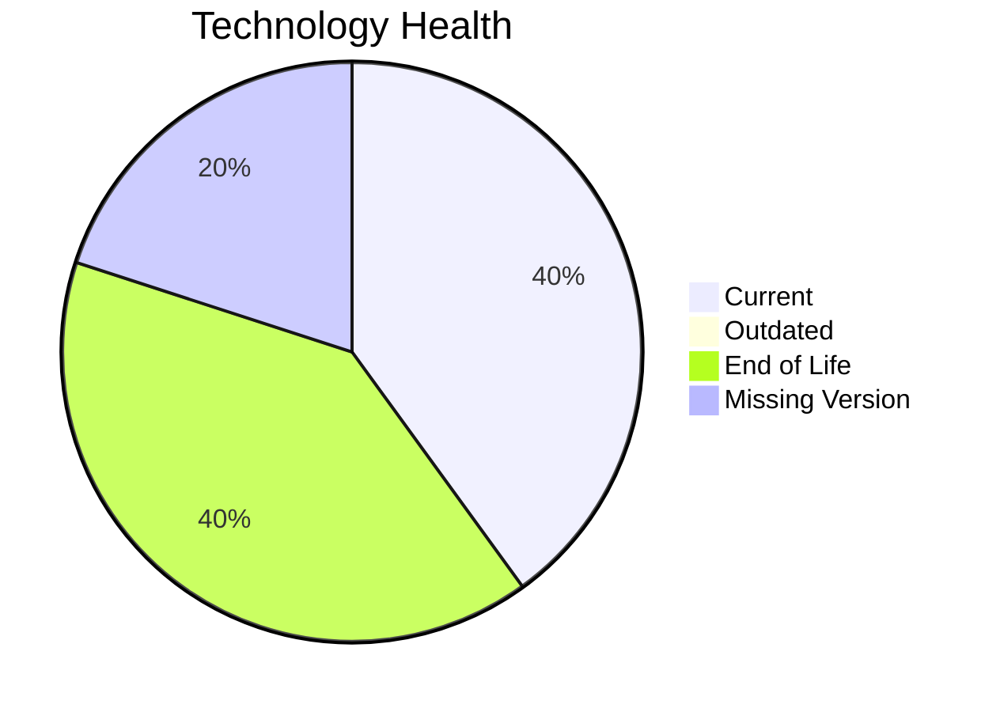

# Application Report: RouteOptApp-011

**ID:** app011  
**Generated:** 2026-05-17

## Overview

| Attribute | Value |
|-----------|-------|
| Owner | unknown |
| Environment | AWS |
| Business Criticality | Medium |
| Users | 125 |
| Servers | sv14 |

## Technology Stack

| Component | Technology | Version | Status |
|-----------|-----------|---------|--------|
| Operating System | CentOS 7 | 7 | 🔴 EOL |
| Database | PostgreSQL 14 | 14 | 🟢 CURRENT_VERSION |
| Language | Python 3.11 | 3.11 | 🟢 CURRENT_VERSION |
| Framework | Unknown Framework | N/A | ⚪ NO_KNOWLEDGE |
| App Server | Glassfish 4.0 | 4.0 | 🔴 EOL |

## Complexity Assessment

**Score:** 5/10 — **MEDIUM**  
**Confidence:** 8

Tech age 7/10 (EOL=2, outdated=0, unknown=1); integration 5/10 (5 interfaces); infrastructure 3/10 (1 servers, 1 envs); criticality 5/10 (Medium); architecture 3/10 (arch=3-Tier, containerized=Yes, ci/cd=Yes); data 3/10 (1 DB(s), storage≈180GB).

## Modernization Scenarios

### Applicable Scenarios

#### ✅ Operating System Update
- **Priority:** High
- **Effort:** Low
- **Effects:** security
- **Cost:** €1006 (one-time)
- **Savings:** €500/year
- **Reasoning:** Operating system is outdated/EOL in technology assessment.

#### ✅ Switch to ARM-based CPU
- **Priority:** Medium
- **Effort:** Medium
- **Effects:** cost, sustainability
- **Cost:** €5028 (one-time)
- **Savings:** €1000/year
- **Reasoning:** No explicit blockers; likely x86/x64 default estate with modernization potential.

#### ✅ Applications Server replacement
- **Priority:** Medium
- **Effort:** Medium
- **Effects:** agility, cost
- **Cost:** €10057 (one-time)
- **Savings:** €10800/year
- **Reasoning:** Application server identified as legacy/EOL.

#### ✅ Update outdated components
- **Priority:** High
- **Effort:** High
- **Effects:** security, agility, cost
- **Cost:** €N/A (one-time)
- **Savings:** €N/A/year
- **Reasoning:** Technology assessment found outdated/EOL components.

### Not Applicable / Other

| Scenario | Status | Reason |
|----------|--------|--------|
| Switch to standard Linux Operating System | FULFILLED | Application already runs on standard Linux distribution. |
| Application Migration to Cloud Infrastructure (Lift & Shift) | FULFILLED | Application already deployed on public cloud. |
| Application Containerization | FULFILLED | Application is already containerized. |
| Application Refactoring and De-coupling | PARTIALLY_FULFILLED | Moderate complexity with selective decoupling opportunities. |
| Upgrade Legacy Databases | PARTIALLY_FULFILLED | Database is supported; periodic modernization still relevant. |
| Switch DB Engine to open-source database solution | NOT_APPLICABLE | Database engine already open-source or open-source based. |

## Financial Summary

| Metric | Value |
|--------|-------|
| Total One-Time Cost | €16091 |
| Total Yearly Savings | €12300 |
| Break-Even | 1.3 years |
